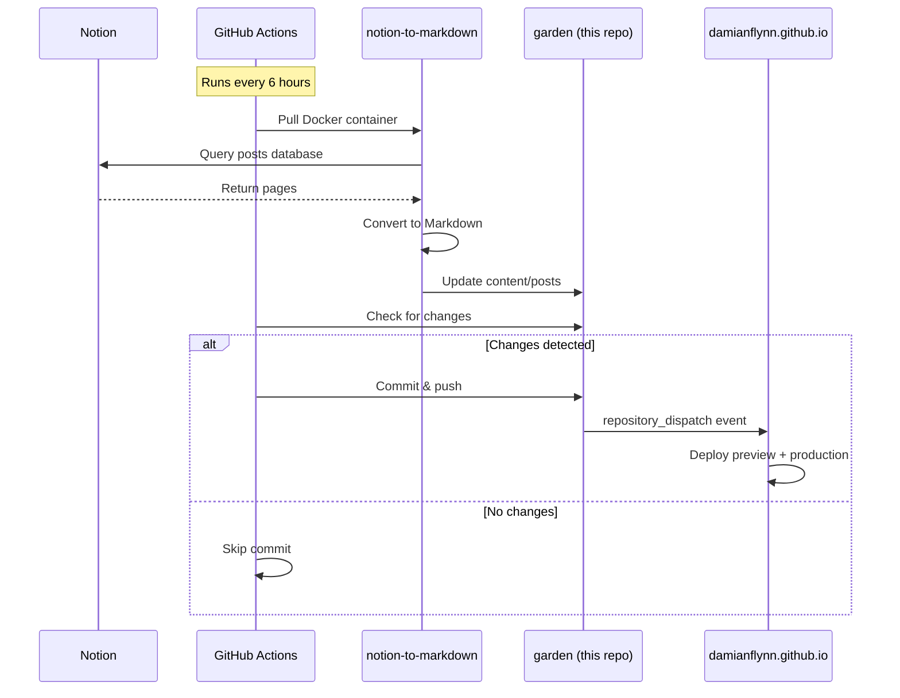

# Garden - Content for damianflynn.com

[](https://github.com/DamianFlynn/garden/actions/workflows/sync-notion-content.yaml)

This repository contains all the content for my personal website [damianflynn.com](https://damianflynn.com), automatically synced from Notion every 6 hours.

## Overview

The `garden` repository serves as the content layer in a modular blog architecture:

- **Content Source**: Notion database (auto-synced)
- **Export Tool**: [notion-to-markdown](https://github.com/DamianFlynn/notion-to-markdown) (Docker container)
- **Sync Schedule**: Every 6 hours via GitHub Actions
- **Deployment**: Triggers both preview and production builds on content changes

## Related Repositories

| Repository | Purpose | Links |
|-----------|---------|-------|
| **[damianflynn.github.io](https://github.com/DamianFlynn/damianflynn.github.io)** | Main site (config, Hugo modules, workflows) | [Production](https://damianflynn.github.io) \| [Preview](https://preview.damianflynn-preview.pages.dev) |
| **[hugo-haptic-theme](https://github.com/DamianFlynn/hugo-haptic-theme)** | Custom Hugo theme | [Docs](https://github.com/DamianFlynn/hugo-haptic-theme#readme) |
| **[notion-to-markdown](https://github.com/DamianFlynn/notion-to-markdown)** | Notion API v5 export tool | [Container](https://ghcr.io/damianflynn/notion-to-markdown) |

## How It Works



## Structure

```
garden/
├── content/           # All content organized by type
│   ├── posts/         # Blog posts
│   ├── series/        # Series collections
│   └── about/         # About pages
├── data/              # Data files (authors, etc.)
└── static/            # Static files (images, etc.)
```

## Adding Content

### New Blog Post

Create a new markdown file in the `content/posts` directory with the following frontmatter:

```markdown
---
title: "Your Post Title"
subtitle: "Optional subtitle"
date: 2023-05-18T10:30:00+08:00
lastmod: 2023-05-18T10:30:00+08:00
draft: false
author: "Damian Flynn"
authorLink: "https://damianflynn.com"
description: "Short description of the post"

tags: ["tag1", "tag2"]
categories: ["category1"]
series: ["series-name"]

featuredImage: "featured-image.jpg"
featuredImagePreview: "featured-image-preview.jpg"

toc:
  enable: true
math:
  enable: false
lightgallery: false
---

Your post content here...
```

### Series Configuration

To create a new series, add a file in the `content/series` directory with information about the series.

## License

The content of this repository is licensed under [Creative Commons Attribution 4.0 International License](https://creativecommons.org/licenses/by/4.0/).
