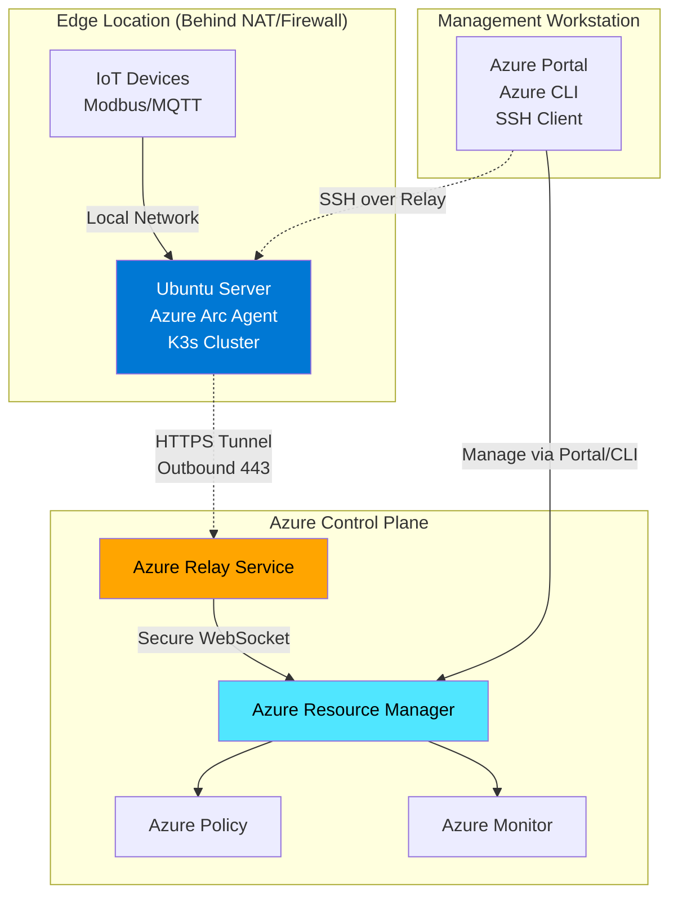
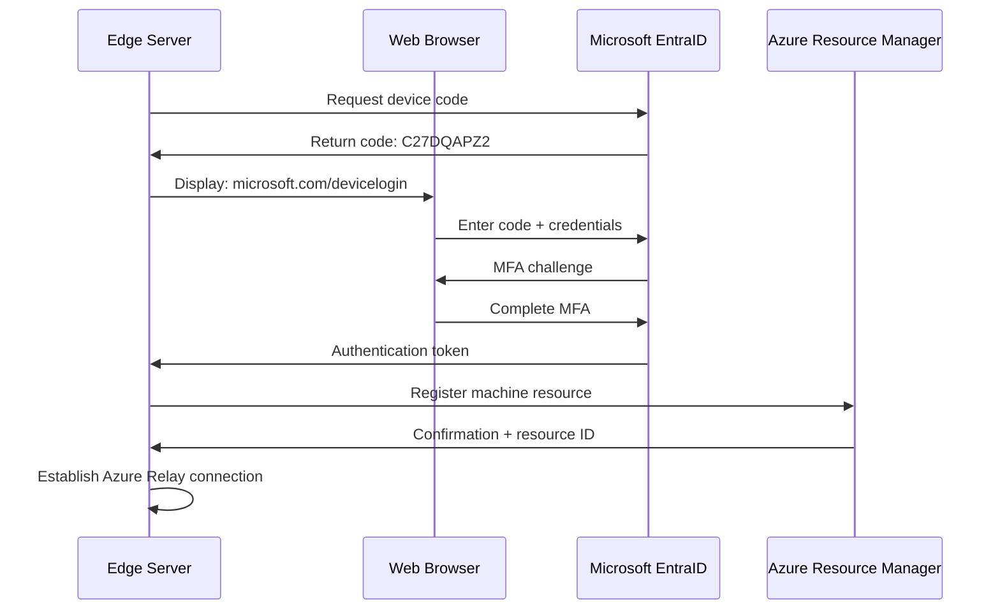
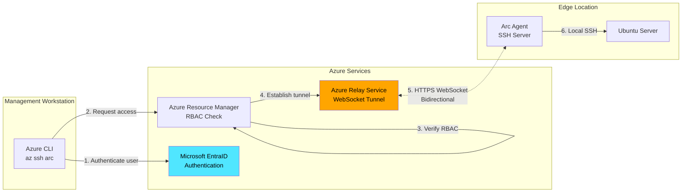
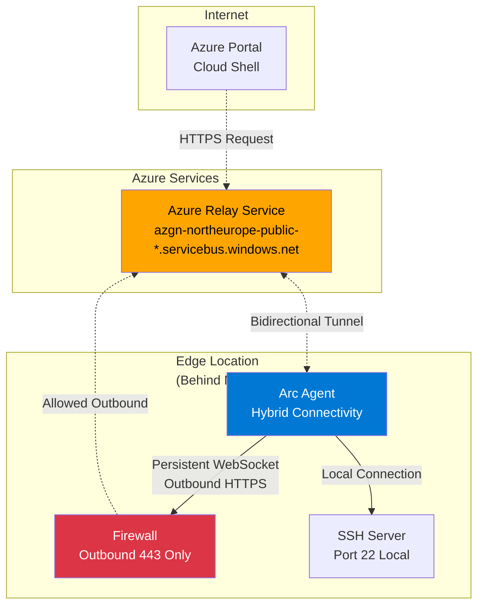
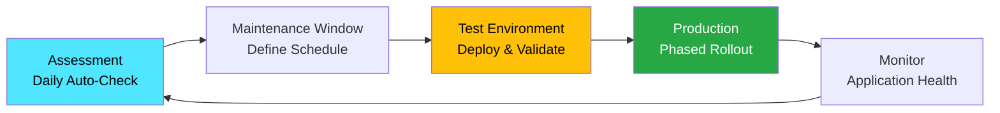
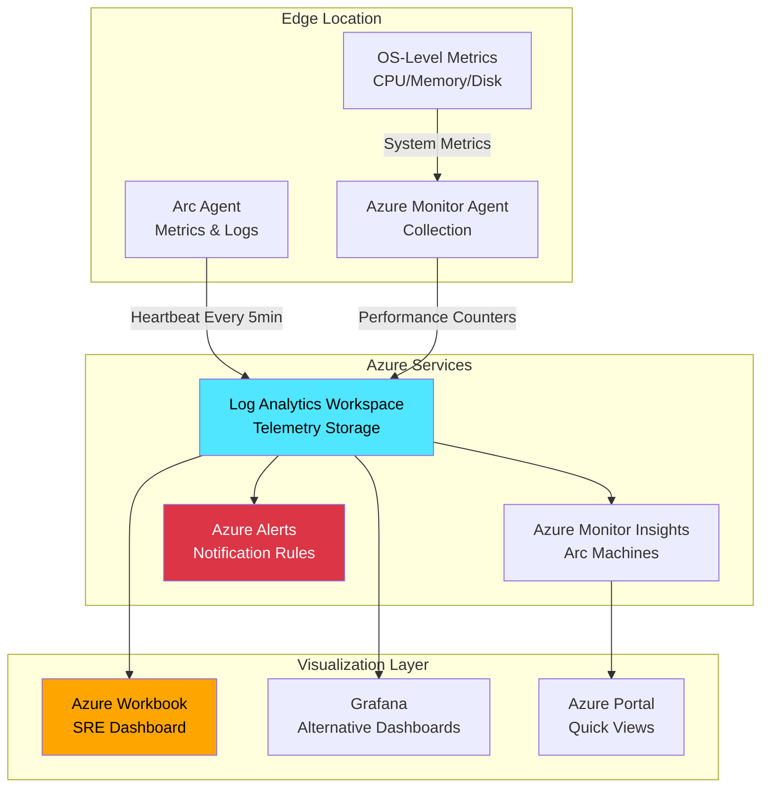

Building a production-ready IoT edge platform requires more than deploying workloads—it demands secure, centrally managed infrastructure that bridges on-premises environments with cloud services. This guide establishes the foundational layer for running **Azure IoT Operations** on **K3s** clusters by implementing **Azure Arc** for hybrid infrastructure management.

If you're architecting IoT solutions that span edge devices, Kubernetes clusters, and Azure services, this is where your journey begins. We'll cover Azure Arc agent deployment, secure remote access patterns, and operational best practices that enable you to manage distributed edge infrastructure at scale.

**What you'll learn:**

* Azure Arc architecture for IoT edge scenarios
* Step-by-step Arc agent installation on Ubuntu Server
* Secure remote access via Azure Relay (SSH over HTTPS)
* EntraID authentication integration for edge resources
* Update management and operational monitoring
* Prerequisites for Azure IoT Operations deployment
## Why Azure Arc for IoT Edge Infrastructure?

Traditional IoT deployments struggle with a fundamental challenge: **managing distributed edge infrastructure** that sits behind NAT, across multiple networks, often in locations with intermittent connectivity. Azure Arc solves this by extending Azure's control plane to edge resources, providing:

**Unified Management**: Govern edge servers, Kubernetes clusters, and data services through Azure Resource Manager

**Security & Compliance**: Apply Azure Policy, role-based access control (RBAC), and compliance frameworks consistently

**Remote Operations**: SSH and manage edge devices without VPN infrastructure or firewall changes

**GitOps Workflows**: Deploy Azure IoT Operations and applications using declarative, version-controlled configurations

**Monitoring & Observability**: Integrate with Azure Monitor, Log Analytics, and Application Insights



**This architectural pattern enables:**

* Edge servers in manufacturing plants, remote sites, or customer premises
* No inbound firewall rules or VPN complexity
* Centralized governance across distributed locations
* Secure remote access for troubleshooting and updates
## Prerequisites & Planning

### Hardware Requirements

For Azure IoT Operations on K3s, your edge server should meet:

**Minimum Specifications:**

* CPU: 4 cores (x86_64 or ARM64)
* Memory: 8GB RAM
* Storage: 40GB SSD (NVMe preferred for production)
* Network: Gigabit Ethernet, stable internet connectivity
**Recommended Specifications:**

* CPU: 8-12 cores (Intel Xeon, AMD EPYC, or Apple Silicon equivalent)
* Memory: 16-32GB RAM
* Storage: 128GB+ NVMe SSD with RAID for resilience
* Network: 10Gb Ethernet if handling high-volume telemetry
**My Test Environment:**

* Platform: KVM virtual machine
* CPU: 2 cores (will upgrade for production loads)
* Memory: 4GB RAM
* Storage: 40GB virtual disk
* OS: Ubuntu 24.04.03 LTS Server
* Network: Bridged adapter with DHCP
### Network & Firewall Requirements

Azure Arc requires **outbound HTTPS (TCP 443)** connectivity to specific Microsoft endpoints. Your firewall must allow:

**Required Endpoints:**

* *.servicebus.windows.net (Azure Relay)
* *.his.arc.azure.com (Hybrid Identity Service)
* packages.microsoft.com (Arc agent installation)
* management.azure.com (Azure Resource Manager)
* login.microsoftonline.com (Authentication)
**Security Consideration**: All communication is **outbound-initiated** over HTTPS. No inbound ports are required on the edge server, significantly reducing your attack surface.

### Azure Subscription Preparation

Before deployment, ensure you have:

1. Azure Subscription with appropriate permissions
1. Resource Group for Arc-enabled servers (e.g., iot-ops)
1. Azure Region selection (choose nearest region for latency)
1. Naming Convention for Arc resources
1. Tagging Strategy for organization and cost tracking
## Azure Arc Agent Installation: Step-by-Step

### Step 1: Generate Installation Script

Navigate to **Azure Portal → Azure Arc → Machines → Add/Create → Add a machine → Add a single server**

**Configuration Parameters:**

  **Tags for Organization:**

Tags enable cost allocation, automation, and reporting. Apply meaningful metadata:

```bash
Datacenter=NorthEurope
City=Ballina
StateOrDistrict=Mayo
CountryOrRegion=Ireland
Environment=Production
Project=OT
ArcSQLServerExtensionDeployment=Disabled
```

Azure generates a customized installation script containing:

* Subscription and tenant identifiers
* Resource group and location
* Authentication tokens
* Your specified tags
### Step 2: Execute Installation Script

The generated script performs three operations:

1. Downloads Arc agent installation package
1. Installs the hybrid agent (azcmagent)
1. Connects the machine to Azure
**Script Breakdown:**

```bash
# Define Azure configuration variables
SUBSCRIPTION_ID="2ae5ef90-259a-4fd0-9b35-8611ffb26417"
TENANT_ID="7d918dfe-bd63-478b-b8b3-2f252b011527"
RESOURCE_GROUP="p-we1iot"
MACHINE_NAME="n013edge"
LOCATION="westeurope"
CORRELATION_ID=$(uuidgen)


# Create resource group (if it doesn't exist)
az group create --name "$RESOURCE_GROUP" --location "$LOCATION"

# Connect server to Azure Arc
sudo azcmagent connect \
  --resource-group "$RESOURCE_GROUP" \
  --tenant-id "$TENANT_ID" \
  --location "$LOCATION" \
  --subscription-id "$SUBSCRIPTION_ID" \
  --cloud "AzureCloud" \
  --resource-name "$MACHINE_NAME" \
  --tags 'Datacenter=NorthEurope,City=Ballina,StateOrDistrict=Mayo,CountryOrRegion=Ireland,Environment=Production,Project=OT,Building=013,ArcSQLServerExtensionDeployment=Disabled' \
  --correlation-id "$CORRELATION_ID"

```

### Step 4: Download Arc Agent

```bash
# Download Arc agent installer
wget https://aka.ms/azcmagent -O ~/install_linux_azcmagent.sh
chmod +x ~/install_linux_azcmagent.sh
```

**Network Requirement**: This step requires internet access to Microsoft's CDN. Ensure your firewall allows HTTPS to `*.`[`arc.azure.com`](http://arc.azure.com/).

### Step 5: Install Arc Agent

```bash
# Install Arc agent
sudo bash ~/install_linux_azcmagent.sh

Using 'curl' for downloads
Total physical memory: 16000548 kB
Platform type:  x86_64:Linux
Retrieving distro info from /etc/os-release...
Configuring for Ubuntu 24.04...
Hit:1 http://archive.ubuntu.com/ubuntu noble InRelease
Hit:2 https://download.docker.com/linux/ubuntu jammy InRelease                                                              
Hit:3 http://archive.ubuntu.com/ubuntu noble-updates InRelease                                                              
Hit:4 http://security.ubuntu.com/ubuntu noble-security InRelease                                                            
Hit:5 http://archive.ubuntu.com/ubuntu noble-backports InRelease                                                            
Hit:6 https://packages.microsoft.com/ubuntu/22.04/prod jammy InRelease                           
Get:7 https://pkgs.tailscale.com/stable/ubuntu jammy InRelease             
Fetched 6,581 B in 1s (8,938 B/s)
Reading package lists... Done
Building dependency tree... Done
Reading state information... Done
37 packages can be upgraded. Run 'apt list --upgradable' to see them.
Reading package lists... Done
Building dependency tree... Done
Reading state information... Done
The following packages will be REMOVED:
  packages-microsoft-prod
0 upgraded, 0 newly installed, 1 to remove and 37 not upgraded.
After this operation, 0 B of additional disk space will be used.
(Reading database ... 204788 files and directories currently installed.)
Removing packages-microsoft-prod (1.2-ubuntu22.04) ...
  % Total    % Received % Xferd  Average Speed   Time    Time     Time  Current
                                 Dload  Upload   Total   Spent    Left  Speed
100  4288  100  4288    0     0  16066      0 --:--:-- --:--:-- --:--:-- 16059
Selecting previously unselected package packages-microsoft-prod.
(Reading database ... 204777 files and directories currently installed.)
Preparing to unpack .../packages-microsoft-prod.deb ...
Unpacking packages-microsoft-prod (1.2-ubuntu24.04) ...
Setting up packages-microsoft-prod (1.2-ubuntu24.04) ...

Installing new version of config file /etc/apt/sources.list.d/microsoft-prod.list ...
File /usr/share/keyrings/microsoft-prod.gpg is missing. Installing...
Hit:1 http://security.ubuntu.com/ubuntu noble-security InRelease
Hit:2 https://download.docker.com/linux/ubuntu jammy InRelease                                                              
Hit:3 http://archive.ubuntu.com/ubuntu noble InRelease                                                                      
Hit:4 http://archive.ubuntu.com/ubuntu noble-updates InRelease                                                              
Get:5 https://packages.microsoft.com/ubuntu/24.04/prod noble InRelease [3,600 B]                 
Hit:6 http://archive.ubuntu.com/ubuntu noble-backports InRelease                                 
Get:7 https://packages.microsoft.com/ubuntu/24.04/prod noble/main amd64 Packages [68.1 kB]
Get:8 https://pkgs.tailscale.com/stable/ubuntu jammy InRelease
Get:9 https://packages.microsoft.com/ubuntu/24.04/prod noble/main armhf Packages [11.2 kB]
Get:10 https://packages.microsoft.com/ubuntu/24.04/prod noble/main all Packages [643 B]
Get:11 https://packages.microsoft.com/ubuntu/24.04/prod noble/main arm64 Packages [50.9 kB]
Fetched 141 kB in 1s (188 kB/s)      
Reading package lists... Done
Reading package lists... Done
Building dependency tree... Done
Reading state information... Done
The following NEW packages will be installed:
  azcmagent
0 upgraded, 1 newly installed, 0 to remove and 38 not upgraded.
Need to get 85.1 MB of archives.
After this operation, 0 B of additional disk space will be used.
Get:1 https://packages.microsoft.com/ubuntu/24.04/prod noble/main amd64 azcmagent amd64 1.58.03228.700 [85.1 MB]
Fetched 85.1 MB in 11s (7,500 kB/s)                                                                                         
Selecting previously unselected package azcmagent.
(Reading database ... 204788 files and directories currently installed.)
Preparing to unpack .../azcmagent_1.58.03228.700_amd64.deb ...
Preinstall...install
Creating himds group ...
Creating himds account ...
Creating arcproxy account ...
Applying udev rule to access TPM...
crw-rw---- 1 tss tss  10,   224 Nov 19 22:39 /dev/tpm0
crw-rw---- 1 tss tss 253, 65536 Nov 10 03:08 /dev/tpmrm0
Adding TPM udev rule
User 'himds' added to tss group
Unpacking azcmagent (1.58.03228.700) ...
Setting up azcmagent (1.58.03228.700) ...
Postinstall...configure
Creating new /var/opt/azcmagent/agentconfig.json
Created symlink /etc/systemd/system/multi-user.target.wants/himdsd.service → /usr/lib/systemd/system/himdsd.service.
Checked guest config disabled: 
Checked ext service disabled: 
Checked arc proxy enabled: 0
Enabling arcproxyd
Created symlink /etc/systemd/system/multi-user.target.wants/arcproxyd.service → /usr/lib/systemd/system/arcproxyd.service.
Getting status via systemd
Arc GC service is not running.
Configuring Arc GC service ...
Found systemd service controller...for Arc GC Service
Created symlink /etc/systemd/system/multi-user.target.wants/gcad.service → /usr/lib/systemd/system/gcad.service.
Service configured through systemd service controller. Gc Service
Enabling gcad
Getting status via systemd
Arc GC service is not running.
STARTING Arc GC
Getting status via systemd
EXT service is not running.
Configuring EXT service ...
Found systemd service controller...for Extension Service
Created symlink /etc/systemd/system/multi-user.target.wants/extd.service → /usr/lib/systemd/system/extd.service.
Created symlink /etc/systemd/system/himdsd.service.wants/extd.service → /usr/lib/systemd/system/extd.service.
Service configured through systemd service controller. Extension Service
Enabling extd
STARTING EXT
Scanning processes...                                                                                                        
Scanning processor microcode...                                                                                              
Scanning linux images...                                                                                                     

Running kernel seems to be up-to-date.

The processor microcode seems to be up-to-date.

No services need to be restarted.

No containers need to be restarted.

No user sessions are running outdated binaries.

No VM guests are running outdated hypervisor (qemu) binaries on this host.
Latest version of azcmagent is installed.
```

**What Just Happened:**

* Microsoft package repository added to APT sources
* Azure Connected Machine Agent (azcmagent) installed
* Four systemd services configured:
  * himdsd: Hybrid Instance Metadata Service
  * arcproxyd: Azure Arc proxy for outbound connections
  * gcad: Guest Configuration agent for Azure Policy
  * extd: Extension service for VM extensions
  ### Step 6: Connect to Azure Arc

```bash
sudo azcmagent connect \
  --resource-group "$RESOURCE_GROUP" \
  --tenant-id "$TENANT_ID" \
  --location "$LOCATION" \
  --subscription-id "$SUBSCRIPTION_ID" \
  --cloud "AzureCloud" \
  --resource-name "$MACHINE_NAME" \
  --tags 'Datacenter=NorthEurope,City=Ballina,StateOrDistrict=Mayo,CountryOrRegion=Ireland,Environment=Production,Project=OT,Building=013,ArcSQLServerExtensionDeployment=Disabled' \
  --correlation-id "$CORRELATION_ID"

INFO    Connecting machine to Azure... This might take a few minutes. 
INFO    Cloud: AzureCloud                            
INFO    Testing connectivity to endpoints that are needed to connect to Azure... This might take a few minutes. 
To sign in, use a web browser to open the page https://microsoft.com/devicelogin and enter the code CSWUL5ZFG to authenticate.
```

**Authentication Flow:**



**Complete the device authentication in your browser.** The Arc agent will continue once authenticated:

```bash
INFO    Cloud: AzureCloud
  20% [==>            ]
  30% [===>           ]  
  INFO    Creating resource in Azure...                 Correlation ID=2989a600-f32a-47d9-884d-c5d59e211ba7 Resource ID=/subscriptions/2ae5ef90-259a-4fd0-9b35-8611ffb26417/resourceGroups/p-we1iot/providers/Microsoft.HybridCompute/machines/n013edge
  60% [========>      ]  
  80% [===========>   ]  
 100% [===============]  
INFO    Connected machine to Azure          
INFO    Machine overview page: https://portal.azure.com/#@7d918dfe-bd63-478b-b8b3-2f252b011527/resource/subscriptions/2ae5ef90-259a-4fd0-9b35-8611ffb26417/resourceGroups/p-we1iot/providers/Microsoft.HybridCompute/machines/n013edge/overview 
```

### Step 7: Verify Connection

Navigate to **Azure Portal → Azure Arc → Machines** to confirm your server appears.

**Key Information Displayed:**

* Machine Name: n013edge
* OS Version: Ubuntu 24.04.03 LTS
* Manufacturer: QEMU (virtual machine) or hardware vendor
* Applied Tags: All specified metadata
* Connection Status: Connected
* Last Heartbeat: Real-time connectivity indicator

```bash
sudo azcmagent show

Resource Name                           : n013edge
Resource Group Name                     : p-we1iot
Resource Namespace                      : Microsoft.HybridCompute
Resource Id                             : /subscriptions/2ae5ef90-259a-4fd0-9b35-8611ffb26417/resourceGroups/p-we1iot/providers/Microsoft.HybridCompute/machines/n013edge
Subscription ID                         : 2ae5ef90-259a-4fd0-9b35-8611ffb26417
Tenant ID                               : 7d918dfe-bd63-478b-b8b3-2f252b011527
VM ID                                   : 5d39b8be-9978-4537-829b-10be2740f625
Correlation ID                          : 2989a600-f32a-47d9-884d-c5d59e211ba7
VM UUID                                 : 72c28174-1349-4815-bade-48210b60d1bf
Location                                : westeurope
Cloud                                   : AzureCloud
Agent Version                           : 1.58.03228.700
Agent Logfile                           : /var/opt/azcmagent/log/himds.log
Agent Status                            : Connected
Agent Last Heartbeat                    : 2025-11-19T23:34:03Z
Agent Error Code                        : 
Agent Error Details                     : 
Agent Error Timestamp                   : 
Using HTTPS Proxy                       : 
Proxy Bypass List                       : 
Upstream Proxy                          : 
Gateway URL                             : 
Cloud Provider                          : N/A
Cloud Metadata
Manufacturer                            : ASUSTeK COMPUTER INC.
Model                                   : NUC13BRF-B
MSSQL Server Detected                   : false
MySQL Server Detected                   : false
PGSQL Server Detected                   : false
Dependent Service Status
  Agent Service (himdsd)                : active
  Azure Arc Proxy (arcproxyd)           : active
  Extension Service (extd)              : active
  GC Service (gcad)                     : active
Portal Page                             : https://portal.azure.com/#@7d918dfe-bd63-478b-b8b3-2f252b011527/resource/subscriptions/2ae5ef90-259a-4fd0-9b35-8611ffb26417/resourceGroups/p-we1iot/providers/Microsoft.HybridCompute/machines/n013edge/overview
Disabled Features                       : 
Agent Auto Upgrade Task Status          : enabled, id: /etc/cron.d/azcmagent_autoupgrade
```


```bash
az connectedmachine show --name "$MACHINE_NAME" --resource-group "$RESOURCE_GROUP"

{
  "adFqdn": "unknown",
  "agentConfiguration": {
    "configMode": "full",
    "extensionsAllowList": [],
    "extensionsBlockList": [],
    "extensionsEnabled": "true",
    "guestConfigurationEnabled": "true",
    "incomingConnectionsPorts": [],
    "proxyBypass": [],
    "proxyUrl": ""
  },
  "agentUpgrade": {
    "enableAutomaticUpgrade": false
  },
  "agentVersion": "1.58.03228.700",
  "clientPublicKey": "MIIBCgKCAQEAseuZnK8dvTOUmgEHJuBYLQJgmo02p5rNK7UJZP6KjN4tbOIqBLrzIC9XNM/gM/tCZeJ+/1mSyLs8WFjPwsdeLofOhWtMJpZMnqtmPsi1tzlKxFKb3wjQu/URVo0/HsvFQ4u0R2UuEKmtnOmEwriQ86nmcazlqKgBUZ4OkHt6Y4XuftCiHWHRXUuUqyKEgzlxF1taX+Ga1wWP+naBJQScbG20esGs84b4uF65ICevegIjdBphSwi2WvmccPifJQ+QAAQSUT8wr2rJiU+t2hXP6n2gDpgamrkGktuSrOhOTUMaKed9yEN103XxPNCSiSm+6qc+mxEWWV9IczY6IuCJMwIDAQAB",
  "cloudMetadata": {
    "provider": "N/A"
  },
  "detectedProperties": {
    "architecture": "amd64",
    "cloudprovider": "N/A",
    "coreCount": "4",
    "logicalCoreCount": "4",
    "manufacturer": "ASUSTeK COMPUTER INC.",
    "model": "NUC13BRF-B",
    "mssqldiscovered": "false",
    "mysqldiscovered": "false",
    "pgsqldiscovered": "false",
    "processorCount": "1",
    "processorNames": "Intel(R) Atom(TM) x7425E",
    "productType": "unknown",
    "serialNumber": "S3ASAC000011JRB",
    "totalPhysicalMemoryInBytes": "16384561152",
    "totalPhysicalMemoryInGigabytes": "15",
    "vmuuidEsu2012": ""
  },
  "displayName": "n013edge",
  "dnsFqdn": "n013edge",
  "domainName": "unknown",
  "errorDetails": [],
  "id": "/subscriptions/2ae5ef90-259a-4fd0-9b35-8611ffb26417/resourceGroups/p-we1iot/providers/Microsoft.HybridCompute/machines/n013edge",
  "identity": {
    "principalId": "2fee3cb1-15df-4bcc-be0f-18666beea729",
    "tenantId": "7d918dfe-bd63-478b-b8b3-2f252b011527",
    "type": "SystemAssigned"
  },
  "lastStatusChange": "2025-11-19T23:34:02.9794112Z",
  "licenseProfile": {
    "esuProfile": {
      "esuEligibility": "Ineligible",
      "esuKeyState": "Inactive",
      "licenseAssignmentState": "NotAssigned",
      "serverType": "Unknown"
    }
  },
  "location": "westeurope",
  "machineFqdn": "n013edge",
  "mssqlDiscovered": "false",
  "name": "n013edge",
  "networkProfile": {
    "networkInterfaces": [
      {
        "ipAddresses": [
          {
            "address": "10.13.100.11",
            "ipAddressVersion": "IPv4",
            "subnet": {
              "addressPrefix": "10.13.100.0/24"
            }
          }
        ]
      },
      {
        "ipAddresses": [
          {
            "address": "100.81.128.71",
            "ipAddressVersion": "IPv4",
            "subnet": {
              "addressPrefix": "100.81.128.71/32"
            }
          },
          {
            "address": "fd7a:115c:a1e0::b234:8047",
            "ipAddressVersion": "IPv6",
            "subnet": {
              "addressPrefix": "fd7a:115c:a1e0::b234:8047/128"
            }
          }
        ]
      },
      {
        "ipAddresses": [
          {
            "address": "172.18.0.1",
            "ipAddressVersion": "IPv4",
            "subnet": {
              "addressPrefix": "172.18.0.0/16"
            }
          }
        ]
      },
      {
        "ipAddresses": [
          {
            "address": "172.17.0.1",
            "ipAddressVersion": "IPv4",
            "subnet": {
              "addressPrefix": "172.17.0.0/16"
            }
          }
        ]
      }
    ]
  },
  "osEdition": "unknown",
  "osName": "linux",
  "osProfile": {
    "computerName": "n013edge"
  },
  "osSku": "Ubuntu 24.04.3 LTS",
  "osType": "linux",
  "osVersion": "6.8.0-87-generic",
  "provisioningState": "Succeeded",
  "resourceGroup": "p-we1iot",
  "resources": [],
  "serviceStatuses": {
    "extensionService": {
      "startupType": "enabled",
      "status": "active"
    },
    "guestConfigurationService": {
      "startupType": "enabled",
      "status": "active"
    }
  },
  "status": "Connected",
  "tags": {
    "ArcSQLServerExtensionDeployment": "Disabled",
    "Building": "013",
    "City": "Ballina",
    "CountryOrRegion": "Ireland",
    "Datacenter": "NorthEurope",
    "Environment": "Production",
    "Project": "OT",
    "StateOrDistrict": "Mayo"
  },
  "type": "Microsoft.HybridCompute/machines",
  "vmId": "5d39b8be-9978-4537-829b-10be2740f625",
  "vmUuid": "72c28174-1349-4815-bade-48210b60d1bf"
}
```

## Secure Remote Access Patterns

Azure Arc enables secure remote management without exposing SSH ports publicly. For **Linux Arc servers**, SSH connectivity is already built into the Arc agent. No extension is needed.

You can **test SSH access right now** from your machine:

### Pattern 1: Local User Authentication

For scenarios where EntraID integration isn't feasible (air-gapped environments, legacy systems), or has not yet been installed Arc supports local user SSH:

**Connect via Azure CLI:**

```bash
# Install Azure CLI Arc extension (first time only)
az extension add --name ssh

# SSH using EntraID credentials
az ssh arc \
  --subscription "df56d048-2e20-4ab6-82b7-11643163aa53" \                                                      
  --resource-group p-we1iot \
  --name n013edge \
  --local-user administrator
```

You'll be prompted for the local user's password. This method still uses Azure Relay for connectivity but authenticates against local Linux user accounts.

**Initial Connection Flow:**

```bash
Port 22 is not allowed for SSH connections in this resource. 
Would you like to update the current Service Configuration to allow connections to port 22? (y/n): y
Finished[#######################]  100.0000%

The authenticity of host 'otedge001 (<no hostip for proxy command>)' can't be established.
ED25519 key fingerprint is SHA256:0yUioI5HsA95qUzM9HM0xS5zzDhBktM3FBi4zKSpU08.
Are you sure you want to continue connecting (yes/no)? yes

Welcome to Ubuntu 24.04.3 LTS (GNU/Linux 6.8.0-87-generic x86_64)
technology@damianflynn.com@otedge001:~$
```

### Pattern 2: EntraID Authentication (Recommended)

EntraID (formerly Azure Active Directory) integration allows your cloud identities to access Arc-enabled servers.

**Install the SSH Login Extension:**

Via the portal, Navigate to **Azure Portal → Arc Server → Extensions → Add → Azure AD based SSH Login - Azure Arc **or via the command, this extension installs in seconds and configures PAM (Pluggable Authentication Modules) for EntraID authentication.

```bash
# Install Azure AD based SSH Login extension for Linux Arc servers
az connectedmachine extension create \
  --machine-name n013edge \
  --resource-group p-we1iot \
  --name AADSSHLoginForLinux \
  --publisher Microsoft.Azure.ActiveDirectory \
  --type AADSSHLoginForLinux \
  --location westeurope \
  --enable-auto-upgrade true
  
{
  "id": "/subscriptions/2ae5ef90-259a-4fd0-9b35-8611ffb26417/resourceGroups/p-we1iot/providers/Microsoft.HybridCompute/machines/n013edge/extensions/AADSSHLoginForLinux",
  "location": "westeurope",
  "name": "AADSSHLoginForLinux",
  "properties": {
    "autoUpgradeMinorVersion": false,
    "enableAutomaticUpgrade": true,
    "instanceView": {
      "name": "AADSSHLoginForLinux",
      "status": {
        "code": "0",
        "level": "Information",
        "message": "Extension Message: Done"
      },
      "type": "AADSSHLoginForLinux",
      "typeHandlerVersion": "1.0.3162.1"
    },
    "provisioningState": "Succeeded",
    "publisher": "Microsoft.Azure.ActiveDirectory",
    "type": "AADSSHLoginForLinux",
    "typeHandlerVersion": "1.0.3162.1"
  },
  "resourceGroup": "p-we1iot",
  "systemData": {
    "createdAt": "2025-11-19T23:54:47.2907904Z",
    "createdBy": "damian.flynn@innofactor.com",
    "createdByType": "User",
    "lastModifiedAt": "2025-11-19T23:54:47.2907904Z",
    "lastModifiedBy": "damian.flynn@innofactor.com",
    "lastModifiedByType": "User"
  },
  "type": "Microsoft.HybridCompute/machines/extensions"
}
```

We can quickly check the extenion is installed also

```bash
# Verify the extension is installed
az connectedmachine extension show \
  --machine-name n013edge \
  --resource-group p-we1iot \
  --name AADSSHLoginForLinux \
  --query "{name:name, provisioningState:provisioningState, publisher:publisher, type:typePropertiesType}" \
  -o table
Name
-------------------
AADSSHLoginForLinux
```

**Assign RBAC Permissions:**

Users require Azure RBAC roles to SSH via EntraID:

* Virtual Machine Administrator Login: Full sudo access
* Virtual Machine User Login: Standard user access without sudo
Navigate to **Arc Server → Access Control (IAM) → Add role assignment **Assign the appropriate role to your user or group, or with the CLI

```bash
# Get your user's Object ID
USER_OBJECT_ID=$(az ad signed-in-user show --query id -o tsv)

# Get the Arc machine's resource ID
MACHINE_RESOURCE_ID=$(az connectedmachine show \
  --name n013edge \
  --resource-group p-we1iot \
  --query id -o tsv)

# Assign "Virtual Machine Administrator Login" role (for sudo access)
az role assignment create \
  --role "Virtual Machine Administrator Login" \
  --assignee "$USER_OBJECT_ID" \
  --scope "$MACHINE_RESOURCE_ID"

# OR assign "Virtual Machine User Login" role (for non-sudo access)
az role assignment create \
  --role "Virtual Machine User Login" \
  --assignee "$USER_OBJECT_ID" \
  --scope "$MACHINE_RESOURCE_ID"
```

Once configured, you can SSH using your Entra ID credentials:

```bash
# SSH with Entra ID authentication (from your macOS machine)
az ssh arc \
  --resource-group p-we1iot \
  --name n013edge
```

No `--local-user` needed - it will use your Entra ID credentials automatically!

**How This Works:**



**Security Benefits:**

* No SSH keys to manage
* Centralized access control via Azure RBAC
* MFA enforcement through EntraID policies
* Audit logs in Azure Activity Log
* Automatic credential rotation
### Pattern 3: Browser-Based Cloud Shell

Azure Portal provides browser-based SSH through Cloud Shell:

Navigate to **Arc Server → Connect → Connect with SSH → Use Cloud Shell**

Cloud Shell launches and executes the `az ssh arc` command automatically.

**Enable SSH Port (First Connection):**

```bash
damian [ ~ ]$ az ssh arc --subscription df56d048-2e20-4ab6-82b7-11643163aa53 \
  --resource-group iot-ops --name otedge001 --local-user sysadmin

Port 22 is not allowed for SSH connections in this resource.
Would you like to update the Service Configuration to allow connections to port 22? (y/n): y
Finished[#######################]  100.0000%
```

**Troubleshooting Initial Connection:**

If the connection fails immediately after enabling SSH, wait 60-90 seconds for the Arc agent to update its service configuration, then retry.

**The Azure Relay Architecture:**



**Key Point**: The edge server **never accepts inbound connections**. The Arc agent maintains a persistent outbound HTTPS connection to Azure Relay, which proxies SSH traffic bidirectionally.

## Update Management with Azure Arc

Azure Arc integrates with **Azure Update Manager** to provide centralized patch management for Arc-enabled servers.

### Enable Periodic Assessment

There is no native command for enabling the assessment on ARC connected nodes, therefore we will call the Azure Management API directly.

```bash
# Enable periodic assessment via REST API
az rest --method patch \
  --url "/subscriptions/2ae5ef90-259a-4fd0-9b35-8611ffb26417/resourceGroups/p-we1iot/providers/Microsoft.HybridCompute/machines/n013edge?api-version=2024-05-20-preview" \
  --body '{
    "properties": {
      "osProfile": {
        "linuxConfiguration": {
          "patchSettings": {
            "assessmentMode": "AutomaticByPlatform",
            "patchMode": "AutomaticByPlatform"
          }
        }
      }
    }
  }'

# Verify the settings
az rest --method get \
  --url "/subscriptions/2ae5ef90-259a-4fd0-9b35-8611ffb26417/resourceGroups/p-we1iot/providers/Microsoft.HybridCompute/machines/n013edge?api-version=2024-05-20-preview" \
  --query "properties.osProfile.linuxConfiguration.patchSettings"
```

Alternatively, we can use the portal, and Navigate to **Arc Server → Updates → Update Settings. **Enable **Periodic assessment** to automatically check for available updates every 24 hours.

### Manual Update Check

To immediately assess available updates:

Navigate to **Arc Server → Updates** and click **Check for updates**

Azure Update Manager inventories available patches and categorizes them by:

* Critical: Security vulnerabilities requiring immediate attention
* Important: Security updates with lower severity
* Moderate: Recommended updates for stability
* Low: Optional updates and feature enhancements
### Update Deployment Strategies

For production IoT edge environments, consider:

**Maintenance Windows**: Schedule updates during low-activity periods

**Phased Rollouts**: Update test environments before production

**Pre/Post Scripts**: Run validation checks before/after patching

**Reboot Management**: Control automatic reboots for critical infrastructure

**Example Production Workflow:**



## Operational Monitoring & Troubleshooting

Production IoT edge deployments require comprehensive observability. This section implements **Site Reliability Engineering (SRE) monitoring** following the **Four Golden Signals** pattern: Latency, Traffic, Errors, and Saturation.

### SRE Monitoring Architecture



## The Four Golden Signals for Azure Arc

Google's Site Reliability Engineering framework defines four critical metrics that reveal system health. For Arc-enabled edge infrastructure, these signals tell you whether your edge servers are reachable, how much they're being used, what's failing, and when you're running out of capacity.

### 1. Latency: Connectivity & Response Time

**Why This Matters:**

Arc-enabled servers depend on consistent connectivity to Azure. High latency or heartbeat gaps indicate network issues, Azure Relay problems, or edge server resource constraints. For IoT edge deployments, latency directly impacts your ability to remotely manage infrastructure and deploy updates.

**What to Measure:**

* Arc agent heartbeat latency
* Azure Relay round-trip time
* SSH connection establishment time
* Extension deployment duration
**How to Measure:**

The queries below analyze heartbeat timing patterns to detect connectivity issues before they impact operations. The first query calculates average, P95, and P99 latency across 5-minute windows—these percentiles reveal whether occasional spikes are affecting user experience. The second query identifies gaps in heartbeats, which indicate network interruptions or agent failures.

**Azure Monitor KQL Queries:**

```javascript
// Arc Agent Heartbeat Latency
// This query measures how long it takes for heartbeats to reach Azure
// Look for: P95 latency >30s indicates network or relay issues
Heartbeat
| where Computer startswith "otedge"
| extend LatencyMs = TimeGenerated - TimeGenerated
| summarize 
    AvgLatency = avg(LatencyMs),
    P95Latency = percentile(LatencyMs, 95),
    P99Latency = percentile(LatencyMs, 99)
    by Computer, bin(TimeGenerated, 5m)
| render timechart

// Heartbeat Gaps (Missed Heartbeats)
// Identifies periods when the Arc agent failed to report
// Action: Investigate any gap >10 minutes immediately
Heartbeat
| where Computer startswith "otedge"
| summarize LastHeartbeat = max(TimeGenerated) by Computer
| extend MinutesSinceLastHeartbeat = datetime_diff('minute', now(), LastHeartbeat)
| where MinutesSinceLastHeartbeat > 10
| project Computer, LastHeartbeat, MinutesSinceLastHeartbeat
```

**Expected Output:**

* Healthy: P95 latency <30 seconds, no gaps >10 minutes
* Degraded: P95 latency 30-60 seconds, occasional gaps
* Critical: P95 latency >60 seconds or gaps >15 minutes
**Recommended SLO:**

* Target: 95% of heartbeats within 30 seconds
* Alert Threshold: Heartbeat missing for >10 minutes
### 2. Traffic: Connection Volume & Operations

**Why This Matters:**

Understanding normal traffic patterns helps you detect anomalies—sudden spikes in SSH connections might indicate security issues, while drops in extension operations could signal deployment pipeline problems. Traffic metrics also inform capacity planning and help justify edge infrastructure investments.

**What to Measure:**

* SSH connection attempts per hour
* Extension deployment operations
* Policy compliance scans
* Update assessments
**How to Measure:**

These queries analyze operational activity to establish baseline traffic patterns. The SSH connection query helps detect both legitimate usage spikes and potential security threats. The extension operations query tracks deployment velocity and success rates, critical for understanding change frequency.

**Azure Monitor KQL Queries:**

```javascript
// SSH Connection Volume
// Tracks remote access patterns to detect usage trends and anomalies
// Use: Establish 7-day baseline, alert on >200% deviation
AzureDiagnostics
| where ResourceType == "HYBRIDCOMPUTE"
| where Category == "ArcConnectivity"
| where OperationName contains "SSH"
| summarize ConnectionCount = count() by Computer, bin(TimeGenerated, 1h)
| render timechart

// Extension Operations Traffic  
// Monitors deployment frequency and types of operations
// Use: Track change velocity, correlate failures with high traffic
AzureDiagnostics
| where ResourceType == "HYBRIDCOMPUTE"
| where Category == "ExtensionManagement"
| summarize 
    Installations = countif(OperationName == "InstallExtension"),
    Updates = countif(OperationName == "UpdateExtension"),
    Removals = countif(OperationName == "RemoveExtension")
    by Computer, bin(TimeGenerated, 1h)
| render timechart
```

**Expected Output:**

* Baseline: Establish normal ranges after 7 days (e.g., 2-5 SSH connections/hour, 1-2 extension ops/day)
* Spike: >200% above baseline requires investigation
* Drop: <50% of baseline may indicate access issues
**Recommended Baseline:**

* Establish 7-day baseline for normal traffic patterns
* Alert on >200% deviation from baseline
### 3. Errors: Failure Rates & Service Disruptions

**Why This Matters:**

Error rates directly impact your ability to manage edge infrastructure. A 1% error rate means 14 minutes of management downtime per day—for distributed IoT deployments, this compounds across dozens or hundreds of edge servers. Tracking errors also reveals whether your error budget supports your SLAs.

**What to Measure:**

* Failed heartbeats (disconnections)
* Extension deployment failures
* SSH authentication failures
* Azure Policy compliance failures
**How to Measure:**

These queries implement error budget tracking—a core SRE practice. The heartbeat error rate query calculates availability percentage and categorizes health status. The authentication failure query detects potential security threats by identifying unusual login patterns.

**Azure Monitor KQL Queries:**

```javascript
// Arc Agent Connection Errors
// Calculates error rate and health status based on missed heartbeats
// Action: <1% = Healthy, 1-5% = Degraded, >5% = Unhealthy
Heartbeat
| where Computer startswith "otedge"
| summarize HeartbeatCount = count() by Computer, bin(TimeGenerated, 5m)
| join kind=leftouter (
    range TimeGenerated from ago(24h) to now() step 5m
    | extend Computer = "otedge001"
) on TimeGenerated, Computer
| extend MissedHeartbeat = isnull(HeartbeatCount)
| summarize ErrorRate = countif(MissedHeartbeat) * 100.0 / count() by Computer
| extend Status = iff(ErrorRate < 1, "Healthy", iff(ErrorRate < 5, "Degraded", "Unhealthy"))

// Extension Deployment Failures
// Tracks which extensions fail and when, enabling root cause analysis
// Action: Investigate patterns—specific extensions, times, or conditions
AzureDiagnostics
| where ResourceType == "HYBRIDCOMPUTE"
| where Category == "ExtensionManagement"
| where ResultType == "Failed"
| summarize 
    FailureCount = count(),
    FailedExtensions = make_set(ExtensionName)
    by Computer, bin(TimeGenerated, 1h)
| render timechart

// SSH Authentication Failures
// Detects brute-force attempts or configuration issues
// Action: >3 failures in 15min = investigate immediately
Syslog
| where Computer startswith "otedge"
| where SyslogMessage contains "Failed password" or SyslogMessage contains "authentication failure"
| summarize FailureCount = count() by Computer, bin(TimeGenerated, 15m)
| where FailureCount > 3  // Potential brute-force attempt
| render timechart
```

**Expected Output:**

* Healthy: Error rate <0.5%, 99.5%+ availability
* Degraded: Error rate 0.5-2%, requires attention but not urgent
* Critical: Error rate >2% or 3+ consecutive missed heartbeats
**Recommended Error Budget:**

* Target: 99.5% availability (3.6 hours downtime/month)
* Alert Thresholds:
  * Error rate >0.5%: Warning
  * Error rate >2%: Critical
  * 3 consecutive missed heartbeats: Critical
  ### 4. Saturation: Resource Utilization & Capacity

**Why This Matters:**

Saturated resources cause cascading failures—high CPU impacts heartbeat reliability, memory pressure crashes agents, and full disks prevent extension installations. Monitoring saturation proactively prevents outages and informs hardware upgrade decisions for edge deployments at scale.

**What to Measure:**

* Edge server CPU utilization
* Memory consumption
* Disk I/O and space
* Network bandwidth usage
* Arc agent process resource consumption
**How to Measure:**

These queries track resource consumption against recommended thresholds. The CPU and memory queries use percentiles to distinguish normal spikes from sustained pressure. The Arc agent process query isolates agent overhead from application workloads—critical for capacity planning when adding K3s and IoT Operations.

**Azure Monitor KQL Queries:**

```javascript
// CPU Saturation
// Tracks processor utilization to predict capacity limits
// Target: P95 <70%, Peak <90%
Perf
| where Computer startswith "otedge"
| where ObjectName == "Processor" and CounterName == "% Processor Time"
| where InstanceName == "_Total"
| summarize 
    AvgCPU = avg(CounterValue),
    P95CPU = percentile(CounterValue, 95)
    by Computer, bin(TimeGenerated, 5m)
| render timechart

// Memory Saturation
// Monitors memory pressure that could cause agent failures
// Target: <80% sustained, <90% peak
Perf
| where Computer startswith "otedge"
| where ObjectName == "Memory"
| where CounterName == "% Used Memory" or CounterName == "Available MBytes"
| summarize 
    AvgMemoryUsedPct = avgif(CounterValue, CounterName == "% Used Memory"),
    AvgMemoryAvailableMB = avgif(CounterValue, CounterName == "Available MBytes")
    by Computer, bin(TimeGenerated, 5m)
| render timechart

// Disk Saturation
// Identifies storage pressure before it causes failures
// Action: Alert when <20% free, plan expansion at <30%
Perf
| where Computer startswith "otedge"
| where ObjectName == "Logical Disk"
| where CounterName == "% Free Space"
| where InstanceName != "_Total"
| summarize MinFreeSpacePct = min(CounterValue) by Computer, InstanceName, bin(TimeGenerated, 15m)
| where MinFreeSpacePct < 20  // Alert when disk <20% free
| render timechart

// Arc Agent Process Resource Consumption
// Isolates agent overhead from application workloads
// Use: Validate agent isn't consuming excessive resources
Perf
| where Computer startswith "otedge"
| where ObjectName == "Process"
| where InstanceName in ("himdsd", "arcproxyd", "gcad", "extd")
| where CounterName in ("% Processor Time", "Working Set")
| summarize 
    AvgCPU = avgif(CounterValue, CounterName == "% Processor Time"),
    AvgMemoryMB = avgif(CounterValue / 1024 / 1024, CounterName == "Working Set")
    by Computer, InstanceName, bin(TimeGenerated, 5m)
| render timechart
```

**Expected Output:**

* Healthy: CPU P95 <60%, Memory <70%, Disk >30% free
* Warning: CPU P95 60-80%, Memory 70-85%, Disk 20-30% free
* Critical: CPU P95 >80%, Memory >85%, Disk <20% free
**Recommended Saturation Thresholds:**

* CPU: <70% sustained (P95), <90% peak
* Memory: <80% sustained, <90% peak
* Disk: >20% free space, <80% I/O utilization
* Network: <70% bandwidth utilization
## Azure Monitor Setup: Step-by-Step

Azure Monitor Agent (AMA) collects performance metrics and logs from your Arc-enabled server and sends them to Log Analytics. Unlike the legacy Log Analytics agent, AMA uses Data Collection Rules (DCRs) for centralized configuration and supports both Azure and Arc-enabled machines.

### Prerequisites

1. Log Analytics Workspace: Create or use existing workspace (same region as Arc server for lowest latency)
1. Azure Monitor Agent (AMA): Extension installed on Arc-enabled server
1. Data Collection Rules (DCR): Defines which metrics/logs to collect and where to send them
### Step 1: Enable Azure Monitor Agent Extension

The Azure Monitor Agent extension runs on your edge server as a managed Arc extension. Installation takes 2-3 minutes and automatically configures the agent to communicate with your Log Analytics workspace.

Navigate to **Azure Portal → Arc Server → Extensions → Add → Azure Monitor Agent**

**Alternative: CLI Installation**

This command installs the AMA extension and associates it with your Log Analytics workspace. The agent will start collecting data based on any associated Data Collection Rules.

```bash
# Install Azure Monitor Agent via Azure CLI
# Replace <workspace-id> with your Log Analytics Workspace ID
az connectedmachine extension create \
  --name AzureMonitorLinuxAgent \
  --publisher Microsoft.Azure.Monitor \
  --type AzureMonitorLinuxAgent \
  --machine-name otedge001 \
  --resource-group iot-ops \
  --location northeurope \
  --settings '{"workspaceId":"<workspace-id>"}'
```

**Expected Result:**

* Extension status shows "Succeeded" in ~2-3 minutes
* Agent process azuremonitoragent appears in ps aux output on edge server
* Extension visible in portal under Arc Server → Extensions
### Step 2: Create Data Collection Rule

Data Collection Rules define what metrics to collect, at what frequency, and where to send them. The configuration below balances observability needs with cost—collecting critical metrics every 60 seconds while less critical counters sample every 5 minutes.

Navigate to **Azure Portal → Monitor → Data Collection Rules → Create**

**Performance Counters to Collect:**

These counters provide the foundation for our Four Golden Signals dashboard. The intervals balance freshness with cost—CPU and memory sampled every 60s for responsiveness, disk space every 5 minutes since it changes slowly.

  **Syslog Facilities:**

Syslog collection captures authentication events, daemon errors, and system-level issues. We filter to Warning/Error/Critical priorities to avoid ingesting debug noise while ensuring security and reliability events are captured.

* auth (Priority: Warning, Error, Critical) - SSH authentication events, sudo usage
* daemon (Priority: Error, Critical) - Service failures, Arc agent errors
* syslog (Priority: Error, Critical) - System-level issues
**Expected Cost:**

* ~5,000 data points per day per edge server
* ~0.5-1GB ingested data per month per edge server
* Estimated cost: $2-5/month per edge server (varies by region)
### Step 3: Associate DCR with Arc Server

Once created, the DCR must be associated with your Arc-enabled machine. This association tells the Azure Monitor Agent which rules to apply. You can associate one DCR with multiple machines or multiple DCRs with one machine for complex scenarios.

```bash
# Associate Data Collection Rule with Arc-enabled machine
# Replace <sub-id>, <rg>, and <dcr-name> with your values
az monitor data-collection rule association create \
  --name "otedge001-dcr-association" \
  --rule-id "/subscriptions/<sub-id>/resourceGroups/<rg>/providers/Microsoft.Insights/dataCollectionRules/<dcr-name>" \
  --resource "/subscriptions/<sub-id>/resourceGroups/iot-ops/providers/Microsoft.HybridCompute/machines/otedge001"
```

**Expected Result:**

* Association shows "Succeeded" within 30 seconds
* Agent begins collecting metrics within 5 minutes
* First data appears in Log Analytics within 10 minutes
### Step 4: Verify Data Collection

After waiting 5-10 minutes for initial data ingestion, run this query to confirm metrics are flowing from your edge server. If no data appears after 15 minutes, check: (1) Agent extension status, (2) DCR association, (3) Network connectivity to Log Analytics endpoints.

**Verification Query:**

```javascript
// Check for recent performance data from Arc-enabled server
// Expected: Multiple ObjectName entries (Processor, Memory, Disk, Network)
// If empty after 15min: Check extension status and DCR association
Perf
| where Computer startswith "otedge"
| summarize LastMetric = max(TimeGenerated) by Computer, ObjectName
| order by LastMetric desc
```

**Expected Output:**

```javascript
Computer    ObjectName         LastMetric
otedge001   Processor          2025-11-19T18:15:00.000Z
otedge001   Memory             2025-11-19T18:15:00.000Z
otedge001   Logical Disk       2025-11-19T18:14:00.000Z
otedge001   Network Adapter    2025-11-19T18:15:00.000Z
```

**Troubleshooting No Data:**

* Check extension: az connectedmachine extension show --name AzureMonitorLinuxAgent --machine-name otedge001 --resource-group iot-ops
* Verify agent process: ps aux | grep azuremonitoragent
* Check firewall allows outbound 443 to *.ods.opinsights.azure.com
```javascript

```

## Azure Workbook: SRE Dashboard

### Create Production Monitoring Workbook

Navigate to **Azure Portal → Monitor → Workbooks → New**

**Dashboard Layout:**

### Tab 1: Overview

```json
{
  "type": "metrics",
  "content": {
    "metrics": [
      {
        "resource": "/subscriptions/.../resourceGroups/iot-ops/providers/Microsoft.HybridCompute/machines/otedge001",
        "metricNamespace": "microsoft.hybridcompute/machines",
        "metricName": "HeartbeatStatus",
        "aggregation": "Average",
        "visualization": "timechart"
      }
    ]
  }
}
```

**Key Tiles:**

1. Connection Status: Real-time heartbeat indicator
1. Last Heartbeat: Time since last successful heartbeat
1. Uptime %: Rolling 7-day availability percentage
1. Active Extensions: Count of installed/running extensions
### Tab 2: Latency (Golden Signal #1)

**KQL Queries:**

* Heartbeat latency trend (5-minute bins)
* P95/P99 latency percentiles
* Heartbeat gap analysis
### Tab 3: Traffic (Golden Signal #2)

**KQL Queries:**

* SSH connection volume by hour
* Extension operations timeline
* Policy evaluation frequency
### Tab 4: Errors (Golden Signal #3)

**KQL Queries:**

* Failed heartbeat rate
* Extension deployment failures
* Authentication failure attempts
* Error budget consumption
### Tab 5: Saturation (Golden Signal #4)

**KQL Queries:**

* CPU utilization trend
* Memory consumption
* Disk space and I/O
* Arc agent process metrics
### Export Workbook Template

Once configured, export the workbook:

**Azure Portal → Workbook → Advanced Editor → Copy JSON**

Save to Git repository for version control and reusability across multiple Arc-enabled servers.

## Alert Rules Configuration

### Critical Alerts

**Alert 1: Arc Agent Disconnected**

```javascript
Heartbeat
| where Computer == "otedge001"
| summarize LastHeartbeat = max(TimeGenerated)
| where LastHeartbeat < ago(15m)
```

**Configuration:**

* Severity: Critical (Sev 1)
* Frequency: Every 5 minutes
* Action: Email + SMS to on-call engineer
**Alert 2: High Error Rate**

```javascript
Heartbeat
| where Computer == "otedge001"
| summarize HeartbeatCount = count() by bin(TimeGenerated, 5m)
| extend ExpectedHeartbeats = 1
| extend ErrorRate = (ExpectedHeartbeats - HeartbeatCount) * 100.0 / ExpectedHeartbeats
| where ErrorRate > 20  // >20% heartbeats missed
```

**Configuration:**

* Severity: Critical (Sev 1)
* Frequency: Every 5 minutes
* Action: Email + PagerDuty
**Alert 3: Resource Saturation**

```javascript
Perf
| where Computer == "otedge001"
| where (ObjectName == "Processor" and CounterName == "% Processor Time" and CounterValue > 90)
   or (ObjectName == "Memory" and CounterName == "% Used Memory" and CounterValue > 90)
   or (ObjectName == "Logical Disk" and CounterName == "% Free Space" and CounterValue < 10)
| summarize ResourceType = any(ObjectName), MaxValue = max(CounterValue) by Computer
```

**Configuration:**

* Severity: Warning (Sev 2)
* Frequency: Every 15 minutes
* Action: Email to operations team
### Warning Alerts

**Alert 4: Elevated Error Rate**

```javascript
// Similar to Alert 2 but with 5-10% threshold
// Severity: Warning (Sev 2)
```

**Alert 5: Certificate Expiry Warning**

```javascript
AzureDiagnostics
| where ResourceType == "HYBRIDCOMPUTE"
| where Category == "CertificateManagement"
| extend DaysToExpiry = datetime_diff('day', ExpiryDate, now())
| where DaysToExpiry < 30
```

**Configuration:**

* Severity: Warning (Sev 2)
* Frequency: Daily
* Action: Email to security team
## Grafana Integration (Optional)

For teams preferring Grafana dashboards, integrate Azure Monitor data:

### Step 1: Configure Azure Monitor Data Source

```yaml
apiVersion: 1
datasources:
  - name: Azure Monitor
    type: grafana-azure-monitor-datasource
    access: proxy
    jsonData:
      subscriptionId: df56d048-2e20-4ab6-82b7-11643163aa53
      tenantId: d993d9e4-644e-4d0a-ba80-0e010d0ea023
      clientId: <service-principal-id>
      cloudName: azuremonitor
      logAnalyticsSubscriptionId: df56d048-2e20-4ab6-82b7-11643163aa53
      logAnalyticsDefaultWorkspace: <workspace-id>
    secureJsonData:
      clientSecret: <service-principal-secret>
```

### Step 2: Import SRE Dashboard Template

Create dashboard with panels for each Golden Signal, using Azure Monitor Logs queries identical to those provided above.

**Grafana Panel Example (Heartbeat Latency):**

```json
{
  "datasource": "Azure Monitor",
  "targets": [
    {
      "azureMonitor": {
        "query": "Heartbeat | where Computer == 'otedge001' | summarize AvgLatency = avg(TimeGenerated - TimeGenerated) by bin(TimeGenerated, 5m)",
        "workspace": "<workspace-id>"
      }
    }
  ],
  "title": "Arc Agent Heartbeat Latency"
}
```

## Local Monitoring & Troubleshooting

### Quick Health Checks

**One-liner Health Script:**

```bash
#!/bin/bash
# arc-health-check.sh

echo "=== Azure Arc Health Check ==="
echo ""

# Service Status
echo "1. Arc Services Status:"
systemctl is-active himdsd arcproxyd gcad extd | paste - <(echo -e "himdsd\narcproxyd\ngcad\nextd")
echo ""

# Last Heartbeat
echo "2. Last Heartbeat:"
sudo azcmagent show --json | jq '.lastStatusChange'
echo ""

# Azure Connectivity
echo "3. Azure Connectivity:"
sudo azcmagent check
echo ""

# Resource Usage
echo "4. Arc Agent Resource Usage:"
ps aux | grep -E 'himds|arcproxy|gcad|extd' | awk '{print $11, "CPU:", $3"%", "MEM:", $4"%"}'
echo ""

# Disk Space
echo "5. Disk Space:"
df -h / | tail -1 | awk '{print "Used:", $3, "Available:", $4, "Use%:", $5}'
echo ""

echo "=== Health Check Complete ==="
```

**Run periodically or as cron job:**

```bash
chmod +x /usr/local/bin/arc-health-check.sh

# Add to crontab (every 15 minutes)
*/15 * * * * /usr/local/bin/arc-health-check.sh >> /var/log/arc-health.log 2>&1
```

### Arc Agent Detailed Status

```bash
# Full agent status in JSON format
sudo azcmagent show --json

# Key fields to monitor:
# - status: "Connected" | "Disconnected" | "Error"
# - lastStatusChange: Last heartbeat timestamp
# - agentVersion: Current agent version
# - extensions: List of installed extensions and states
```

### Network Connectivity Validation

```bash
# Test Azure Resource Manager
curl -v https://management.azure.com

# Test Azure Relay (replace with your region)
curl -v https://azgn-northeurope-public-1p.servicebus.windows.net

# Test specific relay endpoint (from azcmagent config)
RELAY_ENDPOINT=$(sudo azcmagent config list | grep relayuri | awk '{print $2}')
curl -v $RELAY_ENDPOINT

# DNS resolution checks
nslookup gbl.his.arc.azure.com
nslookup management.azure.com
nslookup login.microsoftonline.com
```

### Common Troubleshooting Scenarios

**Scenario 1: Agent Shows Disconnected**

```bash
# Check service status
sudo systemctl status himdsd

# Check recent logs for errors
sudo journalctl -u himdsd -u arcproxyd --since "30 minutes ago" | grep -i error

# Verify network connectivity
sudo azcmagent check

# Force reconnection attempt
sudo systemctl restart himdsd arcproxyd
sleep 10
sudo azcmagent show
```

**Scenario 2: High Heartbeat Latency**

```bash
# Check network latency to Azure
ping -c 10 management.azure.com

# Check Arc agent resource usage
top -b -n 1 | grep -E 'himds|arcproxy'

# Review network interface statistics
ip -s link show

# Check for DNS resolution delays
time nslookup gbl.his.arc.azure.com
```

**Scenario 3: SSH Connection Fails**

```bash
# Verify Arc agent service configuration
sudo azcmagent config list

# Check if SSH is enabled in service configuration
sudo azcmagent config list | grep incomingconnections.ports

# If SSH is disabled, enable it
sudo azcmagent config set incomingconnections.ports "22"
sudo systemctl restart himdsd

# Wait 60-90 seconds for configuration propagation
sleep 90

# Verify local SSH is running
sudo systemctl status ssh

# Check for failed authentication attempts
sudo journalctl -u ssh --since "1 hour ago" | grep -i failed
```

**Scenario 4: Extension Installation Fails**

```bash
# Check extension service status
sudo systemctl status extd

# View extension logs
sudo journalctl -u extd -n 100 --no-pager

# Check extension handler logs
sudo ls -la /var/lib/waagent/
sudo cat /var/log/azure/Microsoft.*/extension.log

# Verify disk space (extensions require temp space)
df -h /var/lib/waagent

# Check for pending extension operations
sudo azcmagent show --json | jq '.extensions[] | {name, status}'
```

**Scenario 5: Certificate Issues**

```bash
# Check certificate expiry
sudo azcmagent show --json | jq '.certificateExpirationDate'

# Force certificate renewal (if within 30 days of expiry)
sudo systemctl restart himdsd

# Check certificate files
sudo ls -la /var/opt/azcmagent/certs/

# Verify certificate chain
openssl x509 -in /var/opt/azcmagent/certs/himds.crt -text -noout | grep -A 2 Validity
```

## Performance Baseline & Capacity Planning

### Establishing Baselines

After 7 days of operation, establish performance baselines:

```javascript
// CPU Baseline (7-day P50, P95, P99)
Perf
| where Computer == "otedge001"
| where TimeGenerated > ago(7d)
| where ObjectName == "Processor" and CounterName == "% Processor Time"
| summarize 
    P50 = percentile(CounterValue, 50),
    P95 = percentile(CounterValue, 95),
    P99 = percentile(CounterValue, 99)

// Memory Baseline
Perf
| where Computer == "otedge001"
| where TimeGenerated > ago(7d)
| where ObjectName == "Memory" and CounterName == "% Used Memory"
| summarize 
    P50 = percentile(CounterValue, 50),
    P95 = percentile(CounterValue, 95),
    P99 = percentile(CounterValue, 99)
```

**Document Baselines:**

* Create a baseline document with P50/P95/P99 values
* Review quarterly and adjust alert thresholds
* Track trends for capacity planning
### Capacity Planning Triggers

**When to Scale Up:**

* Sustained CPU >70% (P95) for 72 hours
* Memory usage >80% (P95) for 72 hours
* Disk space <20% remaining
* Arc agent operations showing latency degradation
**When to Scale Out (Add More Edge Servers):**

* Single server approaching capacity limits
* Geographic distribution requirements
* High availability requirements
* Workload isolation needs
```javascript

```

## Next Steps: Preparing for Azure IoT Operations

With Azure Arc configured, your edge server is now ready for Kubernetes and Azure IoT Operations deployment. The next post in this series will cover:

**Part 2: Deploy Node-RED on K3s for IoT Edge**

* K3s installation and configuration
* Persistent storage for edge workloads
* Node-RED deployment with Azure integration
* MQTT and Modbus connectivity patterns
**Part 3: Building Production IoT Flows**

* Sungrow Modbus-MQTT bridge architecture
* Change detection and intelligent throttling
* Power BI integration patterns
* Production monitoring and alerting
**Key Prerequisites Before Continuing:**

✅ Azure Arc agent installed and connected

✅ SSH access configured and tested

✅ Update management enabled

✅ Firewall rules documented for K3s requirements

## Additional Resources

**Azure Arc Documentation:**

* Azure Arc Overview
* Connected Machine Agent
* Azure Relay Service
* SSH Connectivity Troubleshooting
**Azure IoT Operations:**

* Azure IoT Operations Preview
* Deploy IoT Operations
* K3s Requirements
**Security & Governance:**

* Azure Policy for Arc-enabled servers
* Azure RBAC best practices
* Azure Update Manager
**Questions or feedback?** Drop a comment below or reach out via [LinkedIn](https://linkedin.com/in/damian-flynn). If you found this guide helpful, share it with your team—Azure Arc is a game-changer for distributed infrastructure management.

**Up next**: We'll deploy K3s and Node-RED to start processing IoT telemetry at the edge.

