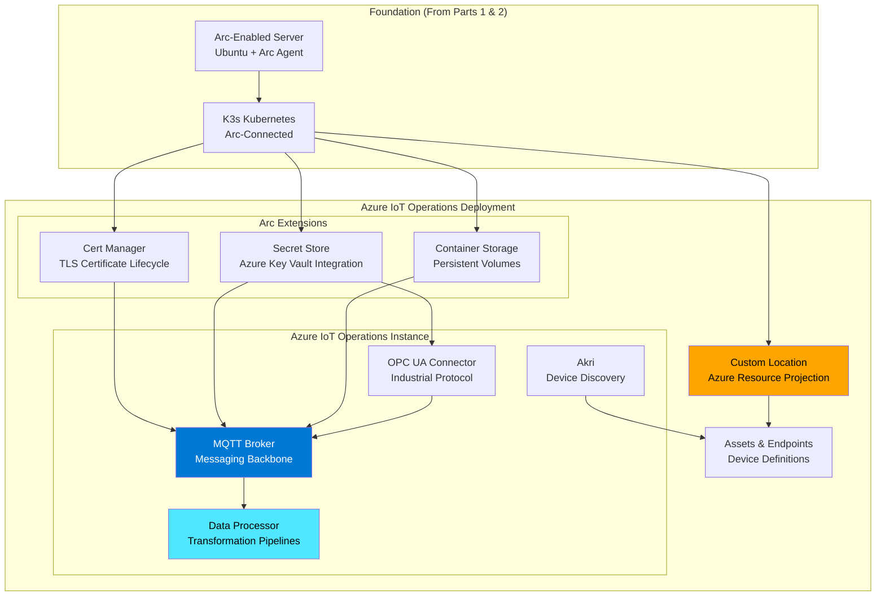
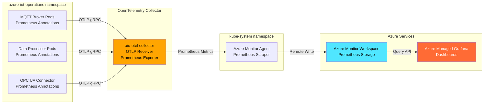

With your Arc-enabled K3s cluster operational and monitored, you're ready to deploy the heart of your edge infrastructure: **Azure IoT Operations**. This platform provides production-grade MQTT brokering, data transformation pipelines, and secure device connectivity—transforming your K3s cluster into a complete edge data platform.

If you completed [Part 1: Azure Arc Infrastructure](https://www.notion.so/439b8c4a958e4f6b9c159335ba96c10b) and [Part 2: K3s Deployment](https://www.notion.so/728ba96c7e6744e19c5294e44fe3ae81), you have a Kubernetes cluster with centralized Azure management, comprehensive monitoring, and workload identity configured. Now we'll deploy the Azure IoT Operations suite that enables industrial IoT scenarios at scale.

**What you'll learn:**

* Azure IoT Operations architecture and component model
* Prerequisites: Schema Registry, Key Vault, and Managed Identities
* Deployment via Azure Portal helper and Azure CLI
* MQTT broker configuration for production workloads
* OpenTelemetry and Prometheus observability integration
* Grafana dashboard deployment for operational monitoring
* Verification and troubleshooting strategies
## Understanding Azure IoT Operations: Deployments vs Instances

Before diving into deployment, it's important to understand two key concepts that Azure IoT Operations uses: **deployments** and **instances**.

### Deployment: The Complete Solution

An Azure IoT Operations **deployment** encompasses the full set of components and resources required for your edge solution:

* Azure IoT Operations Instance: The core platform services
* Arc Extensions: Kubernetes extensions for storage, certificates, and secret management
* Custom Locations: Azure resource abstraction for your edge cluster
* Solution Resources: Assets, asset endpoints, data flows, and connectors you configure
### Instance: The Core Platform

An Azure IoT Operations **instance** is the parent Azure resource that bundles the suite of services including:

* MQTT Broker: High-performance message broker with authentication and authorization
* Data Processor: Pipeline engine for telemetry transformation and routing
* Connector for OPC UA: Industrial protocol bridge for manufacturing systems
* Akri Services: Device discovery and management
* Schema Registry: Message schema validation and versioning
**Key Distinction**: When we talk about "deploying Azure IoT Operations," we mean creating the full *deployment*—all components working together. Once deployed, you manage and update the *instance* through Azure Portal or CLI.



This layered architecture ensures that IoT Operations integrates seamlessly with your existing Arc and K3s infrastructure while maintaining clear separation of concerns.

## Prerequisites

Azure IoT Operations has several Azure-side dependencies that must be configured before deployment. These prerequisites enable schema validation, secret management, and workload identity authentication.

### Why These Prerequisites Matter

**Storage Account with Schema Registry**: IoT solutions involve diverse data sources—sensors, PLCs, building management systems—each with different message formats. The schema registry provides centralized schema validation, versioning, and compatibility checking. This prevents data quality issues downstream and enables confident schema evolution.

**Azure Key Vault**: Edge deployments require numerous secrets: TLS certificates, API keys, connection strings for cloud services. Key Vault integration via managed identities ensures secrets never appear in cluster manifests or environment variables, meeting compliance requirements for industrial environments.

**Managed Identities**: Azure IoT Operations uses two separate managed identities following the principle of least privilege. One identity accesses Key Vault secrets, the other authenticates IoT Operations components to Azure services. This separation limits blast radius if an identity is compromised.

### Step 1: Create Storage Account for Schema Registry

Schema Registry requires an Azure Storage account with **hierarchical namespace** (Azure Data Lake Storage Gen2) and **public network access** enabled for the deployment process.

**Why Hierarchical Namespace?** Schema Registry organizes schemas in a folder-like structure with versioning. Standard blob storage uses a flat namespace, requiring complex naming schemes. Hierarchical namespace provides true directory semantics, simplifying schema management and enabling efficient queries.

```bash
# Set variables for your environment
RESOURCE_GROUP="p-we1iot"
LOCATION="westeurope"
STORAGE="pwe1iotstore"

# Create Storage Account with hierarchical namespace (ADLS Gen2)
az storage account create \
  --name "$STORAGE" \
  --resource-group "$RESOURCE_GROUP" \
  --location "$LOCATION" \
  --sku Standard_LRS \
  --kind StorageV2 \
  --enable-hierarchical-namespace true \
  --min-tls-version TLS1_2 \
  --allow-blob-public-access false \
  --tags 'Purpose=SchemaRegistry,Shared=true'
  
# Save the Storage Account Resource ID for later use
STORAGE_ID=$(az storage account show \
  --name "$STORAGE" \
  --resource-group "$RESOURCE_GROUP" \
  --query id -o tsv)

echo "Storage Account ID: $STORAGE_ID"
```

**Expected Output**: A fully qualified resource ID:

```javascript
/subscriptions/2ae5ef90-259a-4fd0-9b35-8611ffb26417/resourceGroups/p-we1iot/providers/Microsoft.Storage/storageAccounts/pwe1iotstore
```

**Configuration Explained**:

* --sku Standard_LRS: Locally redundant storage (sufficient for edge scenarios; upgrade to ZRS for production)
* --kind StorageV2: General-purpose v2 account (required for hierarchical namespace)
* --enable-hierarchical-namespace true: Enables ADLS Gen2 directory structure
* --min-tls-version TLS1_2: Enforces secure connections
* --allow-blob-public-access false: Prevents accidental public exposure
### Step 2: Create Schema Container

Create a dedicated container within the storage account to hold schema definitions.

```bash
SCHEMA_CONTAINER="schemas"

# Create the Schema Container
az storage container create \
  --name "$SCHEMA_CONTAINER" \
  --account-name "$STORAGE" \
  --auth-mode login
```

**Authentication Note**: `--auth-mode login` uses your Azure AD credentials rather than storage account keys, following zero-standing-privilege practices.

### Step 3: Create IoT Operations Namespace

The **IoT Operations Namespace** is a logical grouping for your Device Registry resources (assets, asset endpoints). It's separate from Kubernetes namespaces—think of it as an Azure resource container specifically for industrial asset definitions.

**Why a Separate Namespace?** In enterprise deployments, you might have multiple edge clusters (one per factory site) but want centralized asset management. The IoT Operations Namespace can span multiple clusters, enabling consistent asset definitions across your estate.

```bash
NAMESPACE="p-we1iot"

# Create the Namespace for Device Registry
az iot ops ns create \
  --name "$NAMESPACE" \
  --resource-group "$RESOURCE_GROUP" \
  --location "$LOCATION" \
  --tags 'Purpose=DeviceRegistry,Shared=true'
  
# Save the Namespace ID
NAMESPACE_ID=$(az iot ops ns show \
  --name "$NAMESPACE" \
  --resource-group "$RESOURCE_GROUP" \
  --query id -o tsv)

echo "Namespace ID: $NAMESPACE_ID"
```

### Step 4: Create Schema Registry

The Schema Registry provides centralized management and versioning of message schemas across your IoT deployment.

```bash
SCHEMA_REGISTRY="p-we1iot-schema"

# Create the Schema Registry linked to Namespace and Storage Container
az iot ops schema registry create \
  --name "$SCHEMA_REGISTRY" \
  --resource-group "$RESOURCE_GROUP" \
  --registry-namespace "$NAMESPACE" \
  --sa-resource-id "$STORAGE_ID" \
  --sa-container "$SCHEMA_CONTAINER" \
  --location "$LOCATION" \
  --tags 'Purpose=SchemaRegistry,Shared=true'
  
# Save the Schema Registry Resource ID
SCHEMA_REGISTRY_ID=$(az iot ops schema registry show \
  --name "$SCHEMA_REGISTRY" \
  --resource-group "$RESOURCE_GROUP" \
  --query id -o tsv)

echo "Schema Registry ID: $SCHEMA_REGISTRY_ID"
```

**What Just Happened**: The Schema Registry was created with a **system-assigned managed identity**. This identity needs permissions to read/write schemas to your storage account.

### Step 5: Grant Schema Registry Access to Storage

Delegate **Storage Blob Data Contributor** role to the Schema Registry's managed identity.

```bash
# Grant Storage Blob Data Contributor role to Schema Registry
az role assignment create \
  --assignee "$SCHEMA_REGISTRY_ID" \
  --role "Storage Blob Data Contributor" \
  --scope "$STORAGE_ID"
```

**Why This Role?** The Schema Registry needs to:

* Read existing schemas during validation
* Write new schema versions when you register schemas
* List schemas for discovery and versioning
`Storage Blob Data Contributor` provides these capabilities without granting access to storage account keys or configuration.

### Step 6: Create Azure Key Vault

Azure Key Vault stores secrets and certificates used by Azure IoT Operations workloads.

**What Gets Stored in Key Vault:**

* TLS certificates for MQTT broker listeners
* Connection strings for Azure services (Event Hubs, Service Bus)
* API keys for third-party integrations
* Passwords for OPC UA server connections
```bash
KEYVAULT="p-we1iot-kv"

# Create Key Vault with RBAC authorization
az keyvault create \
  --name "$KEYVAULT" \
  --resource-group "$RESOURCE_GROUP" \
  --location "$LOCATION" \
  --enable-rbac-authorization true \
  --public-network-access Enabled \
  --tags 'Purpose=Secrets,Shared=true'

# Save the Key Vault Resource ID
KEYVAULT_ID=$(az keyvault show --name "$KEYVAULT" --query id -o tsv)

echo "Key Vault ID: $KEYVAULT_ID"
```

**Configuration Explained**:

* --enable-rbac-authorization true: Uses Azure RBAC instead of legacy access policies (required for managed identity integration)
* --public-network-access Enabled: Required during deployment; you can restrict this post-deployment via Private Link
**Security Note**: With RBAC enabled, Key Vault uses Azure AD for authentication and Azure RBAC for authorization—providing audit logs, conditional access policies, and just-in-time access patterns.

### Step 7: Create Managed Identity for Secret Access

This **user-assigned managed identity** is used by the secret sync controller to fetch secrets from Key Vault and synchronize them to Kubernetes secrets.

**Why User-Assigned vs System-Assigned?** User-assigned identities can be shared across resources and have lifecycles independent of the resources using them. If you redeploy IoT Operations, the same identity and RBAC assignments remain valid—no reconfiguration needed.

```bash
SECRETS_IDENTITY="p-we1iot-secrets-mi"

# Create managed identity for Key Vault secret access
az identity create \
  --name "$SECRETS_IDENTITY" \
  --resource-group "$RESOURCE_GROUP" \
  --location "$LOCATION" \
  --tags 'Purpose=KeyVaultAccess,Shared=true'

# Retrieve all identity details we'll need
SECRETS_MI_RESOURCE_ID=$(az identity show \
  --name "$SECRETS_IDENTITY" \
  --resource-group "$RESOURCE_GROUP" \
  --query id -o tsv)

SECRETS_MI_PRINCIPAL_ID=$(az identity show \
  --name "$SECRETS_IDENTITY" \
  --resource-group "$RESOURCE_GROUP" \
  --query principalId -o tsv)

SECRETS_MI_CLIENT_ID=$(az identity show \
  --name "$SECRETS_IDENTITY" \
  --resource-group "$RESOURCE_GROUP" \
  --query clientId -o tsv)

echo "Secrets MI Resource ID: $SECRETS_MI_RESOURCE_ID"
echo "Secrets MI Principal ID: $SECRETS_MI_PRINCIPAL_ID"
echo "Secrets MI Client ID: $SECRETS_MI_CLIENT_ID"
```

### Step 8: Grant Key Vault Secrets Officer Role

Delegate **Key Vault Secrets Officer** permissions to the managed identity.

```bash
# Assign Key Vault Secrets Officer role
az role assignment create \
  --assignee "$SECRETS_MI_PRINCIPAL_ID" \
  --role "Key Vault Secrets Officer" \
  --scope "$KEYVAULT_ID"
```

**Role Capabilities**: `Key Vault Secrets Officer` can:

* Read secret values
* Create and update secrets
* Delete secrets
* Manage secret versions
This is broader than `Key Vault Secrets User` (read-only) but narrower than `Key Vault Administrator` (can modify access policies). It's the appropriate role for a secret synchronization service.

### Step 9: Create Managed Identity for IoT Operations Components

This second **user-assigned managed identity** is used by Azure IoT Operations components to authenticate to Azure services.

**What Uses This Identity?**

* Data Processor pipelines sending telemetry to Azure Event Hubs
* Connectors writing to Azure Data Explorer or Time Series Insights
* Asset endpoints authenticating to Azure Device Provisioning Service
```bash
IOTOPS_IDENTITY="p-we1iot-n013edge-mi"

# Create managed identity for IoT Operations components
az identity create \
  --name "$IOTOPS_IDENTITY" \
  --resource-group "$RESOURCE_GROUP" \
  --location "$LOCATION" \
  --tags 'Building=013,Purpose=IoTOperations'

# Retrieve all identity details
IOTOPS_MI_RESOURCE_ID=$(az identity show \
  --name "$IOTOPS_IDENTITY" \
  --resource-group "$RESOURCE_GROUP" \
  --query id -o tsv)

IOTOPS_MI_PRINCIPAL_ID=$(az identity show \
  --name "$IOTOPS_IDENTITY" \
  --resource-group "$RESOURCE_GROUP" \
  --query principalId -o tsv)

IOTOPS_MI_CLIENT_ID=$(az identity show \
  --name "$IOTOPS_IDENTITY" \
  --resource-group "$RESOURCE_GROUP" \
  --query clientId -o tsv)

echo "IoT Ops MI Resource ID: $IOTOPS_MI_RESOURCE_ID"
echo "IoT Ops MI Principal ID: $IOTOPS_MI_PRINCIPAL_ID"
echo "IoT Ops MI Client ID: $IOTOPS_MI_CLIENT_ID"
```

**Identity Separation Strategy**: By using separate identities for secrets vs. application authentication, you implement defense in depth. If a data processor pipeline is compromised, the attacker gains access to Event Hubs but not to your Key Vault secrets.

## Deployment Strategy: Portal Helper + Azure CLI

Azure provides a guided deployment experience through the Azure Portal that generates the exact Azure CLI commands needed for your environment. This hybrid approach combines ease of use (portal forms) with repeatability (CLI commands you can save to Git).

### Why Use the Portal Helper?

**Benefits of the Portal-Assisted Approach**:

* Configuration Validation: Portal catches missing prerequisites before generating commands
* Resource Discovery: Automatically finds your cluster, storage, and Key Vault
* Parameter Defaults: Suggests appropriate values based on your resources
* Reproducibility: Final step provides CLI commands to save for future deployments
**What You Won't Do in the Portal**: The portal doesn't actually deploy anything—it's a command generator. You execute the generated CLI commands from your terminal, giving you full visibility and control.

## Step-by-Step: Portal Configuration

### Step 1: Navigate to Azure IoT Operations

In the [Azure Portal](https://portal.azure.com/), search for and select **Azure IoT Operations**.


Click **Create** to begin the deployment helper.

### Step 2: Configure Basics

On the **Basics** tab, provide core deployment information:

  

**Custom Location Concept**: A custom location is an Azure resource type that represents your edge cluster as a deployment target. When you create Azure resources (like IoT Operations instances), you can target them to custom locations just like you would target VMs to an Azure region.

Click **Next: Configuration**.

### Step 3: Configure MQTT Broker and Data Flows

On the **Configuration** tab, tune the MQTT broker for your hardware and workload requirements.

  

**MQTT Broker Sizing Guidance**:

For the test environment in this series (4GB RAM, 2 cores), use the **tiny** memory profile:

* Memory Profile: tiny (256MB per replica)
* Frontend Replicas: 1 (MQTT listeners)
* Frontend Workers: 1 (connection handlers)
* Backend Partitions: 1 (message storage shards)
* Backend Workers: 1 (message processing threads)
* Backend Replication Factor: 2 (message durability)
**Production Scaling**: For production deployments with 16GB+ RAM:

* Memory Profile: medium (1GB) or high (4GB)
* Frontend Replicas: 2-3 (horizontal scaling for connections)
* Backend Partitions: 3-5 (distribute message volume)
* Backend Replication Factor: 2-3 (durability vs. resource tradeoff)
**Why These Settings Matter**: The MQTT broker uses a distributed architecture. Frontends handle client connections, backends store messages. Partitions distribute load, replication ensures durability. Under-provisioning causes message loss, over-provisioning wastes resources.

Click **Next: Dependency management**.

### Step 4: Configure Dependencies

On the **Dependency management** tab, link the prerequisites you created earlier.

### Schema Registry Configuration

1. Expand the Namespace dropdown and select p-we1iot (the namespace you created in Step 3).
1. The Schema Registry dropdown will be empty due to a known portal bug. Click Create New.


1. In the Add a new schema registry popup:
  * Schema registry name: pwe1iotstore (your storage account name)
  * Schema registry namespace: p-we1iot (your namespace)
  

1. Click Select Azure Storage Container, navigate to your storage account, and select the schemas container.


1. Click Save to return to the main form.
**Why This Bug Exists**: The portal attempts to query existing schema registries before loading the form, but the query times out if you have many resources. Creating "new" actually just links to your existing registry—the CLI commands will reference the correct resource ID.

### Security Configuration

Select **Secure settings** for production deployments (recommended).

  

**Test Settings vs. Secure Settings**:

* Test Settings: Uses Kubernetes secrets directly (no Key Vault). Acceptable for development environments with no compliance requirements.
* Secure Settings: Integrates Key Vault, meets compliance requirements (SOC 2, ISO 27001). Required for production.
**Key Vault Requirements**:

* Permission model must be Azure role-based access control (not legacy access policies)
* Your user account needs Key Vault Secrets Officer role to pre-populate secrets during deployment
* The managed identity you selected will get the same role automatically
Click **Next: Review + create**.

### Step 5: Review and Get CLI Commands

The **Review + create** tab displays all your configuration choices and provides the Azure CLI commands to execute.

**Do Not Click "Create"**: Instead, copy the CLI commands shown at the bottom of the page. These commands will:

1. Initialize the cluster for IoT Operations (install foundation extensions)
1. Deploy the IoT Operations instance
1. Enable secret synchronization
1. Assign the managed identity
Save these commands to a script file for repeatability.

## Execute Deployment: Azure CLI Commands

Now execute the generated commands in sequence from your terminal (where you have Azure CLI configured and authenticated).

### Step 1: Install and Upgrade Azure CLI Extension

Ensure you have the latest IoT Operations CLI extension.

```bash
# Upgrade Azure CLI to latest version
az upgrade

# Install/upgrade the Azure IoT Operations extension
az extension add --upgrade --name azure-iot-ops
```

### Step 2: Initialize the Cluster

The `az iot ops init` command prepares your cluster by installing foundation extensions.


> [!tip] 💡 
> The init command only needs to run once per cluster. If you previously deployed Azure IoT Operations 0.8.0 or later, skip this step.
```bash
CLUSTER_NAME="p-we1iot-n013edge"
RESOURCE_GROUP="p-we1iot"
LOCATION="westeurope"

# Initialize cluster for Azure IoT Operations
az iot ops init \
  --resource-group "$RESOURCE_GROUP" \
  --cluster "$CLUSTER_NAME"
```

**What This Installs**:

The command deploys two Arc extensions as Helm charts:

* cert-manager (v0.6.2): Automates TLS certificate lifecycle using Let's Encrypt or custom CA
* azure-secret-store (v1.0.2): Syncs secrets from Azure Key Vault to Kubernetes secrets
**Expected Output** (abbreviated):

```javascript
Azure IoT Operations
Workflow correlation Id: 35f310b8-c0d5-4660-8ae6-0abb5bd429bf

   Pre-Flight
     ✔ Ensure registered resource providers
     ✔ Enumerate pre-flight checks
-> Enablement
     ✔ What-If evaluation
     * Install foundation layer
       • certManager: 0.6.2 stable
       • secretStore: 1.0.2 stable

⠏ Done. ━━━━━━━━━━━━━━━━━━━━━━━━━━━━━━━━━━━━━━━━   Elapsed: 0:07:57

p-we1iot-n013edge
└── extensions
    ├── azure-secret-store
    └── cert-manager
```

**Installation Time**: 7-10 minutes. The command shows real-time progress. You can watch the extensions deploy in a separate terminal:

```bash
# Watch extension installation progress
kubectl get pods -n cert-manager -w
kubectl get pods -n azure-secret-store -w
```

### Step 3: Deploy Azure IoT Operations

The `az iot ops create` command deploys the complete IoT Operations instance including MQTT broker, data processor, and connectors.

**Command Breakdown**: The command below includes all parameters from the portal helper plus optional observability configuration. If you enabled Azure Monitor in Part 2, include the `--ops-config` flags for metrics integration.

```bash
# Set variable for reusability
CLUSTER_NAME="p-we1iot-n013edge"

# Deploy IoT Operations
az iot ops create \
  --name "$CLUSTER_NAME" \
  --cluster "$CLUSTER_NAME" \
  --resource-group "$RESOURCE_GROUP" \
  --sr-resource-id "$SCHEMA_REGISTRY_ID" \
  --ns-resource-id "$NAMESPACE_ID" \
  --broker-mem-profile tiny \
  --broker-frontend-replicas 1 \
  --broker-frontend-workers 1 \
  --broker-backend-part 1 \
  --broker-backend-workers 1 \
  --broker-backend-rf 2 \
  --ops-config secure \
  --add-insecure-listener true \
  --subscription 2ae5ef90-259a-4fd0-9b35-8611ffb26417 \
  --custom-location t-we1iot-n013edge-cl-1097 \
  --ops-config observability.metrics.openTelemetryCollectorAddress=aio-otel-collector.azure-iot-operations.svc.cluster.local:4317 \
  --ops-config observability.metrics.exportInternalSeconds=60
```

**Parameter Explanation**:

  **Expected Installation Progress**:

```javascript
Azure IoT Operations
Workflow correlation Id: cdfef77a-7923-4553-8215-5ccef5febe72

   Pre-Flight
     ✔ Ensure registered resource providers
     ✔ Enumerate pre-flight checks
-> Deploy IoT Operations
       v1.2.112 stable
     * Create instance p-we1iot-n013edge
     - Apply default resources

    ⠸ Done. ━━━━━━━━━━━━━━━━━━━━━━━━━━━━━━━━━━━━━━━━   Elapsed: 0:12:30
    
p-we1iot-n013edge
├── extensions
│   ├── azure-iot-operations-iwy2n
│   ├── azure-secret-store
│   └── cert-manager
└── customLocations
    └── t-we1iot-n013edge-cl-1097
        └── resources
            └── p-we1iot-n013edge
```

**Installation Time**: 20-30 minutes. This is the longest operation in the deployment process.

**What Gets Deployed**:

* Arc Extension: azure-iot-operations Helm chart with all platform services
* Kubernetes Resources: Deployments, StatefulSets, Services, ConfigMaps in azure-iot-operations namespace
* Custom Location: Azure resource representing your cluster as a deployment target
* IoT Operations Instance: Parent Azure resource for management
**Monitor Deployment Progress** (separate terminal):

```bash
# Watch IoT Operations pods come online
kubectl get pods -n azure-iot-operations -w

# Check all resources in the namespace
kubectl get all -n azure-iot-operations
```

**Expected Pods** (abbreviated list):

* aio-broker-*: MQTT broker components
* aio-dataprocessor-*: Data transformation pipelines
* aio-opc-*: OPC UA connector
* aio-akri-*: Device discovery
### Step 4: Enable Secret Synchronization

The `az iot ops secretsync enable` command configures the secret sync controller to fetch secrets from Key Vault.

**What This Does**:

1. Creates a federated identity credential linking the Kubernetes service account to your managed identity
1. Adds Key Vault Secrets Officer role assignment to the managed identity
1. Deploys a secret provider class that defines which Key Vault and identity to use
```bash
# Enable secret sync for IoT Operations
az iot ops secretsync enable \
  --instance "$CLUSTER_NAME" \
  --resource-group "$RESOURCE_GROUP" \
  --kv-resource-id "$KEYVAULT_ID" \
  --mi-user-assigned "$SECRETS_MI_RESOURCE_ID"
```

**Expected Output**:

```json
{
  "extendedLocation": {
    "name": "/subscriptions/.../customLocations/t-we1iot-n013edge-cl-1097",
    "type": "CustomLocation"
  },
  "id": "/subscriptions/.../azureKeyVaultSecretProviderClasses/spc-ops-4f74e85",
  "name": "spc-ops-4f74e85",
  "properties": {
    "clientId": "61a254cf-6abb-4860-8d78-e0053c782d46",
    "keyvaultName": "p-we1iot-kv",
    "provisioningState": "Succeeded",
    "tenantId": "7d918dfe-bd63-478b-b8b3-2f252b011527"
  },
  "type": "microsoft.secretsynccontroller/azurekeyvaultsecretproviderclasses"
}
```

**How Secret Sync Works**:

1. Workload requests a secret via Kubernetes secret reference
1. Secret sync controller intercepts the request
1. Controller uses managed identity to authenticate to Key Vault
1. Secret value retrieved and synchronized to Kubernetes secret
1. Workload receives secret value transparently
**Security Benefit**: Secrets never exist in cluster configuration. They're fetched just-in-time and can be rotated in Key Vault without redeploying workloads.

### Step 5: Assign Managed Identity to IoT Operations

The final command associates the IoT Operations managed identity with the instance, enabling components to authenticate to Azure services.

```bash
# Assign IoT Operations managed identity
az iot ops identity assign \
  --name "$CLUSTER_NAME" \
  --resource-group "$RESOURCE_GROUP" \
  --mi-user-assigned "$IOTOPS_MI_RESOURCE_ID"
```

**What This Configures**:

1. Creates federated identity credential using your cluster's OIDC issuer
1. Links IoT Operations service account (aio-opc-ua-broker-opcua-app) to the managed identity
1. Enables workload identity authentication for all IoT Operations components
**Expected Output**:

```json
{
  "identity": {
    "type": "UserAssigned",
    "userAssignedIdentities": {
      "/subscriptions/.../p-we1iot-n013edge-mi": {
        "clientId": "37a6d03f-6fd0-4dbd-9bdb-0f35bfa2b04e",
        "principalId": "d58d9e9b-0a90-4f6c-98c5-638c5b9abe5d"
      }
    }
  },
  "properties": {
    "provisioningState": "Succeeded",
    "version": "1.2.112"
  }
}
```

**Workload Identity in Action**: When a data flow pipeline sends telemetry to Event Hubs:

1. Pipeline pod has service account with federated identity
1. Pod requests Azure AD token using workload identity
1. Azure AD validates the K8s service account token via OIDC issuer
1. Azure AD issues access token for Event Hubs
1. Pipeline authenticates to Event Hubs with the access token
No secrets involved—the authentication is based on cryptographic proof that the workload is running in your authorized cluster.

## Verify Deployment

With all components deployed, run comprehensive health checks to validate the installation.

### Step 1: Azure CLI Health Check

The `az iot ops check` command evaluates your deployment for health, configuration, and usability issues.

```bash
# Run comprehensive broker health check
az iot ops check --svc broker --detail-level 2
```

**What This Checks**:

* MQTT Broker API resources are registered
* Broker pods are running and healthy
* Listeners are configured correctly
* Authentication and authorization are enabled
* Services have appropriate endpoints
* TLS certificates are valid
**Expected Output** (abbreviated):

```javascript
──────────────────────────── Evaluation for {broker} service deployment ────────────────────────────

Post deployment checks ─────────────────────────────────────────────────────────────────────────────

    ✔ Enumerate MQTT Broker API resources
    
      ✔ mqttbroker.iotoperations.azure.com/v1 API resources
            Broker
            BrokerAuthentication
            BrokerListener
            BrokerAuthorization

    ✔ Evaluate MQTT Brokers
    
      ✔ MQTT Brokers in namespace {azure-iot-operations}
        - Expecting 1 broker resource per namespace. Detected 1.
        
        - Broker {default}
            Status:
                Provisioning Status {Succeeded}
                Health Status {Available}
                
            Cardinality
                - Expecting backend partitions >=1. Actual 1.
                - Expecting backend redundancy factor >=1. Actual 2.
                - Expecting backend workers >=1. Actual 1.
                - Expecting frontend replicas >=1. Actual 1.

    ✔ Evaluate MQTT Broker Listeners
    
      ✔ Broker Listeners in namespace {azure-iot-operations}
        - Expecting >=1 broker listeners per namespace. Detected 2.
        
        - Broker Listener {default} (Port 18883, TLS enabled)
        - Broker Listener {default-insecure} (Port 1883, no TLS)

╭─────── Check Summary ───────╮
│ 25 check(s) succeeded.      │
│ 0 check(s) raised warnings. │
│ 0 check(s) raised errors.   │
│ 4 check(s) were skipped.    │
╰─────────────────────────────╯
```

**Interpreting Results**:

* All checks succeeded: Deployment is healthy, proceed to testing MQTT connectivity
* Warnings: Non-critical issues (e.g., missing optional configuration)
* Errors: Critical issues preventing operation (investigate immediately)
### Step 2: Kubernetes Resource Verification

Verify all pods are running and stable.

```bash
# Check all IoT Operations pods
kubectl -n azure-iot-operations get pods -l app.kubernetes.io/name=microsoft-iotoperations-mqttbroker -o wide

# Verify StatefulSets (broker backends)
kubectl -n azure-iot-operations get sts | grep broker

# Verify Deployments (broker frontends, data processor)
kubectl -n azure-iot-operations get deploy | grep broker

# Check Persistent Volume Claims (backend storage)
kubectl -n azure-iot-operations get pvc | grep broker
```

**Expected Pod States**:

* aio-broker-frontend-0: Running with 1/1 ready containers
* aio-broker-backend-1-0: Running with 1/1 ready containers
* aio-broker-backend-1-1: Running with 1/1 ready containers (replication)
* aio-broker-authentication-0: Running with 1/1 ready containers
* aio-broker-diagnostics-service-0: Running with 1/1 ready containers
* aio-broker-operator-0: Running with 1/1 ready containers
**All PVCs should show **`**Bound**`** status**. If PVCs are `Pending`, check your K3s local-path storage provisioner:

```bash
kubectl get storageclass
kubectl describe pvc <pvc-name> -n azure-iot-operations
```

### Step 3: Check Broker Logs

Inspect broker logs for errors or warnings.

```bash
# Backend pods (adjust names if different)
kubectl -n azure-iot-operations logs aio-broker-backend-1-0 -c broker
kubectl -n azure-iot-operations logs aio-broker-backend-1-1 -c broker

# Frontend pod
kubectl -n azure-iot-operations logs aio-broker-frontend-0 -c broker
```

**Healthy Logs Should Show**:

* Successful startup sequence
* Listener binding on ports 1883 and 18883
* Backend replication established
* No error messages about storage, authentication, or connectivity
**Common Issues**:

* OutOfMemory errors: Increase --broker-mem-profile
* CrashLoopBackOff: Check PVC binding and resource constraints
* Certificate errors: Verify cert-manager is running
### Step 4: Verify MQTT Broker Services

Check that Kubernetes services expose the MQTT broker.

```bash
# List all broker services
kubectl get svc -n azure-iot-operations | grep broker
```

**Expected Services**:

  **LoadBalancer IP**: On K3s, the `aio-broker-insecure` service should show your node's IP address as the external IP. This makes the broker accessible outside the cluster for testing.

**Testing MQTT Connectivity** (from another machine):

```bash
# Install mosquitto MQTT client
sudo apt install mosquitto-clients -y

# Test insecure listener (port 1883)
mosquitto_pub -h 10.13.100.11 -p 1883 -t "test/topic" -m "Hello from IoT Operations"

# Subscribe to verify message routing
mosquitto_sub -h 10.13.100.11 -p 1883 -t "test/topic"
```

**Expected Result**: Subscriber receives the published message. If not, check firewall rules and listener configuration.

### Step 5: Check Node Resources

Ensure your node isn't under resource pressure.

```bash
# Check node conditions and resource allocation
kubectl describe node n013edge | egrep -i 'memory pressure|disk pressure|Allocated resources|Non-terminated'
```

**Warning Signs**:

* MemoryPressure: True: Node is running out of memory (may evict pods)
* DiskPressure: True: Node is running out of disk space (may evict pods)
* Allocated resources close to Allocatable: Node is at capacity
**If Under Resource Pressure**:

1. Reduce broker memory profile: az iot ops update --broker-mem-profile tiny
1. Reduce frontend replicas: --broker-frontend-replicas 1
1. Scale down unneeded workloads
1. Upgrade node hardware (see Part 1 capacity planning)
## Configure Observability

Production IoT Operations deployments require comprehensive monitoring. This section integrates OpenTelemetry for metrics collection, Prometheus for storage, and Grafana for visualization—extending the observability foundation from Part 2.

### Architecture: Metrics Flow



**Why This Architecture?**

* OpenTelemetry Collector: Acts as a metrics aggregation layer. IoT Operations components export metrics via OTLP (OpenTelemetry Protocol), and the collector converts them to Prometheus format.
* Azure Monitor Agent: Scrapes the Prometheus endpoint exposed by the OTel collector and forwards metrics to Azure Monitor Workspace.
* Azure Monitor Workspace: Managed Prometheus storage—no server maintenance, automatic scaling, 18-month retention.
* Azure Managed Grafana: Pre-integrated with Azure Monitor Workspace, with built-in dashboards for Arc and IoT Operations.
### Step 1: Deploy OpenTelemetry Collector

The OpenTelemetry collector receives metrics from IoT Operations components and exposes them in Prometheus format.

**Create Configuration File**:

Save this as `opentelemetry-values.yaml` on your edge server:

```yaml
mode: deployment
fullnameOverride: aio-otel-collector
image:
  repository: otel/opentelemetry-collector
  tag: 0.107.0

config:
  receivers:
    otlp:
      protocols:
        grpc:
          endpoint: ":4317"
        http:
          endpoint: ":4318"
    jaeger: null
    prometheus: null
    zipkin: null

  processors:
    memory_limiter:
      limit_percentage: 80
      spike_limit_percentage: 10
      check_interval: 60s

  exporters:
    prometheus:
      endpoint: ":8889"
      resource_to_telemetry_conversion:
        enabled: true
      add_metric_suffixes: false

  extensions:
    health_check: {}
    memory_ballast:
      size_mib: 0

  service:
    extensions: [health_check]
    pipelines:
      metrics:
        receivers: [otlp]
        exporters: [prometheus]
      logs: null
      traces: null
    telemetry:
      metrics:
        address: "" # Disable legacy internal Prometheus endpoints

resources:
  limits:
    cpu: '100m'
    memory: '512Mi'

ports:
  metrics:
    enabled: true
    containerPort: 8888
    servicePort: 8888
    protocol: 'TCP'
  jaeger-compact:
    enabled: false
  jaeger-grpc:
    enabled: false
  jaeger-thrift:
    enabled: false
  zipkin:
    enabled: false
```

**Configuration Explained**:

* Receivers: Accept OTLP metrics on gRPC (4317) and HTTP (4318)
* Processors: Memory limiter prevents OOM by dropping metrics under pressure
* Exporters: Prometheus exporter on port 8889 for Azure Monitor Agent to scrape
* Resource Limits: 100m CPU, 512Mi memory (adjust based on node capacity)
**Add Helm Repository**:

```bash
# Add OpenTelemetry Helm repo
helm repo add open-telemetry https://open-telemetry.github.io/opentelemetry-helm-charts

# Update repo to get latest charts
helm repo update
```

**Deploy the Collector**:

```bash
# Install OpenTelemetry Collector using Helm
helm upgrade --install aio-observability \
  open-telemetry/opentelemetry-collector \
  -f opentelemetry-values.yaml \
  --namespace azure-iot-operations
```

**Expected Output**:

```javascript
Release "aio-observability" does not exist. Installing it now.
NAME: aio-observability
LAST DEPLOYED: Thu Nov 20 23:02:31 2025
NAMESPACE: azure-iot-operations
STATUS: deployed
REVISION: 1
```

### Step 2: Verify OpenTelemetry Deployment

Confirm the collector is running and accepting metrics.

```bash
# Wait for deployment to be ready
kubectl wait --for=condition=available --timeout=120s \
  deployment/aio-otel-collector \
  -n azure-iot-operations
  
# Check pods
kubectl get pods -n azure-iot-operations -l app.kubernetes.io/name=opentelemetry-collector

# Verify service
kubectl get svc -n azure-iot-operations -l app.kubernetes.io/name=opentelemetry-collector

# Check logs for errors
kubectl logs -n azure-iot-operations deployment/aio-otel-collector
```

**Expected Pod Output**:

```javascript
NAME                                  READY   STATUS    RESTARTS   AGE
aio-otel-collector-6779988db9-x5j7m   1/1     Running   0          2m
```

**Expected Service Output**:

```javascript
NAME                 TYPE        CLUSTER-IP     EXTERNAL-IP   PORT(S)                      AGE
aio-otel-collector   ClusterIP   10.43.112.19   <none>        8888/TCP,4317/TCP,4318/TCP   2m
```

**Healthy Logs Show**:

```javascript
2025-11-20T23:02:42.641Z info service@v0.107.0/service.go:221 Everything is ready. Begin running and processing data.
```

**Collector Endpoints**:

* OTLP gRPC: aio-otel-collector.azure-iot-operations.svc.cluster.local:4317
* OTLP HTTP: aio-otel-collector.azure-iot-operations.svc.cluster.local:4318
* Prometheus: aio-otel-collector.azure-iot-operations.svc.cluster.local:8889
### Step 3: Configure Prometheus Scraping

Azure Monitor Agent needs a ConfigMap telling it to scrape the OpenTelemetry collector and IoT Operations pods.

**Create Prometheus ConfigMap**:

Save this as `ama-metrics-prometheus-config.yaml`:

```yaml
apiVersion: v1
data:
  prometheus-config: |2-
    scrape_configs:
      - job_name: otel
        scrape_interval: 1m
        static_configs:
          - targets:
            - aio-otel-collector.azure-iot-operations.svc.cluster.local:8889
      - job_name: aio-annotated-pod-metrics
        kubernetes_sd_configs:
          - role: pod
        relabel_configs:
          - action: drop
            regex: true
            source_labels:
              - __meta_kubernetes_pod_container_init
          - action: keep
            regex: true
            source_labels:
              - __meta_kubernetes_pod_annotation_prometheus_io_scrape
          - action: replace
            regex: ([^:]+)(?::\\d+)?;(\\d+)
            replacement: $1:$2
            source_labels:
              - __address__
              - __meta_kubernetes_pod_annotation_prometheus_io_port
            target_label: __address__
          - action: replace
            source_labels:
              - __meta_kubernetes_namespace
            target_label: kubernetes_namespace
          - action: keep
            regex: 'azure-iot-operations'
            source_labels:
              - kubernetes_namespace
        scrape_interval: 1m
kind: ConfigMap
metadata:
  name: ama-metrics-prometheus-config
  namespace: kube-system
```

**Configuration Explained**:

**Job 1: otel**

* Scrapes the OpenTelemetry collector's Prometheus endpoint
* Collects aggregated metrics from all IoT Operations components
**Job 2: aio-annotated-pod-metrics**

* Discovers pods in azure-iot-operations namespace
* Filters for pods with prometheus.io/scrape: "true" annotation
* Uses prometheus.io/port annotation for scrape port
* Enables collection from individual pods if needed
**Apply the ConfigMap**:

```bash
# Apply Prometheus scrape configuration
kubectl apply -f ama-metrics-prometheus-config.yaml
```

**Verify ConfigMap**:

```bash
# Check ConfigMap was created
kubectl get configmap ama-metrics-prometheus-config -n kube-system

# Inspect contents
kubectl describe configmap ama-metrics-prometheus-config -n kube-system
```

### Step 4: Verify Prometheus Collection

Confirm Azure Monitor Agent is scraping metrics.

```bash
# Check Azure Monitor Agent pods
kubectl get pods -n kube-system | grep ama-metrics

# View agent logs (look for scrape targets)
kubectl logs -n kube-system deployment/ama-metrics --tail=50
```

**Expected Log Entries**:

```javascript
2025/11/20 21:11:09 config::Using scrape settings for prometheuscollectorhealth: false
2025/11/20 21:11:09 config::Using scrape settings for windowsexporter: false
2025/11/20 21:11:09 Successfully loaded and validated prometheus config
```

**Testing Metric Flow** (from Azure Portal):

1. Navigate to Azure Monitor Workspace → Prometheus Explorer
1. Run query: aio_broker_messages_received_total
1. Should return data within 5 minutes of first MQTT message
If no data appears:

* Check OTel collector logs for connection errors
* Verify Azure Monitor Agent can reach OTel service
* Confirm firewall rules allow outbound to Azure Monitor endpoints
### Step 5: Deploy Grafana Dashboards

Azure IoT Operations provides sample dashboards for operational monitoring.

**Clone Sample Dashboard**:

```bash
# Clone Azure IoT Operations repository
git clone https://github.com/Azure/azure-iot-operations.git

# Navigate to dashboard samples
cd azure-iot-operations/samples/grafana-dashboard
```

**Upload to Azure Managed Grafana**:

1. Navigate to Azure Portal → Your Grafana Instance → Endpoint (opens Grafana)
1. Click + icon (left sidebar) → Import dashboard
1. Browse to azure-iot-operations/samples/grafana-dashboard/aio.sample.json
1. Select your Azure Monitor Workspace data source when prompted
1. Click Import


**Dashboard Sections**:

The sample dashboard provides:

* MQTT Broker Health: Connection count, message rate, error rate
* Data Processor Pipelines: Pipeline throughput, transformation latency
* OPC UA Connector: Connected servers, tag read rate
* Resource Utilization: CPU, memory, disk I/O per component
* Error Tracking: Failed operations, authentication errors


**Customization Tips**:

* Clone the dashboard before editing (preserves original)
* Add panels for your specific metrics (e.g., custom device types)
* Set up alert rules for SLO violations (covered in Part 1's SRE monitoring section)
## Azure IoT Operations Experience Portal

The **IoT Operations Experience Portal** provides a web-based management interface for assets, data flows, and edge deployments.

**Access the Portal**: Navigate to [iotoperations.azure.com](http://iotoperations.azure.com/)


### Operations Sites View

The **Sites** view shows all your deployed edge clusters with IoT Operations instances.


**What You'll See**:

* Site Name: Your cluster custom location name
* Status: Connected, Disconnected, or Degraded
* Version: Installed IoT Operations version
* Last Sync: When the site last reported telemetry
* Asset Count: Number of registered assets
### Cluster Details

Click on a site to view detailed information:


**Available Tabs**:

1. Overview: High-level health, version info, deployed components
1. Assets: Industrial assets (devices, machines, production lines)
1. Asset Endpoints: Connection definitions for asset protocols (OPC UA, Modbus, MQTT)
1. Data Flows: Transformation pipelines routing data from assets to cloud
1. Schemas: Registered message schemas for validation
1. Diagnostics: Logs, events, and troubleshooting tools
**Key Use Cases**:

* Register new assets discovered by Akri
* Create data flows to Azure Event Hubs or Data Explorer
* Monitor asset connectivity status
* Troubleshoot OPC UA connection issues
* Version management and upgrades
## Production Readiness Checklist

Before moving to Part 4 (MQTT and Azure MQ), validate your deployment:

### ✅ Core Components

- [ ] Azure IoT Operations instance shows Succeeded provisioning state
- [ ] All broker pods are Running with no restarts
- [ ] MQTT listeners on ports 1883 and 18883 are accessible
- [ ] OPC UA connector pods are Running
- [ ] Data processor deployment is Running
### ✅ Dependencies

- [ ] Schema Registry connected to storage account
- [ ] Key Vault integration working (secrets sync enabled)
- [ ] Managed identities assigned to IoT Operations
- [ ] Cert-manager issuing certificates successfully
### ✅ Observability

- [ ] OpenTelemetry collector receiving metrics
- [ ] Azure Monitor Agent scraping Prometheus endpoints
- [ ] Metrics flowing to Azure Monitor Workspace
- [ ] Grafana dashboards displaying data
- [ ] IoT Operations Experience Portal showing site as Connected
### ✅ Security

- [ ] Test MQTT authentication (reject unauthorized connections)
- [ ] Verify TLS certificates are valid and auto-renewing
- [ ] Confirm secrets are synchronized from Key Vault
- [ ] Validate workload identity is functioning (check pod logs for Azure auth)
### ✅ Performance

- [ ] No nodes under MemoryPressure or DiskPressure
- [ ] Broker pods not exceeding resource limits
- [ ] Message latency is acceptable for your use case (<100ms for industrial scenarios)
## Troubleshooting Common Issues

### Issue: Broker Pods Stuck in Pending

**Symptoms**: `aio-broker-backend-*` pods show `Pending` status.

**Root Cause**: PersistentVolumeClaim (PVC) not bound—K3s local-path provisioner issue.

**Resolution**:

```bash
# Check PVC status
kubectl get pvc -n azure-iot-operations | grep broker

# If PVCs are pending, check storage class
kubectl get storageclass

# Ensure local-path is default
kubectl patch storageclass local-path -p '{"metadata": {"annotations":{"storageclass.kubernetes.io/is-default-class":"true"}}}'

# Delete pending PVCs (they'll be recreated)
kubectl delete pvc -n azure-iot-operations <pvc-name>

# Restart broker operator to retry
kubectl rollout restart statefulset aio-broker-backend-1 -n azure-iot-operations
```

### Issue: MQTT Connections Refused

**Symptoms**: Clients cannot connect to port 1883 or 18883.

**Root Cause**: Service not exposed, firewall blocking, or authentication failure.

**Resolution**:

```bash
# Verify services are running
kubectl get svc -n azure-iot-operations | grep broker

# Check LoadBalancer IP was assigned
kubectl describe svc aio-broker-insecure -n azure-iot-operations

# Test connectivity from cluster
kubectl run -it --rm mqtt-test --image=eclipse-mosquitto --restart=Never -- \
  mosquitto_pub -h aio-broker -p 1883 -t "test/topic" -m "test"

# If above works but external connections fail, check firewall
sudo ufw status
sudo ufw allow 1883/tcp
```

### Issue: Metrics Not Appearing in Grafana

**Symptoms**: Grafana dashboards show "No Data" after 15 minutes.

**Root Cause**: OpenTelemetry collector not receiving metrics, or Azure Monitor Agent not scraping.

**Resolution**:

```bash
# Check OTel collector is receiving data
kubectl port-forward -n azure-iot-operations svc/aio-otel-collector 8889:8889
curl http://localhost:8889/metrics

# Should return Prometheus-formatted metrics. If empty:
# 1. Check IoT Operations pods have correct observability config
kubectl get configmap -n azure-iot-operations | grep observability

# 2. Verify pods are sending to correct endpoint
kubectl logs -n azure-iot-operations deployment/aio-broker-operator | grep otel

# Check Azure Monitor Agent is scraping
kubectl logs -n kube-system deployment/ama-metrics | grep "otel"

# Should show scrape target discovered. If not, reapply ConfigMap:
kubectl delete configmap ama-metrics-prometheus-config -n kube-system
kubectl apply -f ama-metrics-prometheus-config.yaml
kubectl rollout restart deployment ama-metrics -n kube-system
```

### Issue: Secret Sync Failures

**Symptoms**: Pods fail to start with errors about missing secrets.

**Root Cause**: Managed identity doesn't have Key Vault access, or federated credential not configured.

**Resolution**:

```bash
# Verify secret provider class exists
kubectl get secretproviderclass -n azure-iot-operations

# Check managed identity has Key Vault role
az role assignment list \
  --assignee "$SECRETS_MI_PRINCIPAL_ID" \
  --scope "$KEYVAULT_ID" \
  --query "[?roleDefinitionName=='Key Vault Secrets Officer']"

# If empty, re-run:
az iot ops secretsync enable \
  --instance "$CLUSTER_NAME" \
  --resource-group "$RESOURCE_GROUP" \
  --kv-resource-id "$KEYVAULT_ID" \
  --mi-user-assigned "$SECRETS_MI_RESOURCE_ID"

# Check federated credential was created
az identity federated-credential list \
  --identity-name "$SECRETS_IDENTITY" \
  --resource-group "$RESOURCE_GROUP"
```

## Next Steps: MQTT Applications and Data Flows

With Azure IoT Operations deployed and healthy, you now have a production-grade MQTT broker and data processing platform at the edge. The upcoming posts in this series will build on this foundation:

**Part 4: MQTT and Azure MQ Server** (Next Post)

* Deep dive into MQTT broker architecture
* Authentication strategies (X.509 certificates, SAT tokens)
* Authorization policies for industrial scenarios
* Quality of Service (QoS) configuration
* MQTT v5 features for edge applications
**Part 5: Sungrow Data Logger - Bridge Modbus to MQTT**

* Modbus TCP device integration
* Protocol translation using Node-RED
* Publish solar inverter telemetry to MQTT
* Implement change detection and throttling
**Part 6: Azure IoT Operations - Data Flows**

* Create transformation pipelines
* Route telemetry to Azure Event Hubs
* Schema validation and enrichment
* Error handling and dead-letter queues
**Part 7: **[**Node-RED on K3s for IoT Edge**](https://www.notion.so/2afeb56ea1c380bab1c4f10c56fd7533)

* Deploy Node-RED as edge application
* Integrate with MQTT broker
* Build data collection flows
* Persistent state management
## Key Takeaways

**What You've Accomplished**:

1. ✅ Deployed complete Azure IoT Operations suite including MQTT broker, data processor, and OPC UA connector
1. ✅ Configured secure authentication via Azure Key Vault and workload identity
1. ✅ Integrated observability with OpenTelemetry, Prometheus, and Grafana
1. ✅ Validated deployment health and verified MQTT connectivity
1. ✅ Established foundation for industrial IoT scenarios
**Critical Success Factors**:

* Separation of Concerns: Secret management, application identity, and schema registry are independent—enabling modular upgrades and troubleshooting
* Cloud-Native Patterns: Workload identity, managed identities, and GitOps-ready architecture
* Production Observability: Full metrics pipeline from edge components to Azure-managed dashboards
* Security by Default: TLS-enabled listeners, RBAC authorization, Key Vault integration
**Series Progress**: You now have the complete platform stack:

* Part 1: Arc-enabled server infrastructure ✅
* Part 2: Arc-connected K3s cluster ✅
* Part 3: Azure IoT Operations platform ✅
* Parts 4-9: Application layer (MQTT, protocols, data flows, analytics)
## Additional Resources

**Azure IoT Operations Documentation**:

* What is Azure IoT Operations?
* MQTT Broker Configuration
* Data Processor Pipelines
* OPC UA Connector
**Schema Registry & Key Vault**:

* Schema Registry Overview
* Secret Synchronization
**Observability & Monitoring**:

* Configure Observability
* Grafana Dashboards
* OpenTelemetry Collector
**Questions or issues?** Share your experience in the comments. If this guide helped you deploy Azure IoT Operations at scale, share it with your team!

**Up next**: We'll dive deep into MQTT broker configuration, authentication strategies, and building your first industrial IoT data flows.

