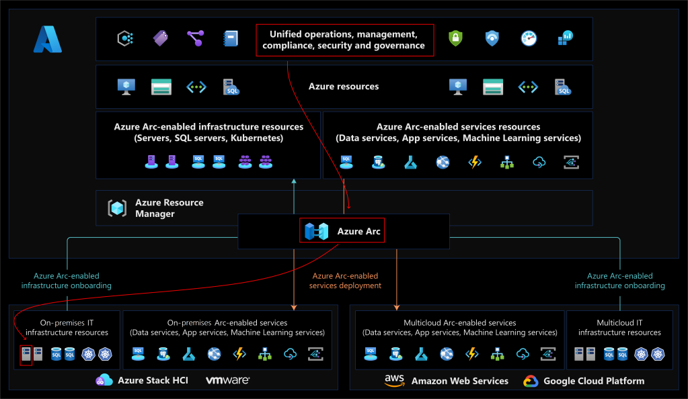
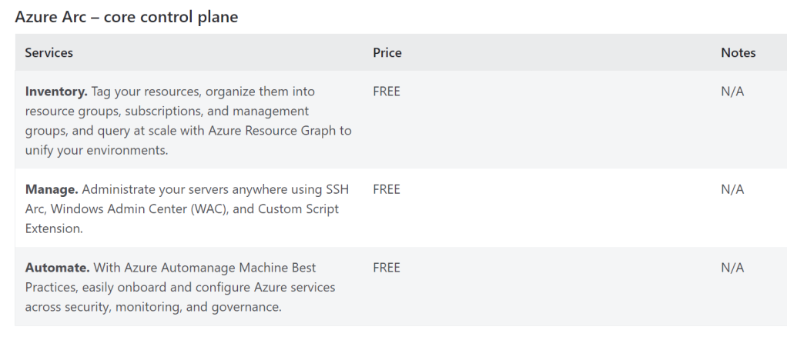

Azure Arc enables you to extend Azure management capabilities to hybrid environments, including on-premises datacenters and third-party cloud providers. You can use Azure Arc to manage and configure your Windows and Linux server machines and Kubernetes clusters that are hosted outside of Azure. You can also use Azure Arc to introduce Azure data services to hybrid environments.



Azure Arc-enabled servers lets you manage Windows and Linux physical servers and virtual machines hosted outside of Azure, on your corporate network, or other cloud provider.



## Getting started

Starting from an Ubuntu server, which has be Arc Enabled, we can use this as a base for the Azure IoT Operations.

1. Arc Enabled Ubuntu Server
### Edge Hardware

For the initial environment I am running a VM on KVM, with 2 core process and 4Gb of RAM. The operating system I am implementing is Ubuntu 22.04 LTS Server, with SSH enabled for access. I have no additional packages installed at this point. This system will be our new Edge Server. 

### Azure Arc

In the Azure Portal, navigate to **Azure Arc** and expand the **Azure Arc resources** where we will select the node **Machines**. From the View, we can now select the option **Add/Create **to present a drop down list, where we can choose the **Add a machine**


We will select from the presented list of choices the appropriate option, in this scenarion, I am selecting **Add a single server**


The presented Form, permits us to select the Subscription and target resource group which will host the ARC resources, identify the region for the resources, and the operating system we are connecting, Linux in this case. The communication flow from the Edge machine to Azure we will use the Public Endpoint initially.


The next page of the Wizard allows to define tags which we will use to organise the resources, 


And then finally, we are offered the script which we are to run on our edge system.


This is the generated script

```bash
export subscriptionId="df56d048-2e20-4ab6-82b7-11643163aa53";
export resourceGroup="iot-operations";
export tenantId="d993d9e4-644e-4d0a-ba80-0e010d0ea023";
export location="northeurope";
export authType="token";
export correlationId="f7cabe53-552b-4c75-90f7-d021e9f0985a";
export cloud="AzureCloud";


# Download the installation package
LINUX_INSTALL_SCRIPT="/tmp/install_linux_azcmagent.sh"
if [ -f "$LINUX_INSTALL_SCRIPT" ]; then rm -f "$LINUX_INSTALL_SCRIPT"; fi;
output=$(wget https://gbl.his.arc.azure.com/azcmagent-linux -O "$LINUX_INSTALL_SCRIPT" 2>&1);
if [ $? != 0 ]; then wget -qO- --method=PUT --body-data="{\"subscriptionId\":\"$subscriptionId\",\"resourceGroup\":\"$resourceGroup\",\"tenantId\":\"$tenantId\",\"location\":\"$location\",\"correlationId\":\"$correlationId\",\"authType\":\"$authType\",\"operation\":\"onboarding\",\"messageType\":\"DownloadScriptFailed\",\"message\":\"$output\"}" "https://gbl.his.arc.azure.com/log" &> /dev/null || true; fi;
echo "$output";

# Install the hybrid agent
bash "$LINUX_INSTALL_SCRIPT";

# Run connect command
sudo azcmagent connect --resource-group "$resourceGroup" --tenant-id "$tenantId" --location "$location" --subscription-id "$subscriptionId" --cloud "$cloud" --tags 'Datacenter=North Europe,City=Ballina,StateOrDistrict=Mayo,CountryOrRegion=Ireland,environment=MVP,ArcSQLServerExtensionDeployment=Disabled' --correlation-id "$correlationId";

```

I have installed SSH on the Edge node, and will use this method to connect; of course you may choose to connect via console, and type the script above, or use USB type media to provision the script.


### Edge Agent Installation

Working on the Edge device, I simply paste the script in blocks

First we will define the variables which identify our Azure Target settings

```bash
sysadmin@otedge001:~$ 
export subscriptionId="df56d048-2e20-4ab6-82b7-11643163aa53";
export resourceGroup="iot-operations";
export tenantId="d993d9e4-644e-4d0a-ba80-0e010d0ea023";
export location="northeurope";
export authType="token";
export correlationId="f7cabe53-552b-4c75-90f7-d021e9f0985a";
export cloud="AzureCloud";
```


Next we proceed to download from the [**arc.azure.com**](http://arc.aure.com/) domain, the linux agent.


> [!warning] ⚠️ 
> This step requires that the edge system is premitted via the firewalls to communicate with the Microsoft download servers
```bash
sysadmin@otedge001:~$ 
# Download the installation package
LINUX_INSTALL_SCRIPT="/tmp/install_linux_azcmagent.sh"
if [ -f "$LINUX_INSTALL_SCRIPT" ]; then rm -f "$LINUX_INSTALL_SCRIPT"; fi;
output=$(wget https://gbl.his.arc.azure.com/azcmagent-linux -O "$LINUX_INSTALL_SCRIPT" 2>&1);
if [ $? != 0 ]; then wget -qO- --method=PUT --body-data="{\"subscriptionId\":\"$subscriptionId\",\"resourceGroup\":\"$resourceGroup\",\"tenantId\":\"$tenantId\",\"location\":\"$location\",\"correlationId\":\"$correlationId\",\"authType\":\"$authType\",\"operation\":\"onboarding\",\"messageType\":\"DownloadScriptFailed\",\"message\":\"$output\"}" "https://gbl.his.arc.azure.com/log" &> /dev/null || true; fi;
echo "$output";

--2025-04-24 10:31:54--  https://gbl.his.arc.azure.com/azcmagent-linux
Resolving gbl.his.arc.azure.com (gbl.his.arc.azure.com)... 172.202.65.10, 172.202.64.10, 2603:1030:13:200::10, ...
Connecting to gbl.his.arc.azure.com (gbl.his.arc.azure.com)|172.202.65.10|:443... connected.
HTTP request sent, awaiting response... 200 OK
Length: unspecified [text/plain]
Saving to: ‘/tmp/install_linux_azcmagent.sh’

     0K .......... .......... .......... .                     1.01M=0.03s

2025-04-24 10:31:54 (1.01 MB/s) - ‘/tmp/install_linux_azcmagent.sh’ saved [32155]

```


Now, we are ready to install the agent, and get it running

```bash
sysadmin@otedge001:~$ 
# Install the hybrid agent
bash "$LINUX_INSTALL_SCRIPT";

Using 'curl' for downloads
Total physical memory: 8126812 kB
Platform type:  x86_64:Linux
Retrieving distro info from /etc/os-release...
Configuring for Ubuntu 24.04...
[sudo] password for sysadmin: 
Hit:1 http://ie.archive.ubuntu.com/ubuntu noble InRelease
Hit:2 http://security.ubuntu.com/ubuntu noble-security InRelease
Get:3 http://ie.archive.ubuntu.com/ubuntu noble-updates InRelease [126 kB]
Hit:4 http://ie.archive.ubuntu.com/ubuntu noble-backports InRelease
Fetched 126 kB in 1s (154 kB/s)
Reading package lists... Done
Building dependency tree... Done
Reading state information... Done
5 packages can be upgraded. Run 'apt list --upgradable' to see them.
Reading package lists... Done
Building dependency tree... Done
Reading state information... Done
E: Unable to locate package packages-microsoft-prod
  % Total    % Received % Xferd  Average Speed   Time    Time     Time  Current
                                 Dload  Upload   Total   Spent    Left  Speed
100  4298  100  4298    0     0  28330      0 --:--:-- --:--:-- --:--:-- 28463
Selecting previously unselected package packages-microsoft-prod.
(Reading database ... 86848 files and directories currently installed.)
Preparing to unpack .../packages-microsoft-prod.deb ...
Unpacking packages-microsoft-prod (1.1-ubuntu24.04) ...
Setting up packages-microsoft-prod (1.1-ubuntu24.04) ...
Hit:1 http://security.ubuntu.com/ubuntu noble-security InRelease
Get:2 https://packages.microsoft.com/ubuntu/24.04/prod noble InRelease [3,600 B]                             
Hit:3 http://ie.archive.ubuntu.com/ubuntu noble InRelease                                                    
Hit:4 http://ie.archive.ubuntu.com/ubuntu noble-updates InRelease
Get:5 https://packages.microsoft.com/ubuntu/24.04/prod noble/main all Packages [576 B]
Hit:6 http://ie.archive.ubuntu.com/ubuntu noble-backports InRelease
Get:7 https://packages.microsoft.com/ubuntu/24.04/prod noble/main arm64 Packages [18.4 kB]
Get:8 https://packages.microsoft.com/ubuntu/24.04/prod noble/main armhf Packages [8,042 B]
Get:9 https://packages.microsoft.com/ubuntu/24.04/prod noble/main amd64 Packages [28.8 kB]
Fetched 59.4 kB in 1s (73.4 kB/s)                         
Reading package lists... Done
Reading package lists... Done
Building dependency tree... Done
Reading state information... Done
The following NEW packages will be installed:
  azcmagent
0 upgraded, 1 newly installed, 0 to remove and 5 not upgraded.
Need to get 80.8 MB of archives.
After this operation, 0 B of additional disk space will be used.
Get:1 https://packages.microsoft.com/ubuntu/24.04/prod noble/main amd64 azcmagent amd64 1.51.03008.304 [80.8 MB]
Fetched 80.8 MB in 3s (29.2 MB/s)    
Selecting previously unselected package azcmagent.
(Reading database ... 86865 files and directories currently installed.)
Preparing to unpack .../azcmagent_1.51.03008.304_amd64.deb ...
Preinstall...install
Creating himds group ...
Creating himds account ...
Creating arcproxy account ...
Applying udev rule to access TPM...
Adding TPM udev rule
KERNEL=="tpm*", SUBSYSTEM=="tpm", TAG+="systemd", OWNER="root", GROUP="tss", MODE="0660"
User 'himds' added to tss group
No TPM device detected
Unpacking azcmagent (1.51.03008.304) ...
Setting up azcmagent (1.51.03008.304) ...
Postinstall...configure
Creating new /var/opt/azcmagent/agentconfig.json
Creating new /etc/cron.d/azcmagent_autoupgrade
Netstat not installed.  Skipping IP port checking. The service needs to listen on 40342
Created symlink /etc/systemd/system/multi-user.target.wants/himdsd.service → /usr/lib/systemd/system/himdsd.service.
Checked guest config disabled: 
Checked ext service disabled: 
Checked arc proxy enabled: 0
Enabling arcproxyd
Created symlink /etc/systemd/system/multi-user.target.wants/arcproxyd.service → /usr/lib/systemd/system/arcproxyd.service.
Getting status via systemd
Arc GC service is not running.
Configuring Arc GC service ...
Found systemd service controller...for Arc GC Service
Created symlink /etc/systemd/system/multi-user.target.wants/gcad.service → /usr/lib/systemd/system/gcad.service.
Service configured through systemd service controller. Gc Service
Enabling gcad
Getting status via systemd
Arc GC service is not running.
STARTING Arc GC
Getting status via systemd
EXT service is not running.
Configuring EXT service ...
Found systemd service controller...for Extension Service
Created symlink /etc/systemd/system/multi-user.target.wants/extd.service → /usr/lib/systemd/system/extd.service.
Service configured through systemd service controller. Extension Service
Enabling extd
STARTING EXT
Scanning processes...                                                                                                      
Scanning candidates...                                                                                                     
Scanning linux images...                                                                                                   

Running kernel seems to be up-to-date.

Restarting services...

Service restarts being deferred:
 /etc/needrestart/restart.d/dbus.service
 systemctl restart systemd-logind.service
 systemctl restart unattended-upgrades.service

No containers need to be restarted.

User sessions running outdated binaries:
 sysadmin @ session #1: login[1014]
 sysadmin @ user manager service: systemd[1229]

No VM guests are running outdated hypervisor (qemu) binaries on this host.
Latest version of azcmagent is installed.
```

Everything looks good, and the latest **azcmagent **will be installed for us. At this point, we will need to connect this agent to Azure, which will of course require premision via the Firewall, but also we will need to authenticate the request is authorised; so to ensure that only our edge devices are connected to our Azure instances

```bash
sysadmin@otedge001:~$ # Run connect command
sudo azcmagent connect --resource-group "$resourceGroup" --tenant-id "$tenantId" --location "$location" --subscription-id "$subscriptionId" --cloud "$cloud" --tags 'Datacenter=North Europe,City=Ballina,StateOrDistrict=Mayo,CountryOrRegion=Ireland,environment=MVP,ArcSQLServerExtensionDeployment=Disabled' --correlation-id "$correlationId";

INFO    Connecting machine to Azure... This might take a few minutes. 
INFO    Testing connectivity to endpoints that are needed to connect to Azure... This might take a few minutes. 
To sign in, use a web browser to open the page https://microsoft.com/devicelogin and enter the code C27DQAPZ2 to authenticate.# Run connect command

```

After the command is exucteded, we are instructed to open our broweser and use the device authentication string to authenticate the connection, this will be followed by the normal authentication MFA flows for your environment, and should conclude with a confirmation that the Authentication is valid

    
    
      
    
    In the meantime, the agent should progress with its tasks


> [!warning] ⚠️ 
> Again this is building a HTTPS Web-socket connection (TCP 443) back to Azure and will need to be authorised on any firewall for this connection to establish
```bash
  20% [==>            ]
  30% [===>           ]  
  INFO    Creating resource in Azure...                 Correlation ID=f7cabe53-552b-4c75-90f7-d021e9f0985a Resource ID=/subscriptions/df56d048-2e20-4ab6-82b7-11643163aa53/resourceGroups/iot-operations/providers/Microsoft.HybridCompute/machines/otedge001
  60% [========>      ]  
  80% [===========>   ]  
 100% [===============]  
  INFO    Connected machine to Azure          
INFO    Machine overview page: https://portal.azure.com/#@d993d9e4-644e-4d0a-ba80-0e010d0ea023/resource/subscriptions/df56d048-2e20-4ab6-82b7-11643163aa53/resourceGroups/iot-operations/providers/Microsoft.HybridCompute/machines/otedge001/overview 
```

On successful completion, if we open the link provided, or just navigate to the machine in the Arc Portal, we will be presented with our new device ready for the next stage


## Managing the Device

Navigating to the Machines page in Azure, we get a first view of the information that has been made available to us, including the Linux Version, the Name of the system, and even the hardware manufacturer *(which in this scenario is QEMU, my virtualization platform). *We also should see all the tags we defined in the script are applied 


### Connect with SSH

While I enabled SSH on the machine, with the purpose of running the script for installation, this SSH connection is NOT enabled outside the local network, and for good reason my IT Security policy would not have this exposed on the firewall; therefore we are confined to using this SSH connection when on a local or trusted routed network. This is not going to be the case for the vast majority of use cases, putting these edge nodes into networks which maybe isolated in different manners. 

As the edge machine creates a Web-Socket back to Azure, this traffic is bi-directional, and allows for many different use cases, including opening an SSH connection over the tunnel.

In the Azure Portal if we expand the **Settings **node, and select **Connect** we will see an option to **Connect with SSH **to the device, offering different authentication options, and the choice of working from the browser or my terminal via an AZ Cli command

```bash
# Azure CLI command to SSH via ARC
az ssh arc --subscription "df56d048-2e20-4ab6-82b7-11643163aa53" --resource-group "iot-operations" --name "otedge001" --local-user "sysadmin"
```


> [!tip] 💡 
> This solution is based on the Azure Relay service, a hidden gem in Azure because it can create secure tunnels all over the internet and beyond. This is also the magic used to support the communication for all other extensions (like Azure IoT Operations).
  Check out the [documentation](https://learn.microsoft.com/azure/azure-arc/servers/ssh-arc-overview?WT.mc_id=AZ-MVP-5002324) for more details about the SSH connection. There is also a [troubleshooting guide](https://learn.microsoft.com/azure/azure-arc/servers/ssh-arc-troubleshoot?WT.mc_id=AZ-MVP-5002324).
  
  > 📢 To  authenticate with Microsoft Entra you will need to make sure you have the 'Microsoft Entra based SSH Login - Azure Arc' extension installed on this server, and the role of ‘Virtual machine administrator login’ or ‘Virtual machine user login’ assigned. 
  ### Browser Cloud Shell

As my test node just has basic **Password **authentication currently, lets try this with the in browser experience

 


The option to connect using the browser is enabled by the use of **Azure Cloud Shell **which will be launched for us, and then the command automatically pasted and executed on our behalf. 


> [!tip] 💡 
> As my environment did not have an exisiting Azure Cloud Shell configuration, for this scenario I did not choose to have presistent storage, and used the same subscription for the Cloud Shell resources. Finally I choose to use bash as my shell for personal preference. 
The command returned quickly to inform me that SSH was not enabled 


I chose to stick with the default port TCP 22, and selected for the agent to update the policy and allow my connect. 

```bash
damian [ ~ ]$ az ssh arc --subscription df56d048-2e20-4ab6-82b7-11643163aa53 --resource-group iot-operations --name otedge001 --local-user sysadmin
Successfuly installed SSH Connectivity Proxy file /home/damian/.clientsshproxy/sshProxy_linux_amd64_1_3_026973
Successfuly installed SSH Connectivity Proxy License file /home/damian/.clientsshproxy/LICENSE.txt
Successfuly installed SSH Connectivity Proxy License file /home/damian/.clientsshproxy/ThirdPartyNotice.txt
Port 22 is not allowed for SSH connections in this resource. Would you like to update the current Service Configuration in the endpoint to allow connections to port 22? If you would like to update the Service Configuration to allow connections to a different port, please provide the -Port parameter or manually set up the Service Configuration. (y/n): y
Finished[#############################################################]  100.0000%
```

The script then continued, attempting to build the SSH Connection, but failed suggesting that it may need a little more time

```bash
{"level":"error","msg":"error connecting to wss://azgn-northeurope-public-1p-neudb-vazr0004.servicebus.windows.net/$hc/microsoft.hybridcompute/machines/98d2b573890c3c95bc3cf5c61efd854ce126dc02c3a0ed45d1670016eedc72b3/1745492868632290560/v2%3Fsb-hc-action=connect\u0026sb-hc-id=118dae85-3c1e-40ac-823d-8c28cf8f0afe. 404 Endpoint does not exist. TrackingId:118dae85-3c1e-40ac-823d-8c28cf8f0afe_G13, SystemTracker:sb://azgn-northeurope-public-1p-neudb-vazr0004.servicebus.windows.net/microsoft.hybridcompute/machines/98d2b573890c3c95bc3cf5c61efd854ce126dc02c3a0ed45d1670016eedc72b3/1745492868632290560/v2, Timestamp:2025-04-24T11:08:04. websocket: bad handshake ","proxyVersion":"1.3.026973"}
{"level":"fatal","msg":"sshproxy: error connecting to the address: 404 Endpoint does not exist. TrackingId:118dae85-3c1e-40ac-823d-8c28cf8f0afe_G13, SystemTracker:sb://azgn-northeurope-public-1p-neudb-vazr0004.servicebus.windows.net/microsoft.hybridcompute/machines/98d2b573890c3c95bc3cf5c61efd854ce126dc02c3a0ed45d1670016eedc72b3/1745492868632290560/v2, Timestamp:2025-04-24T11:08:04. websocket: bad handshake","proxyVersion":"1.3.026973"}
Connection closed by UNKNOWN port 65535
SSH connection failed, possibly caused by new service configuration setup. Retrying the connection in 10 seconds.
{"level":"error","msg":"error connecting to wss://azgn-northeurope-public-1p-neudb-vazr0004.servicebus.windows.net/$hc/microsoft.hybridcompute/machines/98d2b573890c3c95bc3cf5c61efd854ce126dc02c3a0ed45d1670016eedc72b3/1745492868632290560/v2%3Fsb-hc-action=connect\u0026sb-hc-id=4f56f839-4267-4e78-99b4-06a83b18c8b4. 404 There are no listeners connected for the endpoint. TrackingId:4f56f839-4267-4e78-99b4-06a83b18c8b4_G13, SystemTracker:sb://azgn-northeurope-public-1p-neudb-vazr0004.servicebus.windows.net/microsoft.hybridcompute/machines/98d2b573890c3c95bc3cf5c61efd854ce126dc02c3a0ed45d1670016eedc72b3/1745492868632290560/v2, Timestamp:2025-04-24T11:08:15. websocket: bad handshake ","proxyVersion":"1.3.026973"}
{"level":"fatal","msg":"sshproxy: error connecting to the address: 404 There are no listeners connected for the endpoint. TrackingId:4f56f839-4267-4e78-99b4-06a83b18c8b4_G13, SystemTracker:sb://azgn-northeurope-public-1p-neudb-vazr0004.servicebus.windows.net/microsoft.hybridcompute/machines/98d2b573890c3c95bc3cf5c61efd854ce126dc02c3a0ed45d1670016eedc72b3/1745492868632290560/v2, Timestamp:2025-04-24T11:08:15. websocket: bad handshake","proxyVersion":"1.3.026973"}
Connection closed by UNKNOWN port 65535
SSH connection failure could still be due to Service Configuration update. Please re-run command.

```

After waiting about 2 minutes, I re-ran the command, and was instantly greeted with my SSH authentication Challenge

```bash
damian [ ~ ]$ az ssh arc --subscription df56d048-2e20-4ab6-82b7-11643163aa53 --resource-group iot-operations --name otedge001 --local-user sysadmin
The authenticity of host 'otedge001 (<no hostip for proxy command>)' can't be established.
ED25519 key fingerprint is SHA256:lPCGLq0S4hseZqAnKXtBcHPty5Yau2Vj/j20aMAUrpo.
This key is not known by any other names.
Are you sure you want to continue connecting (yes/no/[fingerprint])? yes
Warning: Permanently added 'otedge001' (ED25519) to the list of known hosts.
sysadmin@otedge001's password:

Welcome to Ubuntu 24.04.2 LTS (GNU/Linux 6.8.0-58-generic x86_64)

 * Documentation:  https://help.ubuntu.com
 * Management:     https://landscape.canonical.com
 * Support:        https://ubuntu.com/pro

 System information as of Thu Apr 24 11:15:19 AM UTC 2025

  System load:  0.0                Processes:               146
  Usage of /:   17.9% of 37.57GB   Users logged in:         1
  Memory usage: 4%                 IPv4 address for enp1s0: 172.16.1.50
  Swap usage:   0%

 * Strictly confined Kubernetes makes edge and IoT secure. Learn how MicroK8s
   just raised the bar for easy, resilient and secure K8s cluster deployment.

   https://ubuntu.com/engage/secure-kubernetes-at-the-edge

Expanded Security Maintenance for Applications is not enabled.

0 updates can be applied immediately.

Enable ESM Apps to receive additional future security updates.
See https://ubuntu.com/esm or run: sudo pro status


Last login: Thu Apr 24 10:29:52 2025 from 172.16.1.32
```

And just like that, I was challenged for my password, and then authenticated. From the last line I can also see that my previous connection which was used to install the ARC Agent initially was from an IP address on the same Local Network as my edge node. 

### Terminal Shell

On my Mac, which is not on the same network as the Edge node, I will try the same connection exercise, I have the AZ Cli installed, but have not used the ARC extensions previously. 

AZ identified that the extension was missing, and proceed to install it. Then quickly continued to establish the SSH Connection via Azure as the proxy.

```bash
Last login: Tue Apr 22 23:01:17 on ttys001
damian@BYO-MBP-LY62L726TL ~ % az ssh arc --subscription "df56d048-2e20-4ab6-82b7-11643163aa53" --resource-group "iot-operations" --name "otedge001" --local-user "sysadmin"

/opt/homebrew/Cellar/azure-cli/2.70.0/libexec/lib/python3.12/site-packages/azure/batch/models/_models.py:9067: SyntaxWarning: invalid escape sequence '\ '
  """The source port ranges to match for the rule. Valid values are '\ *' (for all ports 0 - 65535),
/opt/homebrew/Cellar/azure-cli/2.70.0/libexec/lib/python3.12/site-packages/azure/batch/models/_models.py:9225: SyntaxWarning: invalid escape sequence '\ '
  """A pattern indicating which file(s) to upload. Both relative and absolute paths are supported.

Preview version of extension is disabled by default for extension installation, enabled for modules without stable versions. 
Please run 'az config set extension.dynamic_install_allow_preview=true or false' to config it specifically. 
The command requires the extension ssh. Do you want to install it now? The command will continue to run after the extension is installed. (Y/n): Y
Run 'az config set extension.use_dynamic_install=yes_without_prompt' to allow installing extensions without prompt.

Successfuly installed SSH Connectivity Proxy file /Users/damian/.clientsshproxy/sshProxy_darwin_arm64_1_3_026973
Successfuly installed SSH Connectivity Proxy License file /Users/damian/.clientsshproxy/LICENSE.txt
Successfuly installed SSH Connectivity Proxy License file /Users/damian/.clientsshproxy/ThirdPartyNotice.txt
OpenSSH_9.9p1, LibreSSL 3.3.6

The authenticity of host 'otedge001 (<no hostip for proxy command>)' can't be established.
ED25519 key fingerprint is SHA256:lPCGLq0S4hseZqAnKXtBcHPty5Yau2Vj/j20aMAUrpo.
This host key is known by the following other names/addresses:
    ~/.ssh/known_hosts:67: 172.16.1.50
Are you sure you want to continue connecting (yes/no/[fingerprint])? yes
Warning: Permanently added 'otedge001' (ED25519) to the list of known hosts.
sysadmin@otedge001's password: 

Welcome to Ubuntu 24.04.2 LTS (GNU/Linux 6.8.0-58-generic x86_64)

 * Documentation:  https://help.ubuntu.com
 * Management:     https://landscape.canonical.com
 * Support:        https://ubuntu.com/pro

 System information as of Thu Apr 24 11:26:32 AM UTC 2025

  System load:  0.08               Processes:               150
  Usage of /:   17.9% of 37.57GB   Users logged in:         1
  Memory usage: 4%                 IPv4 address for enp1s0: 172.16.1.50
  Swap usage:   0%

 * Strictly confined Kubernetes makes edge and IoT secure. Learn how MicroK8s
   just raised the bar for easy, resilient and secure K8s cluster deployment.

   https://ubuntu.com/engage/secure-kubernetes-at-the-edge

Expanded Security Maintenance for Applications is not enabled.

0 updates can be applied immediately.

Enable ESM Apps to receive additional future security updates.
See https://ubuntu.com/esm or run: sudo pro status


Last login: Thu Apr 24 11:15:20 2025 from 127.0.0.1
```

I needed again to supply my local password for the edge node, and was then connected.

Notice that the Last login, which represents the Cloud Shell connection we just completed was presented as 127.0.0.1 which confirms that the Agent on the edge device is relaying our SSH tunnel over the Web Socket and Proxing via Azure. Extremely neat.

## Update Settings

You can use Update Management in Azure Automation to manage operating system updates for your Windows and Linux virtual machines in Azure, physical or VMs in on-premises environments, and in other cloud environments. You can quickly assess the status of available updates and manage the process of installing required updates for your machines reporting to Update Management.


In the portal, we simply enable the **periodic assessment** for updates


After a few moments, the system will be checked for possible updates, which we can also manually check from the portal by navigating to the **Updates **pane in the **Operations** section of the portal. Once the page is open, we can click on the option **Check for updates **which will ask for a confirmation to trigger the check, and then once approved start the process.


