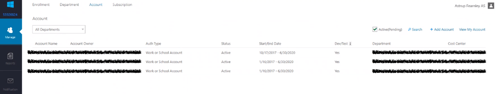
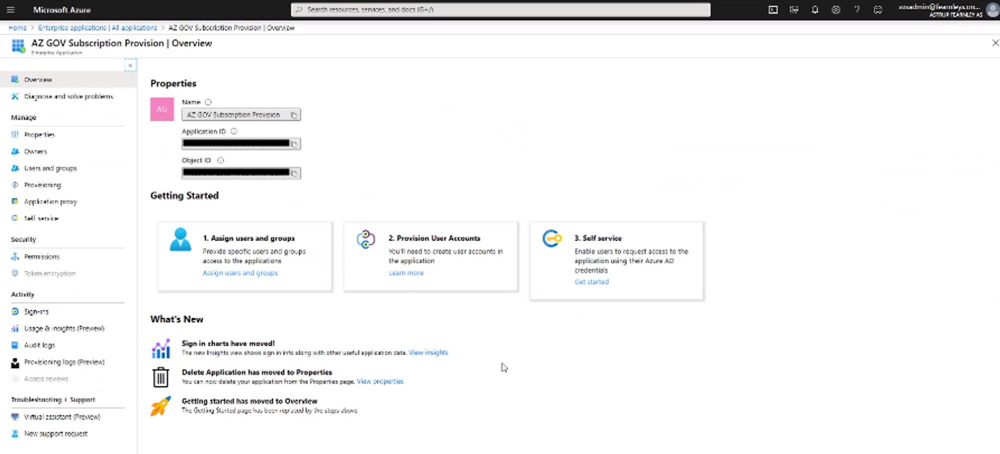

Delegating Azure Enterprise Agreement Owner privileges to a Service Principal (SPN)

Under the Enterprise agreement we have some different Persona’s, which have quite different abilities and operations upon which they are permitted to preform.

Before we being the process of delegation, It is important to understand this Hierarchy, so we can correctly proceed with the technical work ahead.

# Enterprise Administrator

Has the ability to add additional Enterprise and Department Administrators, Additional this persona can

* Add Departments
* Add or Associate Accounts to and Enrolment
* Can view usage and charges across ALL Accounts and Subscriptions
* Can view the monetary commitment balance associated to the Enrolment
There is no limit on the number of Enterprise Administrators that can be associated with an Enrolment, and additionally a notification contact can be assigned to receive all email notifications issued.

## Department Administrator

The Department Administrator has ability to do the following:

* Create Department Administrator (Department focus – click on add administrator)
* View/Edit Department properties such as name or Cost Center (Department focus – click on edit pen icon)
* Create a new Account Owner on the Department they administer (Switch to Account focus – click on add account)
* Remove the associated Accounts from the Department they administer (In Account focus – hover over account and then select the x icon to delete)
* Download usage details of the Department they administer (Switch to Reports panel on left – Select Download Usage focus)
* View the monthly Usage and Charges associated to their Department if Enterprise Administrator has granted permission to do so. (Switch to Reports panel on left –Select Usage Summary focus)
* Enable the Account owners to create Non Production Subscriptions
  * Subscription Offer MS-AZR-0148P for Dev/Test
  * Subscription Offer MS-AZR-0017P for Production
  ## Account Owners

The Account Owner can add Subscriptions to their Accounts. Additionally they have the ability to

* Update the Service Administrator for a Subscription
* View Usage Data for their Account
* If enabled by the Enterprise Administrator, can also view Account Charges
* Enumerate existing subscriptions in their account
* Create new subscriptions within the scope of their account
The Account Owner also has the privilege’s of delegating their responsibility (Role) to a Service Principal; which is the core of the process we are going to undertaken in this post.

> As of March 2020; this is no longer relevant. This account is REQUIRED to have established at least on subscription manually.

In the [EA Portal](https://ea.azure.com/), the *Account* page for a Department will present a list of established subscription.



# Programmatic Subscription Creation

The objective of the is process is to delegate the EA Account Owner privilege’s to a Service Principal, which can be leveraged to programmatically establish subscriptions. While the procedure is not overly complex; we will break the operation in 4 key milestones, which should make this easier to understand.

1. EA Department Account Owner
1. Service Principal for Delegation
1. Delegating EA Account Owner Privilege’s
1. Validation
## EA Department Account Owner

Using the Azure AD account credentials for your Microsoft Tenant, you should be able to authenticate with the [EA Portal](https://ea.azure.com/), and view the *Account* page, as illustrated earlier.

Once you have confirmed that this works as expected, we will repeat this authentication again, however this time, using either the Azure Powershell Module or the Azure CLI; The guide will present the commands used in either scenario.

### Authenticate to Azure the EA Account Owner Credentials

With working credentials validated in the EA Web portal, proceed with a new shell session and authenticate to Azure with your EA Account Owner credentials; you may also take advantage of the Azure Cloud Shell which will automate the login experience.

> The credentials MUST be hosted in the tenants AAD instance. Microsoft Accounts, or Guest accounts from other AAD Tenants are NOT Supported for the following procedures.

```powershell
PS> $aadTenantId =      "aaaaaaaa-aaaa-aaaa-aaaa-aaaaaaaaaaaa" 
PS> $azSubscriptionId = "42d96448-0b0a-4b33-9d9a-5653a3f11811" 
PS> Connect-AzAccount -TenantId $aadTenantId -Subscription $azSubscriptionId
```

```bash
$> az login
```

### Check the EA Accounts which we have access to

Once you have authenticated, we will verify that the credentials do indeed have access to the EA environment, but getting a list of the EA Accounts which can be accessed

```powershell
PS> $eaAccountList = Get-AzEnrollmentAccount
PS> $eaAccountList

ObjectId                              PrincipalName
--------                              -------------
88888888-8888-8888-8888-888888888888  eaaccountowner@org.onmicrosoft.com

PS> $EAAccountId = $eaAccountList.ObjectId
```

```bash
$> az billing enrollment-account list

[
  {
    "id": "/providers/Microsoft.Billing/enrollmentAccounts/88888888-8888-8888-8888-888888888888",
    "name": "88888888-8888-8888-8888-888888888888",
    "principalName": "eaaccountowner@org.onmicrosoft.com",
    "type": "Microsoft.Billing/enrollmentAccounts"
  }
]
```

Assuming the results of these commands, presents back your account, and a billing enrollment object we are ready to proceed. If this is not the case, you must check that you are using the correct account.

The important data you have as we complete this stage is

  ## Service Principal for Delegation

Our objective is to delegate the role of creating new Azure Subscriptions to a Service Principal. Before we begin that effort; we first need to know the ObjectID of the (Service Principal) SPN which we are delegating to.

### Create a new principal

Establish a new AzureAD Application and a Service Principal in the AD Tenant. If you have an existing application which you would rather utilize; we can skip this step and reference that object in the next stage

```powershell
$password = "S3cR3tP@ssw0rd!"
$credentials = New-Object Microsoft.Azure.Commands.ActiveDirectory.PSADPasswordCredential -Property @{StartDate=Get-Date; EndDate=Get-Date -Year 2024; Password=$password}
$spName = "AZ GOV Subscription Provision"
$sp = New-AzAdServicePrincipal -DisplayName $spName -PasswordCredential $credentials
```

```bash
Caz ad sp create-for-rbac --name "azGOVSubscriptionProvision"
{
  "appId": "eeeeeeee-eeee-eeee-eeee-eeeeeeeeeeee",
  "displayName": "azGOVSubscriptionProvision",
  "name": "http://azGOVSubscriptionProvision",
  "password": "8ff3e80e-a518-4dfa-ad5f-235bfb1d8bd9",
  "tenant": "aaaaaaaa-aaaa-aaaa-aaaa-aaaaaaaaaaaa"
}
```

Assuming no errors with this command, you should be able to locate the new principal in the Azure AD portal, under Enterprise Applications.



### Get the Application ID

If you plan on using a newly created Service Principal for the delegation, we can quickly reference it, and store it to a variable

```powershell
PS> $appId = $sp.Id
PS> $appId
eeeeeeee-eeee-eeee-eeee-eeeeeeeeeeee
```

Alternative, we can reference an existing application, and get its Application Id, in this case we simply provide the display name of the service principal we are going to reference

```bash
$> az ad sp list --display-name azGOVSubscriptionProvision --query "[].objectId" -o tsv
eeeeeeee-eeee-eeee-eeee-eeeeeeeeeeee
```

## Delegating EA Account Owner Privilege’s

Finally, we are at the heart of the show. We will delegate the Account Owner role to the chosen Service Principal.

### Add the service principal to your enrollment account

The following command will allocate the Owner role to the EA Account Id which we discovered earlier, to our chosen Service Principal

```powershell
PS> New-AzRoleAssignment -ObjectId $appId -RoleDefinitionName "Owner" -Scope "/providers/Microsoft.Billing/enrollmentAccounts/$eaAccountId"  

RoleAssignmentId   : /providers/Microsoft.Billing/enrollmentAccounts/88888888-8888-8888-8888-888888888888/providers/Microsoft.Authorization/roleAssignments/aa516c46-1954-4bac-bddf-618f1f03acf6
Scope              : /providers/Microsoft.Billing/enrollmentAccounts/88888888-8888-8888-8888-888888888888
DisplayName        : AZ GOV Subscription Provision
SignInName         : 
RoleDefinitionName : Owner
RoleDefinitionId   : 8e3af657-a8ff-443c-a75c-2fe8c4bcb635
ObjectId           : eeeeeeee-eeee-eeee-eeee-eeeeeeeeeeee
ObjectType         : ServicePrincipal
CanDelegate        : False
```

```bash
$> az role assignment create --role Owner --assignee-object-id eeeeeeee-eeee-eeee-eeee-eeeeeeeeeeee --scope /providers/Microsoft.Billing/enrollmentAccounts/88888888-8888-8888-8888-888888888888

{
   "canDelegate": null,
   "id": "/providers/Microsoft.Billing/enrollmentAccounts/88888888-8888-8888-8888-888888888888/providers/Microsoft.Authorization/roleAssignments/11341c1d-7785-46a9-a415-147b5c5aec5c",
   "name": "11341c1d-7785-46a9-a415-147b5c5aec5c",
   "principalId": "eeeeeeee-eeee-eeee-eeee-eeeeeeeeeeee",
   "roleDefinitionId": "/providers/Microsoft.Authorization/roleDefinitions/8e3af657-a8ff-443c-a75c-2fe8c4bcb635",
   "scope": "/providers/Microsoft.Billing/enrollmentAccounts/88888888-8888-8888-8888-888888888888",
   "type": "Microsoft.Authorization/roleAssignments"
}
```

### Azure AD Directory Reader

Finally, To ensure the ability of assigning Onwers to the new subscriptions, we MUST also ensure that the Service Principal has the minimum privilege’s of Azure AD ‘Directory Reader’ role

```powershell
PS> Connect-AzureAD -TenantId aaaaaaaa-aaaa-aaaa-aaaa-aaaaaaaaaaaa

Account         Environment TenantId                             TenantDomain             AccountType
-------         ----------- --------                             ------------             -----------
user@my.org     AzureCloud  aaaaaaaa-aaaa-aaaa-aaaa-aaaaaaaaaaaa org.onmicrosoft.com      User

PS> Add-AzureADDirectoryRoleMember -ObjectId (Get-AzureADDirectoryRole | where-object {$_.DisplayName -eq "Directory Readers"}).Objectid -RefObjectId $appId
```

Fantastic - now we need to wait for the clock work engine in the back of the cloud to wake up the Noddy. Go have a Coffee, and then we can check the results of our efforts

> These delegations must be allowed to propagate, I have observed this taking up to 1 Hour!

## Validation

The final stage of this effort is to validate that everything is working as desired. After waiting for delegations to propagate, we will authenticate to Azure as our Service Principal, and then attempt to communicate with the services we have granted access to. Ready?

### Login as your new Service Principal

With a new shell (or an existing on if you wish); we will proceed to login to Azure using the Service Principal Credentials. I assume the service principal has no Azure subscriptions delegated to it; so we will indicate that also at login time, to prevent warning.

```powershell
$> az login --service-principal -u eeeeeeee-eeee-eeee-eeee-eeeeeeeeeeee --password Easter2019 --tenant aaaaaaaa-aaaa-aaaa-aaaa-aaaaaaaaaaaa --allow-no-subscriptions

[
  {
    "cloudName": "AzureCloud",
    "id": "369b7bfe-5c66-41ef-837a-e2df4e9db6dd",
    "isDefault": true,
    "name": "Management",
    "state": "Enabled",
    "tenantId": "aaaaaaaa-aaaa-aaaa-aaaa-aaaaaaaaaaaa",
    "user": {
      "name": "eeeeeeee-eeee-eeee-eeee-eeeeeeeeeeee",
      "type": "servicePrincipal"
    }
  }
]
```

### Check you have Directory Access

First test, lets see if we can read some object from the Azure AD

```bash
$> az ad user list
```

Assuming no issues, you should see a list of users scroll by, feel free to terminate that process when you are satisfied that this is working to plan

### Check we have access to the Enterprise Agreement Account

Now, the real meat; Do we have access to the Enterprise Agreement Account?

```bash
$> az billing enrollment-account list
[
  {
    "id": "/providers/Microsoft.Billing/enrollmentAccounts/88888888-8888-8888-8888-888888888888",
    "name": "88888888-8888-8888-8888-888888888888",
    "principalName": "eaaccountowner@org.onmicrosoft.com",
    "type": "Microsoft.Billing/enrollmentAccounts"
  }
]
```

Assuming you get a response, take a close look at the *principalName* and you will be presented with the name of the account who have delegated their privilege’s to this active service account to work as.


