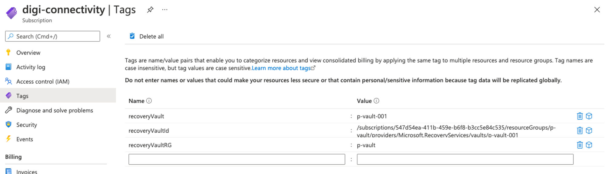
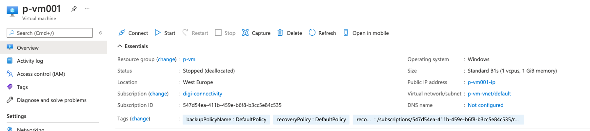
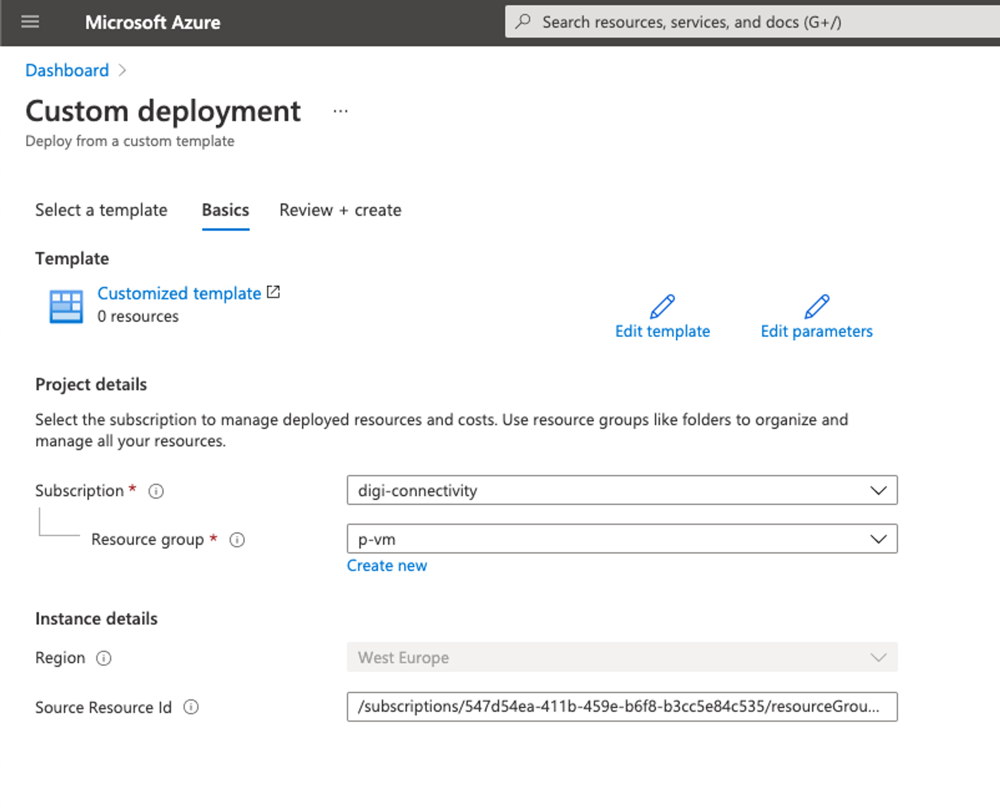
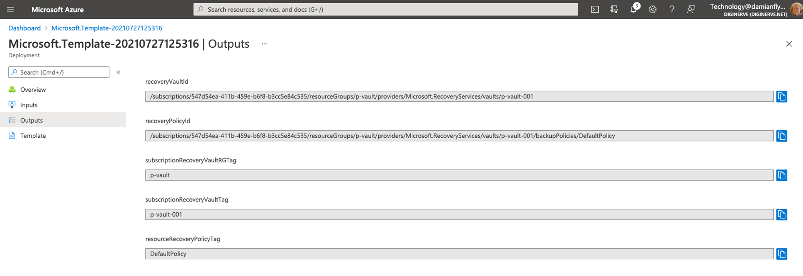

Deploying infrastructure ARM Templates to Azure, but using Tags and thier respective value as the parameter configuration settings

In the post, I am going to introduce a concept which will allow you to greatly up your Infrastructure as Code game, by using Azure as a State Machine!

One of the typical challenges when deploying ARM templates, is the sheer number of parameters which we find as a requirement to complete a deployment; which as you will appreciate gets considerably harder as we target many environments.

There are a number of methods to address this, including the use of Parameter files or Continuous deployment variables; each with their own challenges.

# Resource Tags

Tags can be applied at both the level of the subscription and resources.

For the purpose of this post we will use a scenario of the recovery vault. At the subscription level, we will apply 2 tags to identity the vault we will target for the resources, and then on the actual resource we will add a tag to identity the recovery policy we wish to be applied.

  ## Subscription Level Tags

With these Tags applied, we will have something similar to the following at the subscription level:



In my lab the subscription is `/subscriptions/547d54ea-411b-459e-b6f8-b3cc5e84c535`

## Resource Tags

And the VM called p-vm001, which will represent the resource which we are going to monitor the tag on in my lab will be in the same subscription (for permissions to be simplified), hosted in a resource group called p-vm

The full resource ID of this VM in the lab is `/subscriptions/547d54ea-411b-459e-b6f8-b3cc5e84c535/resourceGroups/p-vm/providers/Microsoft.Compute/virtualMachines/p-vm001` 



# ARM Magic

Now, we have all the parts of this environment in place, we will create an ARM template, which simply looks up the values of these tags for us, and to illustrate how it works, it will return the values as outputs.

Using the Custom Template Deployment in Azure Portal, paste the sample template below

```json
{
  "$schema": "https://schema.management.azure.com/schemas/2019-04-01/deploymentTemplate.json#",
  "contentVersion": "1.0.0.0",
  "parameters": {
    "sourceResourceId": {
      "type": "String",
      "defaultValue": "/subscriptions/547d54ea-411b-459e-b6f8-b3cc5e84c535/resourceGroups/p-vm/providers/Microsoft.Compute/virtualMachines/p-vm001",
      "metadata": {
        "description": "The resource ID of the resource we wish to look up a tag from."
      }
    }
  },
  "variables": {
    "referenceSubscriptionTagsResourceId": "[concat('/subscriptions/', subscription().subscriptionId, '/providers/Microsoft.Resources/tags/default')]",
    "referenceResourceTagsResourceId": "[concat(parameters('sourceResourceId'),'/providers/Microsoft.Resources/tags/default')]",
     "referenceTagsApi": "2020-06-01"
  },
  "resources": [
  ],

  "outputs": {
    "recoveryVaultId": {
      "type": "String",
      "value": "[resourceId(subscription().subscriptionId,  reference(variables('referenceSubscriptionTagsResourceId'), variables('referenceTagsApi')).tags.recoveryVaultRG ,'Microsoft.RecoveryServices/vaults',  reference(variables('referenceSubscriptionTagsResourceId'), variables('referenceTagsApi')).tags.recoveryVault) ]"
    },
    "recoveryPolicyId": {
      "type": "string",
      "value": "[concat( resourceId(subscription().subscriptionId,  reference(variables('referenceSubscriptionTagsResourceId'), variables('referenceTagsApi')).tags.recoveryVaultRG ,'Microsoft.RecoveryServices/vaults',  reference(variables('referenceSubscriptionTagsResourceId'), variables('referenceTagsApi')).tags.recoveryVault), '/backupPolicies/', reference(variables('referenceResourceTagsResourceId'), variables('referenceTagsApi')).tags.recoveryPolicy )]"
    },
    "subscriptionRecoveryVaultRGTag": {
      "type": "string",
      "value": "[reference(variables('referenceSubscriptionTagsResourceId'), variables('referenceTagsApi')).tags.recoveryVaultRG]"
    },
    "subscriptionRecoveryVaultTag": {
      "type": "string",
      "value": "[reference(variables('referenceSubscriptionTagsResourceId'), variables('referenceTagsApi')).tags.recoveryVault]"
    },
    "resourceRecoveryPolicyTag": {
      "type": "String",
      "value": "[reference(variables('referenceResourceTagsResourceId'), variables('referenceTagsApi')).tags.recoveryPolicy]"
    }
  }
}
```

Next, Check your going to deploy to the lab environment subscription, and resource group where we have the test VM which we will check the tag on



**Click on the Review and Create Button, allow the validation to complete, and then click again on Create**

As this is simply a reference deployment, it will complete instantly, so next we can check the output from the deployment



Now, we should see all the tag values which we set in the lab!

# Understanding the Template

So, How?

The following ARM JSON uses the `reference` function to lookup the data we care about

We establish to variables which we use to point at both the tags provider for the current subscription `referenceSubscriptionTagsResourceId` and also, the Resource ID of the lab VM `referenceResourceTagsResourceId`

We also will need a provider API version, while looking up the values of these tags, so we also can use a variable `referenceTagsApi` to store this.

```json
"variables": {
    "referenceSubscriptionTagsResourceId": "[concat('/subscriptions/', subscription().subscriptionId, '/providers/Microsoft.Resources/tags/default')]",
    "referenceResourceTagsResourceId": "[concat(parameters('sourceResourceId'),'/providers/Microsoft.Resources/tags/default')]",
     "referenceTagsApi": "2020-06-01"
  }
```

## Subscription Tags

Now, the magic. In the outputs, we simply reference the resource ID of the Tag provider for the subscription, with its API version, naming the tag as the last parameter, for example `recoveryVaultRG`

```json
[reference(variables('referenceSubscriptionTagsResourceId'), variables('referenceTagsApi')).tags.recoveryVaultRG]
```

We do exactly the same for the subscription Recovery Vault tag called `recoveryVault`

```json
[reference(variables('referenceSubscriptionTagsResourceId'), variables('referenceTagsApi')).tags.recoveryVault]
```

## Resource tags

In a very similar manner we can reference the tags on the resource, returning the `recoveryPolicy` tag value

```json
[reference(variables('referenceResourceTagsResourceId'), variables('referenceTagsApi')).tags.recoveryPolicy]
```

## Getting Creative

Finally, with some concatenation, we can now build resource identifiers dynamically so that we an combine the values of the tags to reference recovery vaults, and recovery policies

```json
    "recoveryVaultId": {
      "type": "String",
      "value": "[resourceId(subscription().subscriptionId,  reference(variables('referenceSubscriptionTagsResourceId'), variables('referenceTagsApi')).tags.recoveryVaultRG ,'Microsoft.RecoveryServices/vaults',  reference(variables('referenceSubscriptionTagsResourceId'), variables('referenceTagsApi')).tags.recoveryVault) ]"
    },
    "recoveryPolicyId": {
      "type": "string",
      "value": "[concat( resourceId(subscription().subscriptionId,  reference(variables('referenceSubscriptionTagsResourceId'), variables('referenceTagsApi')).tags.recoveryVaultRG ,'Microsoft.RecoveryServices/vaults',  reference(variables('referenceSubscriptionTagsResourceId'), variables('referenceTagsApi')).tags.recoveryVault), '/backupPolicies/', reference(variables('referenceResourceTagsResourceId'), variables('referenceTagsApi')).tags.recoveryPolicy )]"
    },
```

In this case our lab produced the following references

  Now - we have the ability to leverage Azure as a stateful configuration database!

