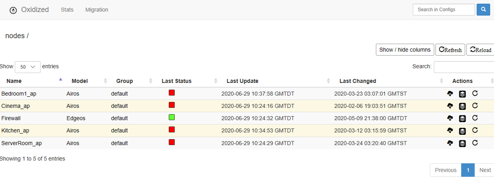
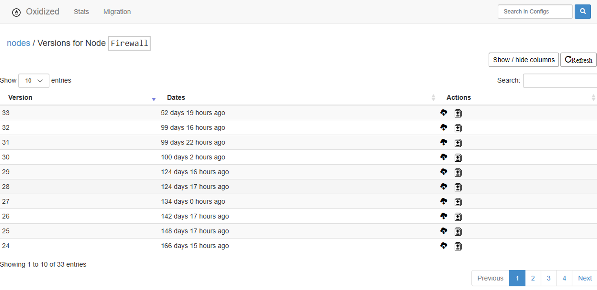
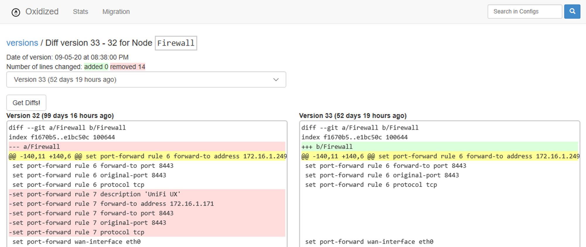

Oxidized is a Linux based service which has the ability to monitor a device’s configuration, including software and hardware. Current configuration is backed up from each device and stored to a GIT repository to maintain history of changes.

The process is very simple:

1. Login to each device in the router list router.db,
1. Run Commands to get the information that will be saved
1. Clean the output
1. Commit the Changes to GIT Repository
The tool is coded in *Ruby*, and implements a Domain Specific Language (DSL) for interaction.

Finally, there is a Web based User experience included in the solution so we can get a fast overview of the world.

# Docker Container

All of the configuration for my container is hosted at the file system location `/opt/appdata/oxidized`

I will also select to execute the Web Interface for Oxidized using its default port with is `tcp:8888`

Using the follow command, we will grab the latest container version from Docker Hub, and call the container *oxidized* locally. Additionally, if the container should stop, I am providing the flag to instruct docker to always restart the service again.

```bash
sudo docker run --restart always -v /opt/appdata/oxidized:/root/.config/oxidized -p 8888:8888/tcp -t oxidized/oxidized:latest oxidized
```

## Configuration

We need a configuration file to guide Oxidized running process

```bash
vi config
```

The following is the configuration sample that I am running with

```yaml
---
username: admin
password: P@ssw0rd!
model: junos
resolve_dns: true
interval: 3600
use_syslog: false
debug: false
threads: 30
timeout: 20
retries: 3
prompt: !ruby/regexp /^([\w.@-]+[#>]\s?)$/
rest: 0.0.0.0:8888
next_adds_job: false
vars: {}
groups: {}
models: {}
pid: "/root/.config/oxidized/pid"
crash:
  directory: "/root/.config/oxidized/crashes"
  hostnames: false
stats:
  history_size: 10
input:
  default: ssh, telnet
  debug: false
  ssh:
    secure: false
  ftp:
    passive: true
  utf8_encoded: true
output:
  default: git
  file:
    directory: "/root/.config/oxidized/configs"
  git:
    single_repo: true
    user: Oxidized
    email: oxidized@email.target
    repo: "~/.config/oxidized/oxidized.git"
source:
  default: csv
  csv:
    file: ~/.config/oxidized/router.db
    delimiter: !ruby/regexp /:/
    map:
      name: 0
      ip: 1
      model: 2
      username: 3
      password: 4
model_map:
  cisco: ios
  juniper: junos
  unifiap: airos
  edgeos: edgeos
```

## Device list

The table based on the configuration we just defined, will be formatted as follows

  To populate the table, we can open the editor `vi router.db`, and then inset the following sample entries

```yaml
Bedroom1_ap:172.16.1.114:unifiap:sysadmin:P@ssw0rd!
Kitchen_ap:172.16.1.121:unifiap:sysadmin:P@ssw0rd!
Cinema_ap:172.16.1.160:unifiap:sysadmin:P@ssw0rd!
ServerRoom_ap:172.16.1.115:unifiap:sysadmin:P@ssw0rd!
Firewall:172.16.1.1:edgeos:ubnt:Sc0rp10n!
```

Now, we are ready, we have the configuration all set for this installation

## Web Interface

Launching our browser to the oxidized site hosted on `TCP 8888` renders the current status



From here we can see all the version changes for the devices configuration



And even select any one of these change sets, and view the changes which were applied to the configuration



# Closing Thoughts

Now, How do you think this might work with Azure?…

