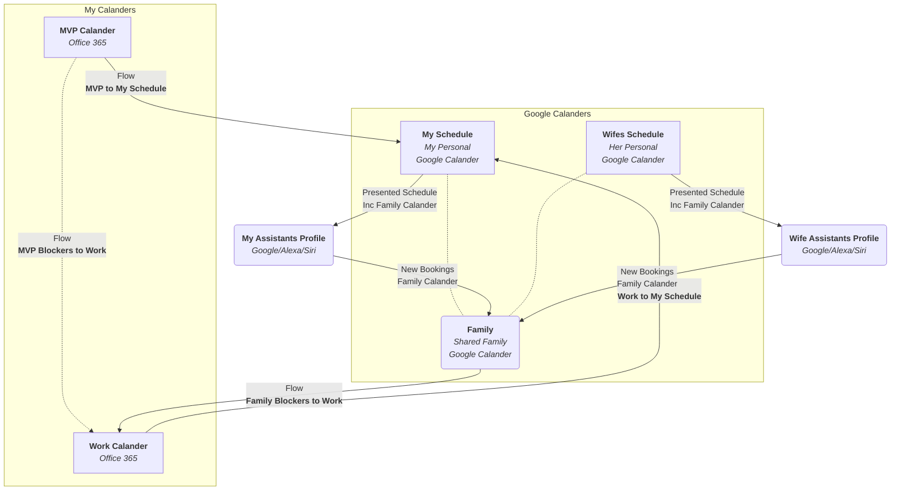

Assuringly I am not alone, when we sit down as a family and talk about our day, and the plan for the next days or the weekend; only to realise that we have some real scheduling issues; because you totally forgot that you would take the children to an event; while your partner had a long-standing appointment with the hairdresser.

Letting this happen once or twice, is forgivable, but happing on a regular basis; is the recipe for a lousy dispute; that we do not need.

# Synchronising Schedules

The solution, of course, is simple, We need to share some visibility of our schedules, and of course be consistent in making sure that we record these events in the calendar in the first place.

The problem is, however, what calendar do we use, and NO; a whiteboard stuck to the fridge or some other silly place is not an option.

This is a digital era, and I need a digital solution; as I can not predict where I might be when I agree with that business trip, or customer call which stomps all over that crucial other thing that I have now entirely forgotten about, and its not possible to run from Oslo to my Fridge door to check!

## Environment Survey

First, I need to determine what are the artefacts I am dealing with here;

### The Actors

* My Wife
  * Her Schedule
  * Myself
  * My Work Schedule, including Trips, Workshops and Meetings
  * My MVP Schedule, including Product Calls, Meetups, Conferences, Community Time
  * 2 Children
  * Pre-School, Appointments, etc.
  * Family Unit
  * Outings, Appointments, Events, Games, etc.
  ### The Actions

Now, Let’s consider the unconscious actions we take

* My Wife
  * iPhone to update her Calendar
  * Myself
  * Outlook primarily to manage both Work and MVP schedules
  * Google/Alexa/Siri
  * Shout at these devices to update the Family calendar
  ## The Objective

The vision is simple:

  
## The approach

### Family Calendar

Using the shared Family calendar features offered by many of the consumer-focused cloud offerings; leverage these services, so that shared appointments are visible; while managing out own independent personal scheduled.

While both my wife and I are currently iPhone users; there is no guarantee that this will always be the case; especially looking at the inflation on the newest models. Accessing the iCloud Calendars outside the Apple ecosystem is not a fantastic experience.

Combined with the desire to leverage Siri, Alexa and Google Assistant; my current conclusion is that the best-supported Calendar for families, for free is *Google Calendar*.

Therefore with existing Gmail accounts, we established a Family relationship and gained the shared family calendar feature.

Additionally, we Invited each other to our *personal calendars* so we can see the potential conflicts which may arise

### My Work Calendars

Others essentially manage my Work and MVP Calendars; as they set meetings, appointments and so on, which I usually am obliged to join. I have kept these two environments independent; mainly due to the NDA’s which I have signed which results in lots of sensitive emails flowing which I am not comfortable being managed by other mail administrators *(I wore that hat long enough to understand the potential access available)*

Using Microsoft Flow, I created three flows to synchronise these schedules

1. Sync Work calendar to my Personal Google Calendar
1. Sync MVP calendar to my Personal Google Calendar
1. Sync Family Google Calendar appointments to Work Calendar [as Time Blockers]
1. Sync MVP calendar to my Work Calendar [as Time Blockers]
### The Big Picture

Now with the boundaries defined, and the flows described, let’s visualise this challenge

## Setting Up

### Google Calender

Using the existing Google accounts which you may have, establish a *Family* Relationship

Next, Invite each party in the family to have read access at least to each other’s calendar.

Turn off notifications on these calendars if they are not your primary calendar. In my scenario I already get notifications from Work and MVP; so do not need duplicate notifications from Google also. My Wife, on the other hand, is using Google as her primary, so does still want notifications.

### Configuring iPhone

Using the IOS Settings App, the following is how I set up both our iPhones.

* Settings
  * Passwords & Accounts
    * Add Account
      * Google
        * Authenticate
        * Select Gmail
      * Enable Calander
      * Enable Contacts
      * Calander
    * Default Calendar
      * Family
      * Contacts
    * Default Account
      * Gmail
      For my phone, I use the Outlook App as the owner of both MVP and Work Mail and Calendars; As Siri has no access in here, only the Google Calendars are linked at the OS level, exposing the data to the native Calander app, and therefore Siri.

### Google Assistant / Alexa

Set up personal profiles, and then Link to your Personal Gmail Account; this should then expose the shared calendars also.

