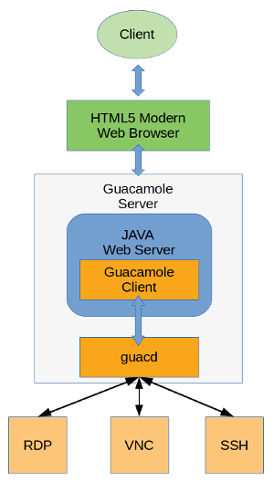
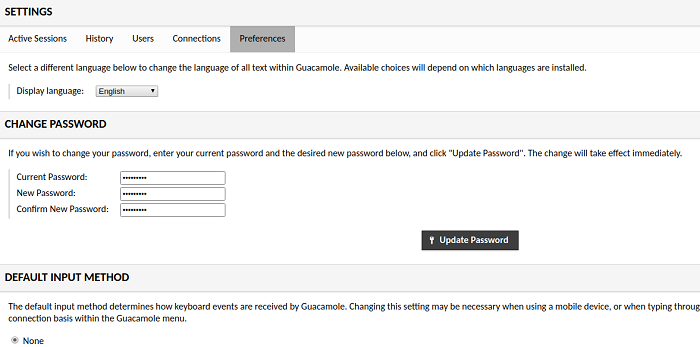
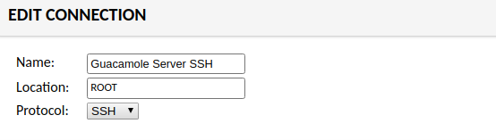
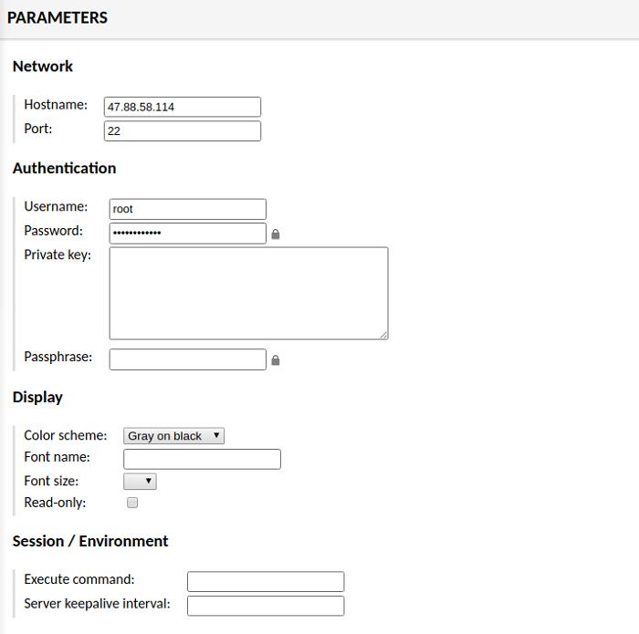
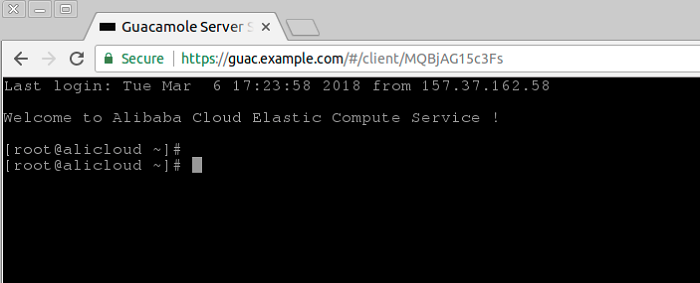

Apache Guacamole is a free and open source web application which lets you access your dashboard from anywhere using a modern web browser. It is a clientless remote desktop gateway which only requires Guacamole installed on a server and a web browser supporting HTML5.

Guacamole is the best way to keep multiple instances accessible over the internet. Once you add an instance to Guacamole, you don’t need to remember the password as it can securely store the credentials. It also lets you share the desktops among other users in a group. Guacamole supports multiple connection methods such as SSH, Telnet, VNC, and RDP.

In this tutorial, we will install Apache Guacamole on a Azure with an Ubuntu 16.04 instance.

## Guacamole Server

Guacamole server consists of the native server-side libraries required to connect to the server and the **guacd** tool. **guacd** is the Guacamole proxy daemon which accepts the user’s connections and connects to the remote desktop on their behalf. Given below is the architecture of Guacamole System.



> Note: It is required to compile and install the Guacamole server on the host machine, installing the binary is not possible for Guacamole server

### Server Install

Download the Guacamole server source code files into the temporary directory.

```shell
cd /tmp
wget "http://apache.org/dyn/closer.cgi?action=download&filename=guacamole/0.9.14/source/guacamole-server-0.9.14.tar.gz" -O guacamole-server-0.9.14.tar.gz
```

Extract the source code archive.

```shell
tar xf guacamole-server-0.9.*.tar.gz
cd guacamole-server-0.9.*
```

Compile and install the source code.

```shell
./configure --with-init-dir=/etc/init.d
makemake install
```

The installation will also set up an `init` script which can be used to manage the `guacd` daemon. Create the necessary links and cache for the shared libraries.

```shell
ldconfig
```

Guacamole server is now installed on your instance. Start the Guacamole proxy daemon and enable it to automatically start at boot time using the following commands.

```shell
systemctl enable guacd
systemctl start guacd
```

You can check the status of the service by running.

```shell
systemctl status guacd
```

## Guacamole Client

Guacamole client is Java based web application which contains all the Java and JavaScript code required for running the user interface of Guacamole. It ultimately creates a web application which connects to the `guacd` daemon running in the background using Guacamole protocol. In the foreground, it renders the remote desktop interface using HTML5 on the web browser to the authorized users.

> Unlike Guacamole server, Guacamole client is not required to be compiled and install from source. Cross-platform Guacamole client binary is available to download and install.

### Apache Tomcat Install

Guacamole binary requires a Java web server to run. In this tutorial, we will install Apache Tomcat 7 or 8 to run the Guacamole binary file.

Install Java 8 runtime on your server, installing JDK is not required since we do not need to compile any Java code.

```shell
yum -y install java-1.8.0-openjdk.x86_64
```

Create a new group and user for Tomcat installation. Running Tomcat server with an unprivileged user is recommended for security reasons.

```shell
groupadd tomcat
useradd -M -s /bin/nologin -g tomcat -d /opt/tomcat tomcat
```

Download latest Tomcat server of version 8.5 from Apache mirror.

```shell
wget http://www-us.apache.org/dist/tomcat/tomcat-8/v8.5.28/bin/apache-tomcat-8.5.28.tar.gz
```

Extract the archive into /opt/tomcat directory.

```shell
mkdir /opt/tomcat
tar xvf apache-tomcat-8*.tar.gz -C /opt/tomcat --strip-components=1
```

Provide appropriate permissions and ownership to Tomcat server files.

```shell
cd /opt/tomcat
chgrp -R tomcat /opt/tomcat
chmod -R g+r conf
chmod g+x conf
chown -R tomcat webapps/ work/ temp/ logs/
```

Create a new systemd service file for managing Tomcat server.

```shell
nano /etc/systemd/system/tomcat.service
```

Populate the file with the following configuration.

```plain text
[Unit]
Description=Apache Tomcat Web Application Container
After=syslog.target network.target

[Service]
Type=forking
Environment=JAVA_HOME=/usr/lib/jvm/jre
Environment=CATALINA_PID=/opt/tomcat/temp/tomcat.pid
Environment=CATALINA_HOME=/opt/tomcat
Environment=CATALINA_BASE=/opt/tomcat
Environment='CATALINA_OPTS=-Xms512M -Xmx1024M -server -XX:+UseParallelGC'
Environment='JAVA_OPTS=-Djava.awt.headless=true -Djava.security.egd=file:/dev/./urandom'

ExecStart=/opt/tomcat/bin/startup.sh
ExecStop=/bin/kill -15 $MAINPID

User=tomcat
Group=tomca
tUMask=0007
RestartSec=10
Restart=always

[Install]
WantedBy=multi-user.target
```

Start the Tomcat server and enable it to automatically start at boot time.

```shell
systemctl start tomcat
systemctl enable tomcat
```

You can check if Tomcat is running by going to http://your-server-ip:8080 using your favourite web browser. You should see the default Tomcat page. If you are getting some error, then make sure that port “8080” is allowed in Security group rules.

### Install Guacamole Client

Since we have installed the Tomcat server, download the Guacamole client binary file using the following command.

```shell
wget "http://apache.org/dyn/closer.cgi?action=download&filename=guacamole/0.9.14/binary/guacamole-0.9.14.war" -O guacamole-0.9.14.war
```

Move the Guacamole client file to the Tomcat’s webapps directory.

```shell
mv guacamole-0.9.14.war /opt/tomcat/webapps/guacamole.war
```

Restart the Tomcat server.

```shell
systemctl restart tomcat
```

Guacamole client is now installed on your server, you can check if Guacamole client is working by going to `http://your-server-ip:8080/guacamole`  using your favourite browser. You should see Guacamole login interface. You will not be able to log in yet as we have not configured authentication yet.

## Setting Up Authentication

Guacamole client supports multiple authentication mechanisms such as file-based auth, database auth, OAuth, LDAP etc. In this section of the tutorial, we will configure database based authentication using MySQL database server.

### Local Authentication

MySQL database will be used to store the authentication and other data. Since we do not require high performance and scalability which ApasaraDB provides, we will install MySQL server on the same instance.

Install MariaDB server which is an open source fork of MySQL.

```shell
yum -y install mariadb mariadb-server
```

Start the MariaDB server and enable it to automatically start at boot time.

```shell
systemctl start mariadb
systemctl enable mariadb
```

Set a password for the MySQL root user and secure the server instance by removing the test database and user.

```shell
mysql_secure_installation
```

Now login to your MySQL shell using the root user and the password you just created.

```shell
mysql -u root -p
```

Run the following queries to create a new database named guacdb along with guacdb-user having full access to the database. Please change StrongPassword to a very strong password.

```sql
CREATE DATABASE guacdb CHARACTER SET utf8 COLLATE utf8_general_ci;
CREATE USER 'guacdb-user'@'localhost' IDENTIFIED BY 'StrongPassword';
GRANT ALL PRIVILEGES ON guacdb.* TO 'guacdb-user'@'localhost';
FLUSH PRIVILEGES;
EXIT;
```

### Configure Guacamole

Now that our database server is running, we need to install the MySQL connector and Guacamole JDBC auth plugin. Create the new directories to store the plugins.

```shell
mkdir -p /etc/guacamole/{extensions,lib}
```

Download the MySQL connector extension from MySQL site.

```shell
cd /tmp
wget https://dev.mysql.com/get/Downloads/Connector-J/mysql-connector-java-5.1.45.tar.gz
```

Extract and move the MySQL connector into `/etc/guacamole/lib.`

```shell
tar xf mysql-connector-java-5.1.45.tar.gz
mv mysql-connector-java-5.*/mysql-connector-java-5.*.jar /etc/guacamole/lib/
```

Download the Guacamole JDBC authentication extension from Apache Guacamole site.

```shell
cd /tmp
wget "http://apache.org/dyn/closer.cgi?action=download&filename=guacamole/0.9.14/binary/guacamole-auth-jdbc-0.9.14.tar.gz" -O guacamole-auth-jdbc-0.9.14.tar.gz
```

Extract the archive and move the extension to `/etc/guacamole/extensions` directory.

```shell
tar xf guacamole-auth-jdbc-0.9.14.tar.gz
mv guacamole-auth-jdbc-0.9*/mysql/guacamole-auth-jdbc-mysql-0.9*.jar /etc/guacamole/extensions/
```

Since we have already created the database and database user, we can proceed to create the database schema and import the initial data. The schema is shipped along with the JDBC extension.

Import the SQL schema and initial data into the `guacdb` database using the following command. Provide the password of the MySQL root user when prompted.

```shell
cd guacamole-auth-jdbc-0.9*/mysql/schema
cat *.sql | mysql -u root -p guacdb
```

Create a new configuration file for Apache Guacamole so it can override the default configuration.

```shell
nano /etc/guacamole/guacamole.properties
```

Populate the file with the following configuration. Make sure to edit the StrongPassword with the actual password of guacdb-user.

```plain text
# MySQL properties

mysql-hostname: localhost
mysql-port: 3306
mysql-database: guacdb
mysql-username: guacdb-user
mysql-password: StrongPassword
mysql-default-max-connections-per-user: 0
mysql-default-max-group-connections-per-user: 0
```

Set `GUACAMOLE_HOME` environment variable so that the Guacamole Server can read the configuration file and the extensions.

```shell
echo "export GUACAMOLE_HOME=/etc/guacamole" >> ~/.bash_profile
source ~/.bash_profile
```

Disable SELinux as it causes errors when running Guacamole.

```shell
sed -i 's/enforcing/disabled/g' /etc/selinux/config
setenforce 0
```

Restart Guacamole proxy daemon and Tomcat server so that the new configuration can take effect.

```shell
systemctl restart guacd
systemctl restart tomcat
```

Guacamole Client authentication is now configured on your server. You can check if you can log in by going to `http://your-server-ip:8080/guacamole` using your favourite browser. Log in using the default administrator user **guacadmin** and password **guacadmin**.

## Setting up Nginx Reverse Proxy

Setting up a reverse proxy secured with SSL is recommended to encrypt the data exchanged between the browser and the Guacamole server. This will also map a domain name to your server so you won’t need to remember the IP address of the server.

Install Nginx web server.

```shell
yum -y install nginx
```

Start the Nginx web server and enable it to automatically start at boot time.

```shell
systemctl start nginx
systemctl enable nginx
```

### SSL Certificate

In this tutorial, we will use the certificates generated with Let’s Encrypt certificate authority. If you wish to use more production friendly certificates, you can purchase commercial certificates from Alibaba Cloud.

Download and install Certbot. Certbot is an official client application for Let’s Encrypt SSL generation.

```shell
wget https://dl.eff.org/certbot-auto -O /usr/bin/certbot
chmod a+x /usr/bin/certbot
```

> Note: Before requesting SSL certificates, make sure that the domain you are using is pointed towards the IP address of the instance. If not, make an “A” type record in DNS management panel and point the domain or subdomain to the public IP address of your instance and wait for the DNS to propagate.

Generate Let’s Encrypt SSL certificates for your domain.

```shell
certbot certonly --webroot -w /usr/share/nginx/html -d guac.example.com
```

Replace all occurrences of *guac.example.com* with your actual domain name. The above command will ask you for your email to send you renewal notices. If the certificates are generated successfully, you should get following output.

```shell
IMPORTANT NOTES:
 - Congratulations! Your certificate and chain have been saved at:
   /etc/letsencrypt/live/guac.example.com/fullchain.pem   Your key file has been saved at:
   /etc/letsencrypt/live/guac.example.com/privkey.pem   Your cert will expire on 2018-06-05. To obtain a new or tweaked
   version of this certificate in the future, simply run certbot
   again. To non-interactively renew *all* of your certificates, run
   "certbot renew"  ...
```

### Auto-Renew Certificate

Create a cron job to renew the certificates as Let’s Encrypt certificates are expired in every three months.

```shell
{ crontab -l; echo '36 2 * * * /usr/bin/certbot renew --post-hook "systemctl reload nginx"'; } | crontab -
```

The above command will run the renewal command every day at 2.36 AM. If the certificates are due for expiry it will automatically renew them.

Create a new server block configuration file for Guacamole web application reverse proxy.

```shell
nano /etc/nginx/conf.d/guacamole.conf
```

Populate the file with the following configuration. Replace the example domain name with the actual one. Also, make sure that the path to the Let’s Encrypt SSL certificate and the private key is correct.

```plain text
server {
    listen 80;
    server_name guac.example.com;
    return 301 https://$host$request_uri;
}
server {
    listen 443 ssl http2;
    server_name guac.example.com;
    root html;
    index index.html index.htm;
    ssl on;
    ssl_certificate         /etc/letsencrypt/live/guac.example.com/fullchain.pem;
    ssl_certificate_key     /etc/letsencrypt/live/guac.example.com/privkey.pem;
    ssl_session_cache    shared:SSL:10m;
    ssl_session_timeout    1440m;
    ssl_protocols  TLSv1 TLSv1.1 TLSv1.2;
    ssl_ciphers HIGH:!aNULL:!eNULL:!EXPORT:!CAMELLIA:!DES:!MD5:!PSK:!RC4;
    ssl_prefer_server_ciphers on;
    add_header Strict-Transport-Security "max-age=31536000; includeSubdomains;";

    access_log  /var/log/nginx/guacamole.access.log;
    location / {
    proxy_pass http://localhost:8080/guacamole/;
    proxy_buffering off;
    proxy_http_version 1.1;
    proxy_set_header X-Forwarded-For $proxy_add_x_forwarded_for;
    proxy_set_header Upgrade $http_upgrade;
    proxy_set_header Connection $http_connection;
    proxy_cookie_path /guacamole/ /;
    }
}
```

Check the Nginx configuration for errors.

```shell
nginx -t
```

You should see the following output if the configuration is error free.

```shell
nginx: the configuration file /etc/nginx/nginx.conf syntax is ok
nginx: configuration file /etc/nginx/nginx.conf test is successful
```

Restart Nginx web server to implement the changes in the configuration.

```shell
systemctl restart nginx
```

Now you can go to https://guac.example.com to access the Guacamole dashboard. The connections to the server and the browser are also secured with SSL.

## Connecting First Client

Guacamole server is now ready and working. You can add as many remote servers as you want. It can connect to the remote clients using SSH, Telnet, RDP, and VNC. To verify if it can connect to the remote server, let’s add our first SSH based connection.

### Change Default Password

Before proceeding further, let’s change the password of the default “guacamole” user. Login with default administrator user `guacadmin` and password `guacadmin` and go to the **Preferences** tab. Change the default password from this tab.



### Add SSH Connection

To add a new connection, go to “Connections” tab and click on “Add new Connection” button. Provide a name for the connection and choose the protocol from drop down. Since I am connecting to the Guacamole server via SSH, I am selecting “SSH”.



In “Parameters” provide the hostname of the target server and port. You also use “localhost” for connecting the same server. Provide the username and password, if connecting through private key than provide the contents of the private key. You can also configure the display, such as color scheme and fonts etc. Once you are done, click on “Save” button.



### Test Connection

To connect to the SSH server you just added, go to the dashboard and it will automatically try to connect to the SSH when there is only a single connection is available. Once you are connected, you should see the following interface.



Similarly, you can add more SSH clients and graphical dashboards using various connection methods. The remote connections you want to add are not required to have either of Guacamole Server or Client, you can directly add them. Once you add the remote servers in Guacamole, you will only need a web browser to access them from anywhere in the world.

