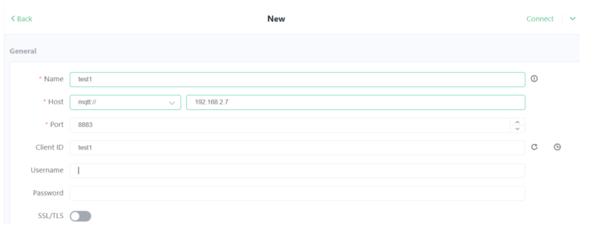
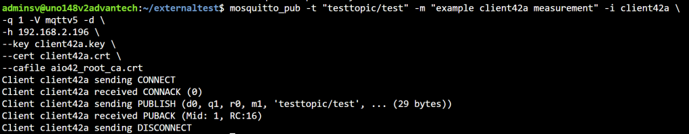
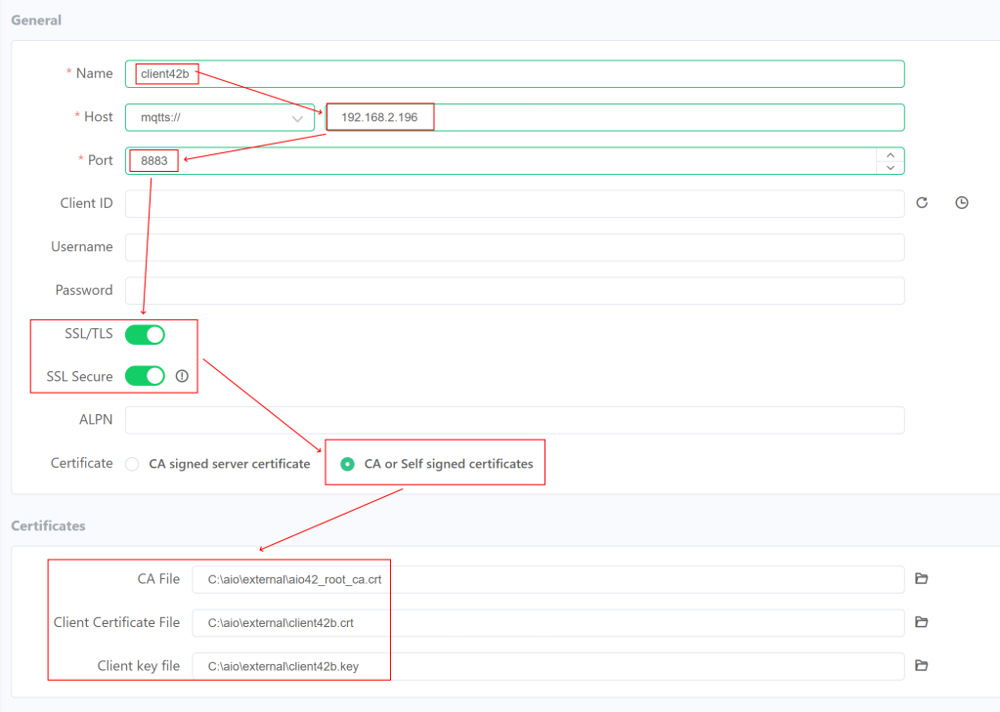

The MQTT broker of Azure IoT Operations is a central part of the edge solution:


In the Azure IoT Operations resource in the Azure portal, we can check the MQTT broker settings and even update and control the broker!

*Note*: for testing purposes, the Kubectl CLI tool can be used on the edge to check the Kubernetes settings and see what is managed from the cloud.

Notice that we cannot manage everything from the Azure portal like deploying certificates in the local Kubernetes secrets store. You need access to the Edge device via SSH but this can be done via Azure Arc.

As you can see, we can control MQTT Broker features like ‘listeners’, authentication, and authorization via the portal:


By default, the MQTT Broker exposes one broker listener of service type ‘ClusterIP’:


Notice that the Service type of this listener is ‘ClusterIP’ so this port is [only exposed within the cluster](https://kubernetes.io/docs/concepts/services-networking/service/#publishing-services-service-types), not outside the cluster, or on the local network. It acts like an IP address only available inside the cluster. So, only pods living on the cluster can make use of this port.

This *default* listener is exposed on port 18883 and uses *default* authentication.

*Note*: There is also an authentication option named ‘None’ which will be discussed later on.

On the Authentication tab, we see that ‘default’ policy:


That policy is set to ‘Kubernetes SAT’ or Service Account Token:


SAT means that only Kubernetes services can connect on this port:


There are almost no details to manage for this method. The ‘audiences’ entry is a default part of a list of accepted tokens.

Because we want to connect with an MQTT client living on the local network, we need other ways to authenticate.

Because we control the logic that is running on the cluster, the ‘default’ listener is still an acceptable solution for having logic running in the pods connecting to the MQTT broker.

Do not alter anything regarding the listener or authentication. Just go back to the main MQTT broker page.

## Adding Nodeport and LoadBalancer access

Next to ClusterID, the MQTT broker also supports NodePort and LoadBalancer:


Let’s add one of each. We start with authentication without any security and we do this with the NodePort listener.

*Note*: It’s also better to create separate listeners with different settings, like a more common MQTT port 8883, to avoid confusion and potential security risks, instead of modifying that default listener.

### NodePort

The NodePort way of exposing a port opens a specific port on all the nodes (the IPCs in your cluster), and any traffic that is sent to this port is forwarded to the service.

Notice that you can only use ports 30000–32767 for NodePort.

I create one NodePort listener on port 31883:


Notice that both authentication and authorization are set to ‘none’. This is what we use here, clients do not need to authenticate themselves and are allowed to use any route.

I also skip the TLS setting.

*Warning*: In this post, we skip authorization and focus just on authentication. In production, it is highly recommended that sufficient authorization is added (next to authentication and TLS) so that only known clients can use a limited set of topics.

Save this listener.

### LoadBalancer

A LoadBalancer service is the standard way to expose a service using a load balancer service on Kubernetes.

Here, we add a LoadBalancer listener ‘loadbalancer-listener’ with service name ‘loadbalancer-listener-service’ on port 8883, without authentication or authorization:


Save the listener.

At this point, the MQTT broker is now exposing three separate listeners, each with its own port.

Let’s try connecting to the two new listeners because only these expose their ports on the local network.

### Client traffic

We start with the [MQTTX client](https://mqttx.app/).

I create a ‘test1’ client that connects to the LoadBalancer listener IP address of the MQTT broker running inside an Azure IoT Operations edge device.

I connect with the port 8883 assigned to the ‘loadbalancer-listener’:



I skip the password and TLS.

When I connect, it works out of the box. Neither the MQTTX configuration nor the MQTT broker are complaining about security etc:


Actually, The MQTT broker allows any client to connect without any authentication like name and password, as configured.

*Note*: Be aware the IPC needs a [fixed IP address](https://ubuntu.com/server/docs/configuring-networks#static-ip-address-assignment) if you want to keep this way of connecting your MQTT clients over a longer period.

When I publish a message on the topic ‘testtopic/1’ via client ‘test1’, it is picked up by the broker:


The MQTTX tool shows the message is being sent by client ‘test1’:


Because another client ‘test2’ is also connected and subscribed to topics starting with ‘testtopic/#’ (where # is a wildcard), the message is received by client ‘test2’:


So, the MQTT broker is supporting subscribing and publishing plain MQTT on port 8883!

I also added client ‘test3’ and client ‘test4’.

These two are connected while listening to port 31883, exposed by the ‘nodeport-listener’.

Both ‘nodeport’ clients are also listening to topics starting with ‘testtopic/#’ but on that 31883 port!

Again, another message is published on ‘loadbalancer’ port 8883 by client ‘test1’:


That message is now received by all three other clients, using several different ports:


So, the same MQTT broker is handling messages on all ports or listeners as if there is only one port!

This is true for the NodePort listeners and the LoadBalancer listeners and I expect also the Kubernetes SAT listener!

Interestingly, if you listen to topic placeholder ‘#’ you will encounter self-test messages from the MQTT service itself:


In my case, the topic is “azedge/dmqtt/selftest/ei5LGtsu”.

## Other ways to authenticate

In a more real-world scenario, we want MQTT clients to authenticate more securely.

For clients living within the Kubernetes cluster the default ClusterID listener is using SAT tokens to authenticate and that is ok for them.

Are there other ways to connect MQTT clients in a secure way, while living on the local network?

Yes, here is a test policy showing all with multiple ways to authenticate:


As you can see, you can add multiple ways to authenticate in a certain order.

> Add and configure authentication methods. MQTT broker tries to authenticate the client’s credentials using the first specified method and iterates through the array until it finds a match or reaches the end.

The Kubernetes SAT authentication is already discussed above, more details are found in this [documentation](https://learn.microsoft.com/azure/iot-operations/manage-mqtt-broker/howto-configure-authentication?tabs=portal&WT.mc_id=AZ-MVP-5002324#kubernetes-service-account-tokens).

The X509 policy uses certificates to connect. This will be tested below in more detail!

The policy allows you to add *details* so attributes are added to the secured clients under certain circumstances:


Note: the details are left out of scope for now. Check the [documentation](https://learn.microsoft.com/azure/iot-operations/manage-mqtt-broker/howto-configure-authentication?tabs=portal&WT.mc_id=AZ-MVP-5002324#x509) for X509 authentication details.

The third option for authentication names Custom policies work with a third-party endpoint:


Check the [documentation](https://learn.microsoft.com/azure/iot-operations/manage-mqtt-broker/howto-configure-authentication?tabs=portal&WT.mc_id=AZ-MVP-5002324#custom-authentication) for Custom authentication details.

Today, we test the ‘x509’ authentication in more detail.

### X509 authentication

X509 authentication is great for giving each client its own private certificate so it has its own identity.

While working on this post, I was in contact with the product team to check certain challenges I encountered.

It comes with the obligation to also have the right TLS certificate flow in place.

Based on our discussion, especially about the TLS support, extra documentation was added.

I can recommend reading this [full end-to-end workflow](https://learn.microsoft.com/azure/iot-operations/manage-mqtt-broker/tutorial-tls-x509?WT.mc_id=AZ-MVP-5002324) page, part of the Azure IoT Operations documentation.

It also demonstrated how a mosquito_pub client can connect outside the Kubernetes cluster. That is, it is executed still on that same AIO edge machine using ‘localhost’:


In my post, we elaborate on this flow with the non-localhost approach and see how several clients can connect that are living on the local network.

### Fixed IP address

First, I gave my [Ubuntu](https://ubuntu.com/server/docs/configuring-networks) machine a fixed IP address 192.168.2.196 because the TLS certificate flow depends on that IP address (this ‘localhost’ will not work for us).

Below is the fixed IP address solution seen for Ubuntu 24.04 LTS.

First, check which adapter has the state ‘UP’ so we know which one is connected to the network:

```plain text
ip link
```

I see the cable is inserted in adapter ‘enp4s0’ where the IP server is eg. 192.168.2.254 and my dynamic IP is now 192.168.2.7 (that 192.168.2.254 should be the DHCP router. Please double check with ‘ifconfig’):

```plain text
ip a
```

So, create or alter this file where the ’01’ is the priority when there are multiple files:

```plain text
sudo nano /etc/netplan/01-netcfg.yaml
```

Construct this text:

```plain text
network:
  version: 2
  renderer: networkd
  ethernets:
    enp4s0:
      dhcp4: false
      dhcp6: false
      addresses:
        - 192.168.2.196/24
      routes:
        - to: default
          via: 192.168.2.254
      nameservers:
        addresses: [8.8.8.8,8.8.4.4]
```

Save it.

Apply it via this command OR perform a reboot (I prefer a reboot to be sure it works as expected):

```plain text
sudo netplan apply
```

*Note*: Be sure you have access to the machine without network access so you can fix it when things go sour.

Check the new IP address:

```plain text
ifconfig | grep 192
```

This should show all lines having 192, including our new IP address (192.168.2.196 in my case).

Check if the internet access still works:

```plain text
pinggoogle.com

wget google.com
```

Now you know for sure the certificates generated will always be valid in combination with the fixed IP address of our edge device.

### Generating certificates

I expect you only have that basic load balancer listener. You also have not created an x509 authentication policy yet.

So, create an x509 authentication policy (the basic settings are ok). Just give it a proper policy name like ‘x509-policy’. We will revisit this policy configuration later on.

Revisit the load balancer listener (still having all the basic settings).

Select the x509 authentication policy but keep the rest as-is.

Notice that changing the listener and policy takes some time. This is because these Portal settings need to be forwarded to the local Kubernetes cluster.

Once the changes are made, check the external IP address of the newly created load balancer listener:

```plain text
sudo kubectl get service loadbalancer-listener-service -n azure-iot-operations
```

As an alternative, you can also list all services:

```plain text
sudo kubectl get service -n azure-iot-operations
```

As you can see, this external IP address is the same as the fixed IP address (192.168.2.196 in my case):


We first create certificates for the Kubernetes cluster. We do this on the IPC running Azure IoT Operations.

Notice that I use AIO42 to identify our edge device. I use Clients42 when we need something at this used by all clients. A client is identified as either client42a or client42b. I deviate only a bit from that ‘contoso/fabricam’ flow seen in the original documentation.

Create the following certificates via the [step CLI tool](https://smallstep.com/docs/step-cli/installation/#linux-packages-amd64):

```plain text
# download and install step CLI
wget https://dl.smallstep.com/cli/docs-cli-install/latest/step-cli_amd64.deb
sudo dpkg -i step-cli_amd64.deb

# create a separate folder
cd ~
mkdir aiocerts
cd aiocerts

# create a server root key and certificate
step certificate create "AIO42 Root CA" \
aio42_root_ca.crt aio42_root_ca.key \
--profile root-ca \
--not-after 72000h --no-password --insecure

# create an server intermediate key and certificate
step certificate create "AIO42 Intermediate CA 1" \
aio42_intermediate_ca.crt aio42_intermediate_ca.key \
--profile intermediate-ca \
--ca ./aio42_root_ca.crt --ca-key ./aio42_root_ca.key \
--not-after 72000h --no-password --insecure

# create endpoint key and certificate for the TLS handshake (notice the external IP address)
step certificate create mqtts-endpoint \
mqtts-endpoint.crt mqtts-endpoint.key \
--profile leaf \
--ca ./aio42_intermediate_ca.crt --ca-key ./aio42_intermediate_ca.key \
--bundle \
--san 192.168.2.196 \
--not-after 72000h --no-password --insecure
```

If you forget to change the SAN, later on, you will encounter an error on the client like this one when you want to connect to your broker:


For the MQTT clients to connect, we need a separate set of certificates:

```plain text
# create a clients root key and certificate
step certificate create --profile root-ca "Clients42 Root CA" \
clients42_root_ca.crt clients42_root_ca.key \
--not-after 72000h --no-password --insecure

# create an clients intermediate key and certificate
step certificate create "Clients42 Intermediate CA 1" \
clients42_intermediate_ca.crt clients42_intermediate_ca.key \
--profile intermediate-ca \
--ca ./clients42_root_ca.crt --ca-key ./clients42_root_ca.key \
--not-after 72000h --no-password --insecure

# create key and certificate for client A
step certificate create client42a client42a.crt client42a.key \
--ca ./clients42_intermediate_ca.crt --ca-key ./clients42_intermediate_ca.key --bundle \
--not-after 72000h --no-password --insecure

# create key and certificate for client B
step certificate create client42b client42b.crt client42b.key \
--ca ./clients42_intermediate_ca.crt --ca-key ./clients42_intermediate_ca.key --bundle \
--not-after 72000h --no-password --insecure
```

The server and client certificates are created (you can create more clients if needed).

We still need to configure Kubernetes, using all these (non-client) keys:

```plain text
# create a tls secret named 'broker-server-cert'
sudo kubectl create secret tls broker-server-cert -n azure-iot-operations \
--cert mqtts-endpoint.crt \
--key mqtts-endpoint.key

# create a config map named 'clients42-ca'
sudo kubectl create configmap clients42-ca -n azure-iot-operations \
--from-file=client_ca.pem=clients42_root_ca.crt

# check the construction of that configmap
sudo kubectl describe configmap clients42-ca -n azure-iot-operations
```

The check should return something like:


Notice the ‘clients42-ca’ value in the CLI commands. We must reference the ‘clients42-ca’ value on the authentication method details page.

Navigate in the Azure portal to the ‘x509-policy’ policy and select the ‘Edit details’ button.

Replace the details with:

```plain text
{
    "trustedClientCaCert": "clients42-ca"
}
```

This will look like this:


Save these details and policy settings changes.

Notice also the ‘broker-server-cert’ value in the CLI commands. We need to fill that ‘broker-server-cert’ value as a manual TLS configuration.

Navigate in the Azure portal to the ‘loadbalancer-listener’ settings and select the ‘TLS Edit’ button.

Select *Manual* TLS mode and fill in the secret name:

```plain text
broker-server-cert
```

This looks like:


Save the TLS configuration and the listener settings.

Again, the Kubernetes services should still look the same if we rerun that Kubectl command:

```plain text
sudo kubectl get service -n azure-iot-operations

sudo kubectl get service loadbalancer-listener-service -n azure-iot-operations
```

The configuration of the MQTT broker is done.

Let’s test the service access for several MQTT clients!

## MQTT clients

We start with the Mosquitto MQTT client. We also look into NodeRed and MQTTX.

### X509 secured Mosquitto client

You can install the Mosquitto client via:

```plain text
sudo apt install -y mosquitto-clients
```

Notice that we do not need to install the Mosquitto server:

  If you have installed the Mosquitto client either on the same AIO edge device or somewhere on the local network, run it while having access to the three certificates listed below (I had to copy these from my edge device because that is where I generated the client certificates. It is recommended to generate the certificates at a central location).

You need to provide both the certificate and the client’s key. Here I use the certificates from client A.

You also need to provide the server root certificate ‘aio42_root_ca.crt’ for the TLS check:

```plain text
mosquitto_pub -t "testtopic/test" -m "example client42a measurement" -i client42a \
-q 1 -V mqttv5 -d \
-h 192.168.2.196 -p 8883 \
--key client42a.key \
--cert client42a.crt \
--cafile aio42_root_ca.crt
```

Notice that we use port 8883, the port secured by X509 certificates.

The answer should look like this (notice the acknowledgment of the connection and a successful publish command):



If MQTTX is still running and any client for the NodePort endpoint is connected, the client should receive the message too:


This means the LoadBalancer port and the NodePort port are still connected to the common background, even when one connection is made secure.

### X509 secured MQTTX client

Open the MQTTX application and add a new client.

*Note*: This client is probably running on a different device so you need to copy the following certificates:

* aio42_root_ca.crt
* client42a.crt / client42b.crt
* client42a.key / client42b.key
Fill in the correct host IP address and port number.

We make use of both secure SSL/TLS and self-signed certificates:



Notice that the ‘Client B’ certificate files are used for client ‘Client B’.

Save the settings and connect the client.

Once the client is connected, I first subscribe to ‘testtopic/#’ (step 1a):


I then send a message over the topic ‘testtopic/1’ (step 1b).

This message is sent correctly (step 2)

Because we listen to messages on the same topic via the ‘#’ wildcard, it arrives also at our client (it even arrives at the other connected client, marked with a black icon ‘1’) (steps 3 and 4).

So, the MQTTX client app can connect also to the broker.

### X509 secured NodeRed client

The NodeRed flow collects energy data over three phases:


Notice that [this example is also used to connect](https://sandervandevelde.wordpress.com/2024/08/02/microsoft-fabric-rti-derived-streams-in-the-real-time-hub/) to the Azure EventGrid MQTT broker directly.

So, I just added a few extra MQTT clients (having an insecure or secure MQTT broker connection):


I first tried to connect to the (unsecure) NodePort endpoint so I created this MQTT Out Node writing to the ‘testtopic/cc100unsecure’ topic:


I just filled in the endpoint and the port under an alternative MQTT property construction:


Using these minimal settings, it connects without any problem to the unsecured broker endpoint.

We see the arrival of all three topics, coming from the insecure NodePort listener endpoint:


Then I tried to connect via the X509 secured ‘Client A’ credentials.

Another MQTT Out Node was created, now writing to the ‘testtopic/cc100secure’ topic:


Next to the server IP address and the port, I also entered the required TLS settings for ‘Client A’:


Here, the key and certificate for Client A are referenced. And I added the CA certificate:


Save it and check the MQTTX client when active.

This time, the three types of messages arrive over the ‘testtopic/cc100secure’ topic:


This proves we can connect NodeRed MQTT clients in a secure way via X509 certificates.

## Bonus: connecting to Azure Container registry from Kubernetes

I got a message from a reader who got its Azure IoT Operation K3S cluster connected to an Azure Container Registry.

Check this [documentation](https://learn.microsoft.com/en-us/azure/container-registry/authenticate-kubernetes-options) for adding/updating the ‘pod pull secrets’.

This way, additional pods can be added to the cluster using a secure container registry.

## Conclusion

Azure IoT Operations is ‘the new kid on the block’.

The edge comes with a local MQTT broker that offers both secure and insecure endpoints for clients to connect [inside the Kubernetes cluster](https://learn.microsoft.com/azure/iot-operations/create-edge-apps/howto-develop-mqttnet-apps?WT.mc_id=AZ-MVP-5002324) and outside the edge device, on the local network.

All endpoints exchange their published messages with each other if clients are subscribed on topics on any endpoint.

We have seen how both the MQTTX client, the Mosquitto client, and NodeRed can connect to the broker via an X509 secured connection.

We have seen how certificates must be generated and how the MQTT broker is configured both via the cloud and on the command line via the Kubectl CLI tool.

This is the first blog post regarding Azure IoT Operations.

Next, we will look into [connecting Azure IoT Operations to Microsoft Fabric](https://sandervandevelde.wordpress.com/2024/11/29/azure-iot-operations-microsoft-fabric-eventstream-dataflow/)!

