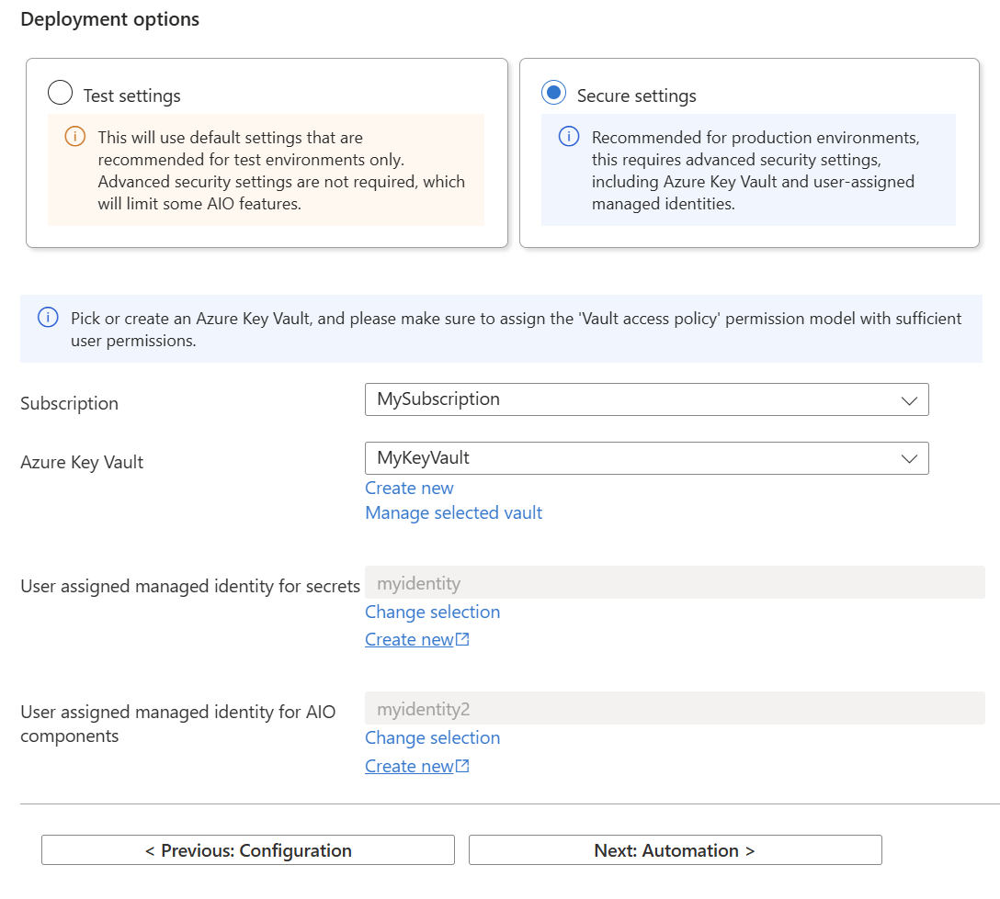

An Azure Arc-enabled Kubernetes cluster is a prerequisite for deploying Azure IoT Operations. This article describes how to prepare a cluster before you deploy Azure IoT Operations. This article includes guidance for Ubuntu


> [!warning] ⚠️ 
> Microsoft supports Azure Kubernetes Service (AKS) Edge Essentials for deployments on Windows and K3s for deployments on Ubuntu. If you want to deploy Azure IoT Operations to a multi-node solution, use K3s on Ubuntu.
Starting from an Ubuntu server, which has be Arc Enabled, we can use this as a base for the Azure IoT Operations.

1. Azure Arc enabling an Ubuntu Server
1. K3s Kubernettes on Ubuntu (Single or Multi-Node)
1. Azure IoT Operations
# IoT Operations

We discuss Azure IoT Operations *deployments* and *instances*, which are two different concepts:

* An Azure IoT Operations deployment describes all of the components and resources that enable the Azure IoT Operations scenario. These components and resources include:
  * An Azure IoT Operations instance
  * Arc extensions
  * Custom locations
  * Resources that you can configure in your Azure IoT Operations solution, like assets and asset endpoints.
  * An Azure IoT Operations instance is the parent resource that bundles the suite of services that are defined in What is Azure IoT Operations? like MQTT broker, data flows, and connector for OPC UA.
When we talk about deploying Azure IoT Operations, we mean the full set of components that make up a *deployment*. Once the deployment exists, you can view, manage, and update the *instance*.

## Deploying

The Azure portal deployment experience is a helper tool that generates a deployment command based on your resources and configuration. The final step is to run an Azure CLI command.

In the [Azure portal](https://portal.azure.com/), search for and select **Azure IoT Operations**.


1. Select Create.
1. On the Basics tab, provide the following information:
  **Expand table**
  
    
  
  
  1. Select Next: Configuration.
1. On the Configuration tab, provide the following information:
  **Expand table**
  
    
  
  1. Select Next: Dependency management.
1. On the Dependency management tab, select an existing schema registry or use these steps to create one:
  1. Select Create new.
  1. Provide a Schema registry name and Schema registry namespace.
  1. Select Select Azure Storage container.
  1. Choose a storage account from the list of hierarchical namespace-enabled accounts, or select Create to create one.
    Schema registry requires an Azure Storage account with hierarchical namespace and public network access enabled. When creating a new storage account, choose a **General purpose v2** storage account type and set **Hierarchical namespace** to **Enabled**.
    
    1. Select a container in your storage account or select Container to create one.
  1. Select Apply to confirm the schema registry configurations.
  1. On the Dependency management tab, select either the Test settings or the Secure settings deployment option. If you aren't sure which is right for your scenario, review the guidance in Deployment details > Choose your features.


The Azure IoT Operations extension for Azure CLI. Use the following command to add the extension or update it to the latest version:

```bash
az extension add --upgrade --name azure-iot-ops
```


## Secure

Use these steps if you chose the **Secure settings** option on the **Dependency management** tab.

1. In the Deployment options section, provide the following information:
  **Expand table**
  
    
  
  1. Select Next: Automation.
1. One at a time, run each Azure CLI command on the Automation tab in a terminal:
  1. Sign in to Azure CLI interactively with a browser even if you already signed in before. If you don't sign in interactively, you might get an error that says Your device is required to be managed to access your resource when you continue to the next step to deploy Azure IoT Operations.
    Azure CLICopy
    
    ```plain text
    az login
    
    ```
    
    1. Install the latest Azure IoT Operations CLI extension.
    Azure CLICopy
    
    ```plain text
    az upgrade
    az extension add --upgrade --name azure-iot-ops
    
    ```
    
    1. Create a schema registry which will be used by Azure IoT Operations components. Copy and run the provided az iot ops schema registry create command.
    If you chose to use an existing schema registry, this command isn't displayed on the **Automation** tab.
    
    **Note**
    
    This command requires that you have role assignment write permissions because it assigns a role to give schema registry access to the storage account. By default, the role is the built-in **Storage Blob Data Contributor** role, or you can create a custom role with restricted permissions to assign instead. For more information, see [**az iot ops schema registry create**](https://learn.microsoft.com/en-us/cli/azure/iot/ops/schema/registry#az-iot-ops-schema-registry-create).
    
    1. Prepare the cluster for Azure IoT Operations deployment. Copy and run the provided az iot ops init command.
    **Tip**
    
    The `init` command only needs to be run once per cluster. If you're reusing a cluster that already had Azure IoT Operations version 0.8.0 deployed on it, you can skip this step.
    
    This command might take several minutes to complete. You can watch the progress in the deployment progress display in the terminal.
    
    1. Deploy Azure IoT Operations. Copy and run the provided az iot ops create command.
    If you followed the optional prerequisites to prepare your cluster for observability, add the following optional parameters to the `create` command:
    
    **Expand table**
    
      This command might take several minutes to complete. You can watch the progress in the deployment progress display in the terminal.
    
    1. Enable secret sync for the deployed Azure IoT Operations instance. Copy and run the provided az iot ops secretsync enable command.
    This command:
    
    * Creates a federated identity credential using the user-assigned managed identity.
    * Adds a role assignment to the user-assigned managed identity for access to the Azure Key Vault.
    * Adds a minimum secret provider class associated with the Azure IoT Operations instance.
    1. Assign a user-assigned managed identity to the deployed Azure IoT Operations instance. Copy and run the provided az iot ops identity assign command.
    This command creates a federated identity credential using the OIDC issuer of the indicated connected cluster and the Azure IoT Operations service account.
    
    1. Once all of the Azure CLI commands complete successfully, you can close the Install Azure IoT Operations wizard.
Once the `create` command completes successfully, you have a working Azure IoT Operations instance running on your cluster. At this point, your instance is configured for production scenarios.

**Verify deployment**

After the deployment is complete, use [az iot ops check](https://learn.microsoft.com/en-us/cli/azure/iot/ops#az-iot-ops-check) to evaluate IoT Operations service deployment for health, configuration, and usability. The *check* command can help you find problems in your deployment and configuration.

Azure CLICopy

```plain text
az iot ops check

```

The `check` command displays a warning about missing data flows, which is normal and expected until you create a data flow. For more information, see [Process and route data with data flows](https://learn.microsoft.com/en-us/azure/iot-operations/connect-to-cloud/overview-dataflow).

You can check the configurations of topic maps, QoS, and message routes by adding the `--detail-level 2` parameter to the `check` command for a verbose view.


## Monitoring

### Deploy OpenTelemetry Collector

Define and deploy an [OpenTelemetry (OTel) Collector](https://opentelemetry.io/docs/collector/) to your Arc-enabled Kubernetes cluster.

1. Create a file called otel-collector-values.yaml and paste the following code into it to define an OpenTelemetry Collector:
  ```yaml
  mode: deployment
  fullnameOverride: aio-otel-collector
  image:
    repository: otel/opentelemetry-collector
    tag: 0.107.0
  config:
    processors:
      memory_limiter:
        limit_percentage: 80
        spike_limit_percentage: 10
        check_interval: '60s'
    receivers:
      jaeger: null
      prometheus: null
      zipkin: null
      otlp:
        protocols:
          grpc:
            endpoint: ':4317'
          http:
            endpoint: ':4318'
    exporters:
      prometheus:
        endpoint: ':8889'
        resource_to_telemetry_conversion:
          enabled: true
        add_metric_suffixes: false
    service:
      extensions:
        - health_check
      pipelines:
        metrics:
          receivers:
            - otlp
          exporters:
            - prometheus
        logs: null
        traces: null
      telemetry: null
    extensions:
      memory_ballast:
        size_mib: 0
  resources:
    limits:
      cpu: '100m'
      memory: '512Mi'
  ports:
    metrics:
      enabled: true
      containerPort: 8889
      servicePort: 8889
      protocol: 'TCP'
    jaeger-compact:
      enabled: false
    jaeger-grpc:
      enabled: false
    jaeger-thrift:
      enabled: false
    zipkin:
      enabled: false
  
  ```
  
  1. In the otel-collector-values.yaml file, make a note of the following values that you use in the az iot ops create command when you deploy Azure IoT Operations on the cluster:
  * fullnameOverride
  * grpc.endpoint
  * check_interval
  1. Save and close the file.
1. Deploy the collector by running the following commands:
  ```bash
  kubectl get namespace azure-iot-operations || kubectl create namespace azure-iot-operations
  helm repo add open-telemetry https://open-telemetry.github.io/opentelemetry-helm-charts
  
  helm repo update
  helm upgrade --install aio-observability open-telemetry/opentelemetry-collector -f otel-collector-values.yaml --namespace azure-iot-operations
  ```
  
  ### Configure Prometheus metrics collection

Configure Prometheus metrics collection on your cluster.

1. Create a file named ama-metrics-prometheus-config.yaml and paste the following configuration:
  ```yaml
  apiVersion: v1
  data:
    prometheus-config: |2-
      scrape_configs:
        - job_name: otel
          scrape_interval: 1m
          static_configs:
            - targets:
              - aio-otel-collector.azure-iot-operations.svc.cluster.local:8889
        - job_name: aio-annotated-pod-metrics
          kubernetes_sd_configs:
            - role: pod
          relabel_configs:
            - action: drop
              regex: true
              source_labels:
                - __meta_kubernetes_pod_container_init
            - action: keep
              regex: true
              source_labels:
                - __meta_kubernetes_pod_annotation_prometheus_io_scrape
            - action: replace
              regex: ([^:]+)(?::\\d+)?;(\\d+)
              replacement: $1:$2
              source_labels:
                - __address__
                - __meta_kubernetes_pod_annotation_prometheus_io_port
              target_label: __address__
            - action: replace
              source_labels:
                - __meta_kubernetes_namespace
              target_label: kubernetes_namespace
            - action: keep
              regex: 'azure-iot-operations'
              source_labels:
                - kubernetes_namespace
          scrape_interval: 1m
  kind: ConfigMap
  metadata:
    name: ama-metrics-prometheus-config
    namespace: kube-system
  
  ```
  
  1. Apply the configuration file by running the following command:
  ```bash
  kubectl apply -f ama-metrics-prometheus-config.yaml
  ```
  
  ### Deploy dashboards to Grafana

Azure IoT Operations provides a [sample dashboard](https://github.com/Azure/azure-iot-operations/tree/main/samples/grafana-dashboard) designed to give you many of the visualizations you need to understand the health and performance of your Azure IoT Operations deployment.

Complete the following steps to install the Azure IoT Operations curated Grafana dashboards.

1. Clone or download the azure-iot-operations repository to get the sample Grafana Dashboard json file locally: https://github.com/Azure/azure-iot-operations.
1. Sign in to the Grafana console. You can access the console through the Azure portal or use the az grafana show command to retrieve the URL.
  ```bash
  az grafana show --name <GRAFANA_NAME> --resource-group <RESOURCE_GROUP> --query url -o tsv
  ```
  
  1. In the Grafana application, select the + icon.
1. Select Import dashboard.
1. Browse to the sample dashboard directory in your local copy of the Azure IoT Operations repository, azure-iot-operations > samples > grafana-dashboard, then select the aio.sample.json dashboard file.
1. When the application prompts, select your managed Prometheus data source.
1. Select Import.

### Connect IoT Operations to Azure Arc

Log in to Azure

```bash
az login

To sign in, use a web browser to open the page https://microsoft.com/devicelogin and enter the code DFVLJBMXT to authenticate.
```

Register resource providers

```bash
az provider register --namespace "Microsoft.IoTOperations"
az provider register --namespace "Microsoft.DeviceRegistry"
az provider register --namespace "Microsoft.SecretSyncController"

```

Connect your K3s cluster to Azure Arc


### Enable the cluster for secure settings

To enable secrets synchronization for your Azure IoT Operations instance, your cluster must be enabled as an OIDC issuer and for workload identity federation. This configuration is required for the Secret Store extension to sync the secrets from an Azure Key Vault and store them on the edge as Kubernetes secrets.

For Azure Kubernetes Service (AKS) clusters, the OIDC issuer and workload identity features can be enabled only at the time of cluster creation. For clusters on AKS Edge Essentials, the automated script enables these features by default. For AKS clusters on Azure Local, follow the steps to [Deploy and configure workload identity on an AKS enabled by Azure Arc cluster](https://learn.microsoft.com/en-us/azure/aks/aksarc/workload-identity) to create a new cluster if you don't have one with the required features.

For k3s clusters on Kubernetes, you can update an existing cluster. To enable and configure these features, use the following steps:

1. Update the cluster to enable OIDC issuer and workload identity.
  ```bash
  az connectedk8s update -n <CLUSTER_NAME> -g <RESOURCE_GROUP> --enable-oidc-issuer --enable-workload-identity
  ```
  
  If you enabled the OIDC issuer and workload identity features when you created the cluster, you don't need to run the previous command again. Use the following command to check the status of the OIDC issuer and workload identity features for your cluster:
  
  ```bash
  az connectedk8s show -g <RESOURCE_GROUP> -n <CLUSTER_NAME> --query "{ClusterName:name, OIDCIssuerEnabled:oidcIssuerProfile.enabled, WorkloadIdentityEnabled:securityProfile.workloadIdentity.enabled}"
  ```
  
  1. Get the cluster's issuer URL.
  ```bash
  az connectedk8s show -g <RESOURCE_GROUP> -n <CLUSTER_NAME> --query oidcIssuerProfile.issuerUrl --output tsv
  ```
  
  Make a note of the output from this command to use in the next steps.
  
  1. Create the k3s config file on the machine where you deployed your Kubernetes cluster:
  ```bash
  sudo nano /etc/rancher/k3s/config.yaml
  ```
  
  1. Add the following content to the config.yaml file, replacing the <SERVICE_ACCOUNT_ISSUER> placeholder with the cluster issuer URL you made a note of previously:
  ```yaml
  kube-apiserver-arg:
  - service-account-issuer=<SERVICE_ACCOUNT_ISSUER>
  - service-account-max-token-expiration=24h
  ```
  
  Save the file and exit the nano editor.
  
  1. Restart the k3s service:
  ```bash
  sudo systemctl restart k3s
  ```
  
  ### Set up secrets management

Secrets management for Azure IoT Operations uses the Secret Store extension to sync the secrets from an Azure Key Vault and store them on the edge as Kubernetes secrets. The Secret Store extension requires a user-assigned managed identity with access to the Azure Key Vault where secrets are stored. To learn more, see [What are managed identities for Azure resources?](https://learn.microsoft.com/en-us/entra/identity/managed-identities-azure-resources/overview).

To set up secrets management:

1. Create an Azure Key Vault that's used to store secrets, and give your user account permissions to manage secrets with the Key Vault Secrets Officer role.
1. Create a user-assigned managed identity for the secret store extension to use to access the key vault.
1. Use the az iot ops secretsync enable command to set up the Azure IoT Operations instance for secret synchronization. This command:
  * Creates a federated identity credential by using the user-assigned managed identity.
  * Adds a role assignment to the user-assigned managed identity for access to the Azure Key Vault.
  * Adds a minimum secret provider class associated with the Azure IoT Operations instance.
  ```bash
  # Variable block
  AIO_INSTANCE_NAME="<AIO_INSTANCE_NAME>"
  RESOURCE_GROUP="<RESOURCE_GROUP>"
  USER_ASSIGNED_MI_NAME="<USER_ASSIGNED_MI_NAME>"
  KEYVAULT_NAME="<KEYVAULT_NAME>"
  
  #Get the resource ID of the user-assigned managed identity
  USER_ASSIGNED_MI_RESOURCE_ID=$(az identity show --name $USER_ASSIGNED_MI_NAME --resource-group $RESOURCE_GROUP --query id --output tsv)
  
  #Get the resource ID of the key vault
  KEYVAULT_RESOURCE_ID=$(az keyvault show --name $KEYVAULT_NAME --resource-group $RESOURCE_GROUP --query id --output tsv)
  
  #Enable secret synchronization
  az iot ops secretsync enable --instance $AIO_INSTANCE_NAME \
                               --resource-group $RESOURCE_GROUP \
                               --mi-user-assigned $USER_ASSIGNED_MI_RESOURCE_ID \
                               --kv-resource-id $KEYVAULT_RESOURCE_ID
  
  ```
  
  Now that secret synchronization setup is complete, you can refer to [Manage secrets for your Azure IoT Operations deployment](https://learn.microsoft.com/en-us/azure/iot-operations/deploy-iot-ops/howto-manage-secrets) to learn how to use secrets with Azure IoT Operations.

### Set up a user-assigned managed identity for cloud connections

Some Azure IoT Operations components, like data flow endpoints, use a user-assigned managed identity for cloud connections. We recommend that you use a separate identity from the one that you used to set up secrets management.

1. Create a user-assigned managed identity that's used for cloud connections.
  **Note**
  
  You'll need to grant the identity permission to whichever cloud resource you'll use the managed identity for.
  
  1. Use the az iot ops identity assign command to assign the identity to the Azure IoT Operations instance. This command also creates a federated identity credential by using the OIDC issuer of the indicated connected cluster and the Azure IoT Operations service account.
  ```bash
  # Variable block
  AIO_INSTANCE_NAME="<AIO_INSTANCE_NAME>"
  RESOURCE_GROUP="<RESOURCE_GROUP>"
  USER_ASSIGNED_MI_NAME="<USER_ASSIGNED_MI_NAME FOR CLOUD CONNECTIONS>"
  
  #Get the resource ID of the user-assigned managed identity
  USER_ASSIGNED_MI_RESOURCE_ID=$(az identity show --name $USER_ASSIGNED_MI_NAME --resource-group $RESOURCE_GROUP --query id --output tsv)
  
  #Assign the identity to the Azure IoT Operations instance
  az iot ops identity assign --name $AIO_INSTANCE_NAME \
                             --resource-group $RESOURCE_GROUP \
                             --mi-user-assigned $USER_ASSIGNED_MI_RESOURCE_ID
  
  ```
  
  Now you can use this managed identity in data flow endpoints for cloud connections.


