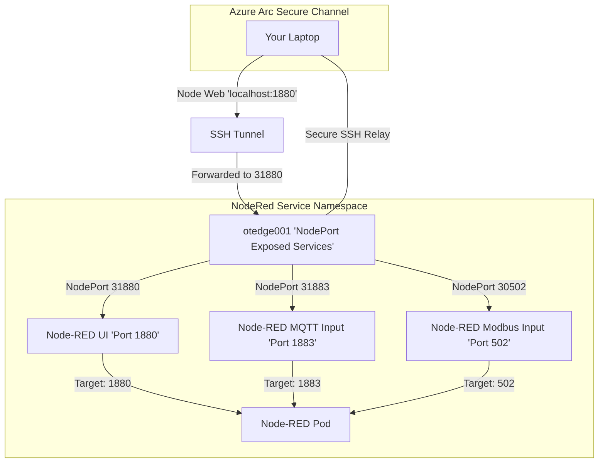
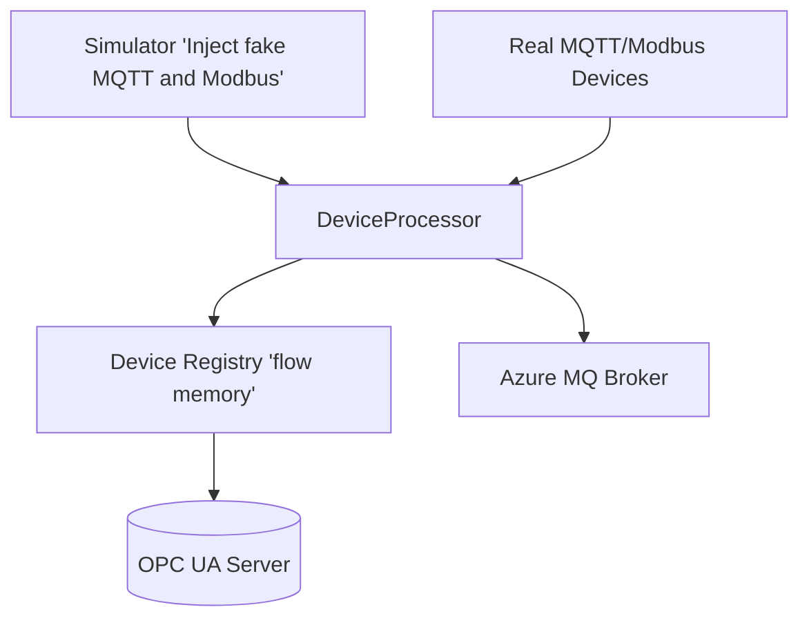
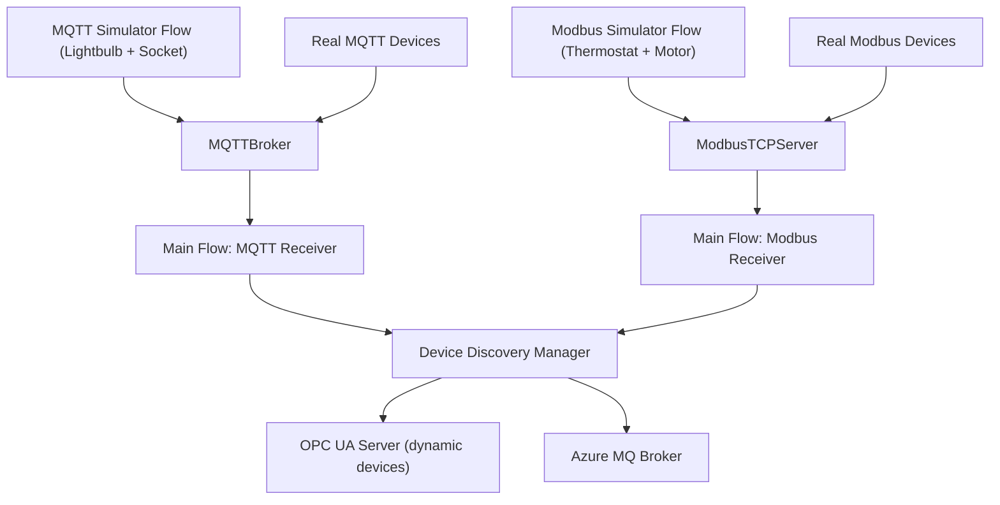

```bash
export KUBECONFIG=~/.kube/config
sysadmin@otedge001:~$ kubectl get namespace
NAME                      STATUS   AGE
arc-workload-identity     Active   3d23h
azure-arc                 Active   3d23h
azure-arc-release         Active   3d23h
azuremonitor-containers   Active   2d15h
default                   Active   4d
kube-node-lease           Active   4d
kube-public               Active   4d
kube-system               Active   4d
```


# Node Red

An overview of the objectives here

* Local network devices (outside Kubernetes) are sending:
  * MQTT messages
  * Modbus TCP traffic
  * Your Node-RED, running inside K3s, must receive:
  * NodeRED Web Interfaces
  * MQTT subscriptions from devices
  * Modbus polling/requests from devices
  * Then Node-RED forwards processed data to:
  * Azure MQ Service inside the same K3s cluster
  Expose Node-RED to your local network by:

* NodePort service to open specific ports from the edge node (otedge001) to the outside world

## Name Space 

Create the Name Space

```bash
sysadmin@otedge001:~$ kubectl create namespace nodered
namespace/nodered created
```

## Presistant Storage

Add a PVC (assumes you have default storage class like `local-path` from K3s):

```yaml
yaml
CopyEdit
apiVersion: v1
kind: PersistentVolumeClaim
metadata:
  name: nodered-pvc
  namespace: nodered
spec:
  accessModes:
    - ReadWriteOnce
  resources:
    requests:
      storage: 1Gi
```

Apply this storage

```bash
kubectl apply -f nodered-pvc.yaml
```

Since you’re running **K3s** (and unless you changed nything manually), by default K3s installs the `**local-path-provisioner**` as the storage backend for dynamic PVCs. That means:

* Your PVC storage will physically be on the node’s local filesystem
* Specifically under a folder like: /var/lib/rancher/k3s/storage/
* The sub-folder names include:
  * The PVC ID (pvc-2c5110d0-82c0-42fa-99e2-fdf653bdb42c)
  * The namespace (nodered)
  * The pvc name (nodered-pvc)
  * example /var/lib/rancher/k3s/storage/pvc-<uid><namespace><pvc-name>/
  * Each PersistentVolume (PV) will have its own subdirectory inside there.

```bash
sysadmin@otedge001:~/nodered$ kubectl get pvc -n nodered
NAME          STATUS   VOLUME                                     CAPACITY   ACCESS MODES   STORAGECLASS   VOLUMEATTRIBUTESCLASS   AGE
nodered-pvc   Bound    pvc-2c5110d0-82c0-42fa-99e2-fdf653bdb42c   1Gi        RWO            local-path     <unset>                 5m15s
```

## Deployment

Create the manifest for the deployment `nodered-deployment.yaml` 

```yaml
apiVersion: apps/v1
kind: Deployment
metadata:
  name: nodered
  namespace: nodered
  labels:
    app: nodered
spec:
  replicas: 1
  selector:
    matchLabels:
      app: nodered
  template:
    metadata:
      labels:
        app: nodered
    spec:
      containers:
      - name: nodered
        image: nodered/node-red:latest
        ports:
        - containerPort: 1880 # Node-RED editor UI
        - containerPort: 1883 # MQTT listener (Node-RED MQTT broker node)
        - containerPort: 502  # Modbus TCP port (Modbus nodes listen on 502)
        volumeMounts:
        - name: nodered-data
          mountPath: /data
        resources:
          requests:
            memory: "128Mi"
            cpu: "250m"
          limits:
            memory: "512Mi"
            cpu: "500m"
      volumes:
      - name: nodered-data
        persistentVolumeClaim:
          claimName: nodered-pvc
      initContainers:
      - name: install-azure-nodes
        image: node:18
        command:
          [
            "sh", "-c",
            "npm install --prefix /data node-red-contrib-azure-iot-hub node-red-contrib-azure-blob-storage"
          ]
        volumeMounts:
        - name: nodered-data
          mountPath: /data

```

And deploy it

```yaml
kubectl apply -f nodered-deployment.yaml

# Check the Deployment is grabbing a container
sysadmin@otedge001:~/nodered$ kubectl get pods -n nodered
NAME                      READY   STATUS    RESTARTS   AGE
nodered-7dc66dcdb7-hh2sg   1/1     Running   0          91s
```

Inspect the Container to see if it is starting.

In our manifest, we added an `**initContainer**` (`install-azure-nodes`). **InitContainers run first**, *before* the main container (`nodered`) starts. Until all **InitContainers** finish successfully, Kubernetes holds the Pod in `PodInitializing` state. W**hen you run **`**kubectl logs <pod>**`, it by default tries to show **the main container logs** — **but your main container hasn't even started yet**, so you get:

```bash
# Check the container is starting
sysadmin@otedge001:~/nodered$ kubectl logs nodered-7dc66dcdb7-hh2sg -n nodered -f
28 Apr 13:29:41 - [info] 
Error from server (BadRequest): container "nodered" in pod "nodered-78948ddfb4-8q4jj" is waiting to start: PodInitializing

```

If we use `--container` flag to tell `kubectl` you want logs from the** init container** instead of the main container 

```bash
# Check the container is starting looking at the initContainer
sysadmin@otedge001:~/nodered$ kubectl logs nodered-6f867d544c-9vgkg -n nodered -c install-azure-nodes -f

npm warn deprecated cryptiles@2.0.5: This version has been deprecated in accordance with the hapi support policy (hapi.im/support). Please upgrade to the latest version to get the best features, bug fixes, and security patches. If you are unable to upgrade at this time, paid support is available for older versions (hapi.im/commercial).
npm warn deprecated glob@7.2.3: Glob versions prior to v9 are no longer supported
npm warn deprecated sntp@1.0.9: This module moved to @hapi/sntp. Please make sure to switch over as this distribution is no longer supported and may contain bugs and critical security issues.
npm warn deprecated inflight@1.0.6: This module is not supported, and leaks memory. Do not use it. Check out lru-cache if you want a good and tested way to coalesce async requests by a key value, which is much more comprehensive and powerful.
npm warn deprecated crypto@0.0.3: This package is no longer supported. It's now a built-in Node module. If you've depended on crypto, you should switch to the one that's built-in.
npm warn deprecated azure-iot-device-amqp-ws@1.0.14: The Amqp over Websockets feature is now provided by azure-iot-device-amqp.AmqpWs
npm warn deprecated har-validator@2.0.6: this library is no longer supported
npm warn deprecated uuid@3.4.0: Please upgrade  to version 7 or higher.  Older versions may use Math.random() in certain circumstances, which is known to be problematic.  See https://v8.dev/blog/math-random for details.
npm warn deprecated node-uuid@1.4.8: Use uuid module instead
npm warn deprecated boom@2.10.1: This version has been deprecated in accordance with the hapi support policy (hapi.im/support). Please upgrade to the latest version to get the best features, bug fixes, and security patches. If you are unable to upgrade at this time, paid support is available for older versions (hapi.im/commercial).
npm warn deprecated azure-event-hubs@0.0.8: This package has been deprecated. Please use @azure/event-hubs instead
npm warn deprecated request@2.74.0: request has been deprecated, see https://github.com/request/request/issues/3142
npm warn deprecated hoek@2.16.3: This version has been deprecated in accordance with the hapi support policy (hapi.im/support). Please upgrade to the latest version to get the best features, bug fixes, and security patches. If you are unable to upgrade at this time, paid support is available for older versions (hapi.im/commercial).
npm warn deprecated hawk@3.1.3: This module moved to @hapi/hawk. Please make sure to switch over as this distribution is no longer supported and may contain bugs and critical security issues.
npm warn deprecated azure-storage@1.4.0: Please note: newer packages @azure/storage-blob, @azure/storage-queue and @azure/storage-file are available as of November 2019 and @azure/data-tables is available as of June 2021. While the legacy azure-storage package will continue to receive critical bug fixes, we strongly encourage you to upgrade. Migration guide can be found: https://github.com/Azure/azure-sdk-for-js/blob/main/sdk/storage/MigrationGuide.md

added 282 packages, and audited 283 packages in 27s

17 packages are looking for funding
  run `npm fund` for details

20 vulnerabilities (12 moderate, 6 high, 2 critical)

To address issues that do not require attention, run:
  npm audit fix

Some issues need review, and may require choosing
a different dependency.

Run `npm audit` for details.
npm notice
npm notice New major version of npm available! 10.8.2 -> 11.3.0
npm notice Changelog: https://github.com/npm/cli/releases/tag/v11.3.0
npm notice To update run: npm install -g npm@11.3.0
npm notice

```


> [!warning] ⚠️ 
> 
  # Checking Containers Logs
  
    If your `install-azure-nodes` init container **fails**, the whole Pod will stay in `Init:Error` or `CrashLoopBackoff`, and you can troubleshoot from the init logsHere's what's happening:
  
  Once, it has started without issues, we can then inspect the main containers logs

```bash
sysadmin@otedge001:~/nodered$ kubectl logs nodered-6f867d544c-9vgkg -n nodered 
Defaulted container "nodered" out of: nodered, install-azure-nodes (init)
28 Apr 15:09:42 - [info] 

Welcome to Node-RED
===================

28 Apr 15:09:42 - [info] Node-RED version: v4.0.9
28 Apr 15:09:42 - [info] Node.js  version: v20.19.0
28 Apr 15:09:42 - [info] Linux 6.8.0-58-generic x64 LE
28 Apr 15:09:43 - [info] Loading palette nodes
(node:7) [DEP0128] DeprecationWarning: Invalid 'main' field in '/data/node_modules/azure-iot-amqp-base/package.json' of 'main.js'. Please either fix that or report it to the module author
(Use `node --trace-deprecation ...` to show where the warning was created)
(node:7) [DEP0128] DeprecationWarning: Invalid 'main' field in '/data/node_modules/azure-iot-device-amqp-ws/node_modules/azure-iot-amqp-base/package.json' of 'main.js'. Please either fix that or report it to the module author
(node:7) [DEP0128] DeprecationWarning: Invalid 'main' field in '/data/node_modules/azure-iot-device-amqp-ws/node_modules/azure-iot-amqp-base/package.json' of 'main.js'. Please either fix that or report it to the module author
28 Apr 15:09:52 - [info] Settings file  : /data/settings.js
28 Apr 15:09:52 - [info] Context store  : 'default' [module=memory]
28 Apr 15:09:52 - [info] User directory : /data
28 Apr 15:09:52 - [warn] Projects disabled : editorTheme.projects.enabled=false
28 Apr 15:09:52 - [info] Flows file     : /data/flows.json
28 Apr 15:09:52 - [info] Creating new flow file
28 Apr 15:09:52 - [warn] 

---------------------------------------------------------------------
Your flow credentials file is encrypted using a system-generated key.

If the system-generated key is lost for any reason, your credentials
file will not be recoverable, you will have to delete it and re-enter
your credentials.

You should set your own key using the 'credentialSecret' option in
your settings file. Node-RED will then re-encrypt your credentials
file using your chosen key the next time you deploy a change.
---------------------------------------------------------------------

28 Apr 15:09:52 - [warn] Encrypted credentials not found
28 Apr 15:09:52 - [info] Starting flows
28 Apr 15:09:52 - [info] Started flows
28 Apr 15:09:52 - [info] Server now running at http://127.0.0.1:1880/
```


We can also inspect the PVC, to see that NodeRed has its data files created

```bash
# Check the PVC, use the path as described in the PVC Creation
sysadmin@otedge001:~/nodered$ sudo ls -al /var/lib/rancher/k3s/storage/pvc-2c5110d0-82c0-42fa-99e2-fdf653bdb42c_nodered_nodered-pvc
total 72
drwxrwxrwx 4 root     root      4096 Apr 28 13:29 .
drwx------ 3 root     root      4096 Apr 28 13:29 ..
-rw-r--r-- 1 sysadmin sysadmin 14681 Apr 28 13:29 .config.nodes.json
-rw-r--r-- 1 sysadmin sysadmin   133 Apr 28 13:29 .config.runtime.json
-rw-r--r-- 1 sysadmin sysadmin    40 Apr 28 13:29 .config.runtime.json.backup
drwxr-xr-x 3 sysadmin sysadmin  4096 Apr 28 13:29 lib
drwxr-xr-x 2 sysadmin sysadmin  4096 Apr 28 13:29 node_modules
-rw-r--r-- 1 sysadmin sysadmin   120 Apr 28 13:29 package.json
-rw-r--r-- 1 sysadmin sysadmin 24649 Apr 28 13:29 settings.js
```

## Create the Service

Create a file called `nodered-service.yaml`:

```yaml
apiVersion: v1
kind: Service
metadata:
  name: nodered-service
  namespace: nodered
spec:
  selector:
    app: nodered
  type: NodePort
  ports:
  - name: http-ui
    port: 1880
    targetPort: 1880
    nodePort: 31880
  - name: mqtt
    port: 1883
    targetPort: 1883
    nodePort: 31883
  - name: modbus
    port: 502
    targetPort: 502
    nodePort: 30502
```

Apply it:

```shell
kubectl apply -f nodered-service.yaml
```

* Note: If you are on a bare-metal K3s and LoadBalancer isn’t available (no MetalLB), you can change type: LoadBalancer to type: NodePort.
Check that an IP has been assigned

```bash
sysadmin@otedge001:~/nodered$ kubectl get svc -n nodered
NAME              TYPE       CLUSTER-IP     EXTERNAL-IP   PORT(S)                                       AGE
nodered-service   NodePort   10.43.73.230   <none>        1880:31880/TCP,1883:31883/TCP,502:30502/TCP   29m
```

Great, but we have a small problem, our edge machine (`otedge001`) is behind NAT or firewalled, and therefore you **can't** reach it directly.

### Port Redirection over the SSH Tunnel

Since you already SSH into `otedge001` using:

```bash
az ssh arc --subscription "<id>" --resource-group "<rg>" --name "<machine>" --local-user "sysadmin"
```

You can add **port forwarding** to forward `localhost:1880` on your laptop → to the Node-RED service inside K3s.

```shell
az ssh arc --subscription "<id>" --resource-group "<rg>" --name "<machine>" --local-user "sysadmin" 
```

Explanation:

* L 1880:localhost:31880 means: "forward my local port 1880 to remote localhost port 31880"
Then, **from your laptop**, open `http://localhost:1880` and you'll connect straight to Node-RED inside your K3s cluster through the Arc tunnel!



✅ No firewall changes needed

✅ No public IPs needed


# NodeRED Flow





## Simulated Devices

Each device will send simulated data every 5 seconds., On first message arrival for a device:

* Automatically create a new OPC UA Node
* Forward data to Azure MQ Broker

  ## Flows

As part of a framework, I will establish initially 3 flows

1. The Main Flow
1. MQTT Simulator flow
1. Modbus Simulator flow


### Main Flow

Features of this flow include

* MQTT/Modbus listeners
* Device discovery (after 3 messages)
  * Cache first 3 telemetry messages before accepting device as "real"
  * Only then dynamically add to OPC UA
  * OPC UA node creation
* Azure MQ forwarding
* Full comments and clean structure
```yaml
// === Main Core Flow (Listener, Discovery, OPC UA, AzureMQ) ===
[
  {
    "id": "core-tab",
    "type": "tab",
    "label": "Main Core Flow",
    "disabled": false,
    "info": "Receives MQTT/Modbus messages, detects new devices after 3 messages, registers to OPC UA, forwards to Azure MQ"
  },
  {
    "id": "mqtt-in-core",
    "type": "mqtt in",
    "z": "core-tab",
    "name": "MQTT Receiver",
    "topic": "home/+/+",
    "qos": "2",
    "datatype": "auto",
    "broker": "mqtt-broker",
    "nl": false,
    "rap": false,
    "rh": 0,
    "x": 140,
    "y": 100,
    "wires": [["device-handler"]]
  },
  {
    "id": "modbus-in-core",
    "type": "function",
    "z": "core-tab",
    "name": "Modbus Receiver",
    "func": "// Simulated Modbus message arrives here from simulator
msg.topic = \"modbus/\" + msg.payload.deviceId;
return msg;",
    "x": 140,
    "y": 160,
    "wires": [["device-handler"]]
  },
  {
    "id": "device-handler",
    "type": "function",
    "z": "core-tab",
    "name": "Device Handler + Discovery",
    "func": "// Keep per-device message counters and OPC UA registration
flow.set('deviceRegistry', flow.get('deviceRegistry') || {});
let registry = flow.get('deviceRegistry');

let deviceKey = msg.topic.replace(/[^a-zA-Z0-9]/g, '_');
let device = registry[deviceKey] || { count: 0, registered: false };
device.count += 1;

// Register to OPC UA after 3 messages
if (!device.registered && device.count >= 3) {
    device.registered = true;
    node.send([null, {
        opcuaCommand: \"addVariable\",
        nodeId: \"ns=1;s=\" + deviceKey,
        datatype: \"Double\",
        value: 0
    }]);
}

registry[deviceKey] = device;
flow.set('deviceRegistry', registry);

// Send to AzureMQ and OPC UA write
let value = msg.payload.value || (msg.payload.data ? msg.payload.data[0] : msg.payload);
return [{
    topic: \"edge/devices/\" + deviceKey,
    payload: {
        deviceId: deviceKey,
        value: value,
        timestamp: Date.now()
    }
}, {
    opcuaCommand: \"write\",
    nodetype: \"variable\",
    nodeId: \"ns=1;s=\" + deviceKey,
    datatype: \"Double\",
    value: value
}];",
    "outputs": 2,
    "x": 420,
    "y": 130,
    "wires": [["mqtt-out-azure"], ["opcua-server"]]
  },
  {
    "id": "mqtt-out-azure",
    "type": "mqtt out",
    "z": "core-tab",
    "name": "Azure MQ Broker",
    "topic": "",
    "qos": "1",
    "retain": "false",
    "broker": "azure-mq-broker",
    "x": 700,
    "y": 100,
    "wires": []
  },
  {
    "id": "opcua-server",
    "type": "OpcUa-Server",
    "z": "core-tab",
    "port": "4840",
    "name": "OPC UA Server",
    "endpoint": "NodeRedOPCUA",
    "users": [],
    "allowAnonymous": true,
    "x": 700,
    "y": 160,
    "wires": [[]]
  },
  {
    "id": "mqtt-broker",
    "type": "mqtt-broker",
    "name": "Local MQTT Broker",
    "broker": "localhost",
    "port": "1883",
    "clientid": "",
    "usetls": false,
    "protocolVersion": "4",
    "keepalive": "60",
    "cleansession": true
  },
  {
    "id": "azure-mq-broker",
    "type": "mqtt-broker",
    "name": "Azure MQ Broker",
    "broker": "azure-mq-service.mq.svc.cluster.local",
    "port": "1883",
    "clientid": "",
    "usetls": false,
    "protocolVersion": "4",
    "keepalive": "60",
    "cleansession": true
  }
]

```

### MQTT Simulator

Lightbulb + Smart Socket with realistic control and ramp behavior

* Lightbulb:
  * Starts ON by default
  * Breathing brightness (30% ↔ 100%)
  * Controlled via MQTT home/lightbulb1/control
  * Smart Socket:
  * Starts ON by default
  * Power draw fluctuates (e.g., 100–200W)
  * Controlled via MQTT home/socket1/control
  * Every 5 seconds sending updates
* Full comments and structure
```yaml
[
  {
    "id": "mqtt-sim-tab",
    "type": "tab",
    "label": "MQTT Simulator Flow",
    "disabled": false,
    "info": "Simulates MQTT lightbulb and smart socket with control topics and ramping output"
  },
  {
    "id": "lightbulb-state",
    "type": "function",
    "z": "mqtt-sim-tab",
    "name": "Lightbulb State Machine",
    "func": "// Simulates lightbulb brightness ramping while ON. OFF = brightness 0.
let state = context.get('state') || { on: true, brightness: 30, direction: 1 };

if (state.on) {
    state.brightness += state.direction * 5;
    if (state.brightness >= 100 || state.brightness <= 30) {
        state.direction *= -1;
        state.brightness = Math.max(30, Math.min(100, state.brightness));
    }
} else {
    state.brightness = 0;
}

context.set('state', state);

return {
    topic: 'home/lightbulb1/brightness',
    payload: state.brightness
};",
    "outputs": 1,
    "x": 340,
    "y": 100,
    "wires": [["mqtt-out"]]
  },
  {
    "id": "lightbulb-timer",
    "type": "inject",
    "z": "mqtt-sim-tab",
    "name": "Every 5s",
    "props": [{ "p": "payload" }],
    "repeat": "5",
    "payload": "",
    "payloadType": "date",
    "x": 120,
    "y": 100,
    "wires": [["lightbulb-state"]]
  },
  {
    "id": "lightbulb-control",
    "type": "mqtt in",
    "z": "mqtt-sim-tab",
    "name": "Lightbulb Control",
    "topic": "home/lightbulb1/control",
    "qos": "2",
    "datatype": "json",
    "broker": "mqtt-broker",
    "x": 130,
    "y": 160,
    "wires": [["lightbulb-control-handler"]]
  },
  {
    "id": "lightbulb-control-handler",
    "type": "function",
    "z": "mqtt-sim-tab",
    "name": "Handle ON/OFF",
    "func": "let state = context.get('state') || { on: true };

if (msg.payload && msg.payload.state) {
    state.on = msg.payload.state.toUpperCase() === 'ON';
    context.set('state', state);
}
return null;",
    "outputs": 1,
    "x": 350,
    "y": 160,
    "wires": [[]]
  },
  {
    "id": "socket-state",
    "type": "function",
    "z": "mqtt-sim-tab",
    "name": "Socket State Machine",
    "func": "let state = context.get('state') || { on: true };
let power = 0;

if (state.on) {
    power = 100 + Math.round(Math.random() * 100); // Simulate 100–200W
}

context.set('lastPower', power);

return {
    topic: 'home/socket1/power',
    payload: power
};",
    "outputs": 1,
    "x": 340,
    "y": 260,
    "wires": [["mqtt-out"]]
  },
  {
    "id": "socket-timer",
    "type": "inject",
    "z": "mqtt-sim-tab",
    "name": "Every 5s",
    "props": [{ "p": "payload" }],
    "repeat": "5",
    "payload": "",
    "payloadType": "date",
    "x": 120,
    "y": 260,
    "wires": [["socket-state"]]
  },
  {
    "id": "socket-control",
    "type": "mqtt in",
    "z": "mqtt-sim-tab",
    "name": "Socket Control",
    "topic": "home/socket1/control",
    "qos": "2",
    "datatype": "auto",
    "broker": "mqtt-broker",
    "x": 130,
    "y": 320,
    "wires": [["socket-control-handler"]]
  },
  {
    "id": "socket-control-handler",
    "type": "function",
    "z": "mqtt-sim-tab",
    "name": "Handle ON/OFF",
    "func": "let state = context.get('state') || { on: true };
if (msg.payload === 'ON') state.on = true;
if (msg.payload === 'OFF') state.on = false;
context.set('state', state);
return null;",
    "outputs": 1,
    "x": 350,
    "y": 320,
    "wires": [[]]
  },
  {
    "id": "mqtt-out",
    "type": "mqtt out",
    "z": "mqtt-sim-tab",
    "name": "Simulator MQTT Output",
    "topic": "",
    "qos": "0",
    "retain": "false",
    "broker": "mqtt-broker",
    "x": 600,
    "y": 200,
    "wires": []
  }
]
```

### Modbus Simulator

Thermostat + Motor with realistic ramp behavior, Simulated like real Modbus devices and Injects into **Main Flow Modbus Receiver**

* Thermostat:
  * Smooth temperature drift (21–24°C)
  * Motor:
  * Smooth RPM drift (1400–1500 RPM)
  * Every 5 seconds sending updates
* Full comments and structure
```yaml
// === Modbus Simulator Flow (Thermostat + Motor, Ramp Simulation) ===
[
  {
    "id": "modbus-sim-tab",
    "type": "tab",
    "label": "Modbus Simulator Flow",
    "disabled": false,
    "info": "Simulates Modbus devices: thermostat (temperature) and motor (RPM) using function + inject"
  },
  {
    "id": "thermostat-state",
    "type": "function",
    "z": "modbus-sim-tab",
    "name": "Thermostat State Machine",
    "func": "let state = context.get('state') || { temp: 21.0, direction: 0.1 };

state.temp += state.direction;
if (state.temp >= 24.0 || state.temp <= 21.0) {
    state.direction *= -1;
    state.temp = Math.max(21.0, Math.min(24.0, state.temp));
}

context.set('state', state);

return {
    topic: 'modbus/1',
    payload: { deviceId: 1, data: [parseFloat(state.temp.toFixed(2))] }
};",
    "outputs": 1,
    "x": 350,
    "y": 100,
    "wires": [["modbus-out"]]
  },
  {
    "id": "thermostat-timer",
    "type": "inject",
    "z": "modbus-sim-tab",
    "name": "Every 5s",
    "props": [{ "p": "payload" }],
    "repeat": "5",
    "payload": "",
    "payloadType": "date",
    "x": 130,
    "y": 100,
    "wires": [["thermostat-state"]]
  },
  {
    "id": "motor-state",
    "type": "function",
    "z": "modbus-sim-tab",
    "name": "Motor RPM State Machine",
    "func": "let state = context.get('state') || { rpm: 1400, direction: 5 };

state.rpm += state.direction;
if (state.rpm >= 1500 || state.rpm <= 1400) {
    state.direction *= -1;
    state.rpm = Math.max(1400, Math.min(1500, state.rpm));
}

context.set('state', state);

return {
    topic: 'modbus/2',
    payload: { deviceId: 2, data: [state.rpm] }
};",
    "outputs": 1,
    "x": 350,
    "y": 200,
    "wires": [["modbus-out"]]
  },
  {
    "id": "motor-timer",
    "type": "inject",
    "z": "modbus-sim-tab",
    "name": "Every 5s",
    "props": [{ "p": "payload" }],
    "repeat": "5",
    "payload": "",
    "payloadType": "date",
    "x": 130,
    "y": 200,
    "wires": [["motor-state"]]
  },
  {
    "id": "modbus-out",
    "type": "function",
    "z": "modbus-sim-tab",
    "name": "Forward to Core Modbus Receiver",
    "func": "// This node simulates injection to the main Modbus handler
return msg;",
    "outputs": 1,
    "x": 640,
    "y": 150,
    "wires": [["modbus-forward"]]
  },
  {
    "id": "modbus-forward",
    "type": "link out",
    "z": "modbus-sim-tab",
    "name": "To Modbus Core",
    "links": [],
    "x": 840,
    "y": 150,
    "wires": []
  }
]

```

