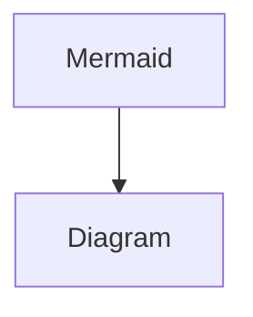

# Heading 1

Link to [GitHub](https://github.com/)

Lorem ipsum dolor sit amet, consectetur adipiscing elit. Ut sagittis commodo mauris, id semper ipsum condimentum sed. Nunc quam velit, malesuada et finibus a, laoreet vitae lacus. Morbi in augue sodales, semper tellus sed, scelerisque lacus. Pellentesque eu turpis non eros tristique malesuada. Quisque et magna eget lectus aliquet tempus. Donec ut nisl quis mauris tristique tincidunt. Sed eleifend facilisis enim, et gravida orci. Morbi erat ligula, commodo ut sapien non, blandit lacinia sem.

## Heading 2

Lorem ipsum dolor sit amet, consectetur adipiscing elit. Ut sagittis commodo mauris, id semper ipsum condimentum sed. Nunc quam velit, malesuada et finibus a, laoreet vitae lacus. Morbi in augue sodales, semper tellus sed, scelerisque lacus. Pellentesque eu turpis non eros tristique malesuada. Quisque et magna eget lectus aliquet tempus. Donec ut nisl quis mauris tristique tincidunt. Sed eleifend facilisis enim, et gravida orci. Morbi erat ligula, commodo ut sapien non, blandit lacinia sem.

### Heading 3

Lorem ipsum dolor sit amet, consectetur adipiscing elit. Ut sagittis commodo mauris, id semper ipsum condimentum sed. Nunc quam velit, malesuada et finibus a, laoreet vitae lacus. Morbi in augue sodales, semper tellus sed, scelerisque lacus. Pellentesque eu turpis non eros tristique malesuada. Quisque et magna eget lectus aliquet tempus. Donec ut nisl quis mauris tristique tincidunt. Sed eleifend facilisis enim, et gravida orci. Morbi erat ligula, commodo ut sapien non, blandit lacinia sem.

- [ ] To-do 1
  - [ ] To-do 2
    - [ ] To-do 3
    - [x] To-do completed 1
  - [x] To-do completed 2
    - [x] To-do completed 3
    1. Ordered list 1
1. Ordered list 2
  1. Ordered list 3
  * Unordered list 1
* Unordered list 2
  * Unordered list 3
      Lorem ipsum dolor sit amet, consectetur adipiscing elit. Ut sagittis commodo mauris, id semper ipsum condimentum sed. Nunc quam velit, malesuada et finibus a, laoreet vitae lacus. Morbi in augue sodales, semper tellus sed, scelerisque lacus. Pellentesque eu turpis non eros tristique malesuada. Quisque et magna eget lectus aliquet tempus. Donec ut nisl quis mauris tristique tincidunt. Sed eleifend facilisis enim, et gravida orci. Morbi erat ligula, commodo ut sapien non, blandit lacinia sem.
  
  1. Ordered list 1
  1. Ordered list 2
    1. Ordered list 3
        > Quote 1

  Quote 2
  
  
> [!tip] 💡 
> Callout
  Callout content
  
  
  > [!tip] 💡 
  > Inner Callout
  ## Mentions

2022-09-03T00:00:00.000+01:00 → 2022-09-21T02:00:00.000+01:00 

Hello @Anonymous!

## Image

### Internal


### External


## Bookmark

## Video

File

YouTube

## Audio

## Code

```c
#include <stdio.h>

int main() {
	printf("Hello world!")
}
```

## PDF

## File



## Embed

## Maths

Inline maths equation: c = \pm\sqrt{a^2 + b^2}

Block maths equation:


Thats all Folks!

