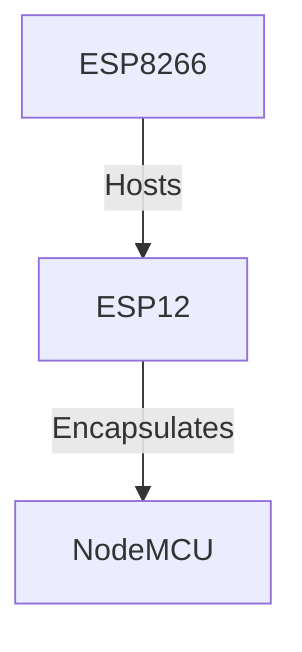
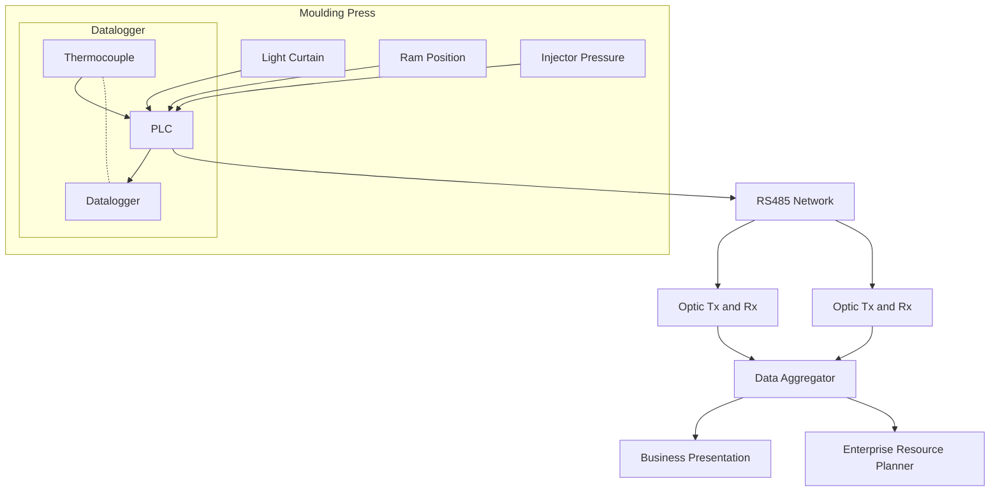
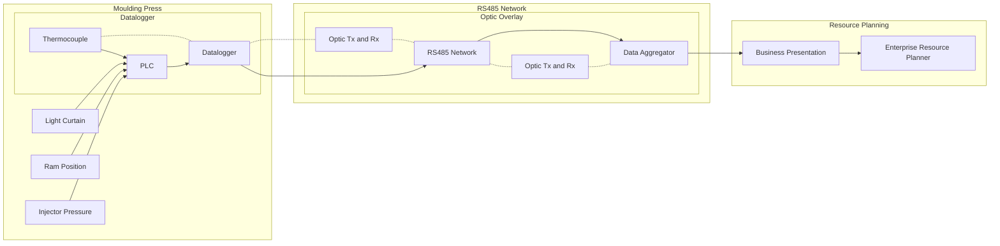
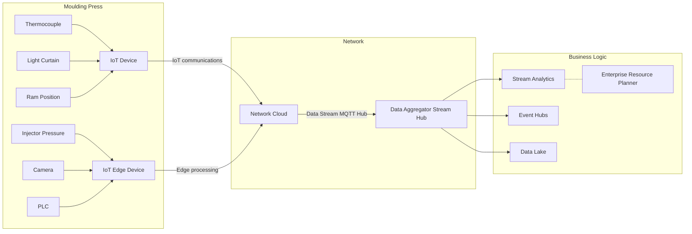

In a previous post, I referred to an embedded device which is called a **NodeMCU**. This device is a developer kit, designed to make it easy to develop and test programs for the embedded *ESP8266 System on a Chip*. Many manufacturers are offering both developer and production kits which leverage this SoC; including the Wemos D1, Lolin, and in my case the NodeMCU.

The function of these developer kits is to add some supporting features, for example, a USB to serial converter which makes programming a lot easier, in addition to a couple of buttons, and maybe an LED or two, for testing some simple scenarios with.

Once your development efforts are at a stage ready for production, we can implement the *ESP12* module on custom circuit boards, designed for the specific scenarios you might be addressing. The cost of the models is meager and can be significantly reduced further based on the order size. For a tiny quantity of 10 unit’s, we will have change out of €15, after Postage and Packing.

The developer board, is a little more expensive, for example you can grab these from many online suppliers including my link to Amazon, which offers two developer boards for €8, seriously not going to burst any banks here. 

# Some History

So why am I playing with these devices? I have been working on embedded technologies for over 30 years; starting with my first industrial deploying in a rubber injection moulding company, using a board from an American company called Tern, Inc; developing the code in *C*, and running my own communications protocol across an RS485 network! This was way back in 1994! *Now, I am showing my age!*

The scenario at the time was to monitor the state of the Moulding press, ensure the safety guards were down while injection was happening, reporting temperature which has been managed by a Siemens PLC, and then using a digital scale, counting the number of rubber parts which were just created and placed in a plastic box.

30 years later, not a lot has changed, we still use conveyor belts, PLCs, digital scales, thermocouples, and so on; what has changed however…

1. The computers have shrunk considerably
1. Protocols are now published and supported with free open-source libraries
1. Projects are shared so development can be accelerated, and new patterns and practices discovered and learnt
1. Costs have decreased, while reliability has increased.
1. Data is preferred to be stored in large pool’s; exposing some amazing value attributes.
## Learning

My original deployment failed after a few weeks in live production, for reasons which are now very obvious, but at the time were not so transparent. Considering the environment, all the heavy 3-Phase machinery introduced a lot of noise, Not noise as in you should wear ear protection, but electrical noise, Spikes, and drops, which on a network of 2 twisted wires with no error handling; and a rudimentary communications protocol with nothing more than a CRC code for data blocks, resulted in some false data getting stored, or worse lost.

The fix at the time was costly. Firstly, the network required to be insulated; trough both software (firmware) updates to harden the protocol, and better error handling; along with physical shielding from the noise base; In the worst areas of the factory, the copper RS485 network had to be redeployed with optical cables, which transmitted the signal using couplers and decouplers. Very cool stuff back then.

After some painful weeks, the solution was stabilized and happily ran for many years, and well after I had left the company.

## Retrospective Thought’s

While this solution completely changed the efficiency of the production line, and provided end to end visibility of work at all its stages in the manufacturing pipeline; the super important business data was locked tightly behind the code, and only leveraged to illuminate the insights from data which was determined to be of business value in a fixed set of scenarios.

Updates were tedious; considering every data collector had to be individually re-flashed with a new firmware in-situ. Considering that every update was guaranteed to change the data payload, as new sensors were introduced or retired; then the only option was to shutdown the complete solution for the duration of the update; followed by a number of test cycles, before finally bringing everything up; which of course had to be in the correct sequence. Oh, and the Plant ran 3 Shifts, each 8 hours, for 5 days a week, and some weekends on a Saturday depending on demand pressures. This of course translated to your truly working a lot of Sunday’s, and Early Monday’s for the first shift to commence

In today’s world the architecture would be much more modular, with the data been deposited into a large pool; and interrogated by subject matter experts to gain insights which are relevant to a particular business scenario, or process. However when a new perspective on a situation might be required; then with open access to all the data points, that subject matter expert can dip into the pool, and evaluate the data to expose the results specific to their case.

Attempting to achieve this at the time would, well, likely have cost more than one of those moulding presses; and require that all the operators had degrees in computer science related fields.

## The IoT Approach

If we were challenged with this sample problem 30 years on, how would we approach the project?

* I certainly promise, I will not be writing my own communication Protocols again; there is no requirement to reinvent the wheel.
* Data collectors have not changed a lot. Of course, they will be faster and more accurate, but a thermocouple is still a thermocouple.
* New collectors types with much richer data, cameras for example; including heat, night vision, spectral, high speed, high resolution and so on.
* Interacting with the collectors, is essentially reduced to a single line of code, thanks to the ecosystem of libraries.
* Data would be all pooled securely, enabling the correct people, services and technologies access, to build new business models.
* Data models packaged into light payloads, JSON, MQTT, etc.
* No more nightmares of In-Situ updates; Over the Air, self applying firmwares
* Secure Data communications, shielding and transports
* Staggered updates; with no system wide downtime, or sensitive startup dependencies
* Scale, Scale, Scale
* Fail Fast
* Change Management and DevOps
* And so on…
The evolution is real, yet so much is still very familiar.

Business logic Encapsulated as separate and distinct micro-services, ensuring a platform that can scale, while leveraging the correct tools at any point in time to address a scenario; enabling new and old approaches to be conducted in parallel, risk-free

## Tooling Up

Taking a leave from my beloved memories of *Borland’s Turbo C* IDE and compiler; *(Which, I still have in my display cabinet,)* accompanied with its collection of 2 3.5” floppy disks, and the now almost defunct RS232 serial cable behind, how do we approach these new developer kits for embedded IoT devices?

Pretty simple actually. Regardless of your OS platform, you can now leverage the rich ecosystems which these kits have established; you simply need to decide on what environment you wish to leverage and get started.

But be warned, when I started with the *Tern, Inc.* boards, there was only **one** choice, the SDK was licensed for use with the specific board; today, however, this is not the case, and before you start on your first line of code, you can easily be overwhelmed.

### Hardware

Over the years a number of different standards have developed and evolved. One of the richest and possibly best know is that of **Arduino**; which is a family of boards with an amazing eco-system of supporting libraries; shapes, sizes, and purposes.

However, Prior to spending time with this family, I actually went *100% Nerd*, and choose to develop on the **MicroChip PIC** series CPUs; which were 100% chips, and required a special programmer to flash the chip, in my real early days these were based on EPROMS (which could only be reset, by playing them in a special UV drawer), and later the cooler EEPROMS which had an Electronic Erase option on the Programable Read Only Memory. Debugging was a different story; in this case I had a RICE Device, which was an expensive ‘thing’ that enabled step by step debugging of the code been flashed; however most of the time, this was totally without any of the real inputs which would ultimately be connected to the circuit.

There are other boards, which I will take a closer look at on this journey; including the *Microsoft IoT SDK board*, which is known as the **MX Chip**, essentially also a developer board, but with a boot load of additional inputs and outputs.

And of course, the board which I am still waiting patiently to arrive, the *Microsoft Azure Sphere board*.

### Development Environments

When I first started playing with these **Arduino** based systems, I of course made the default choice of development tools, and embraced the cumbersome Arduino IDE; which in many ways is still far less flexible than my fond memories of Borland’s IDE.

I quickly focused on VS Code, to use its extension for the Arduino IDE; which in all due respect is a really fantastic effort, and a revolutionary step forward, but due to its total dependency on the Arduino IDE been still installed, there are still a lot of irritable behaviors.

### PlatformIO

However, I finally saw the light, and one day in pure anger, uninstalled the Ardunio Extension and IDE from my system, and added PlatformIO as an alternative. At that time, I also had a copy of Atom installed, as I had embraced it long before VS Code; and what a change this was.

Today however, I am working primary in VS Code for all my work; and adding PlatformIO extensions turns development for these boards into a total dream.

## Summary

So, after a long story, lets simply this; If you are working on, or considering to get hands dirty on your first IoT project; then allow me to suggest that you can save a ton of time and confusion by simply taking the following path:

* IDE: VS Code with PlatformIO Extension
* SDK: Start with Arduino as its an enormous community
* Board: NodeMCU 1.0, Wemos 1D Mini, Lolin v3
And all you need to plan for, is what project your going to build. It’s Christmas time, and I love lights; so join me on next posts, as I dress the house for the holidays!

