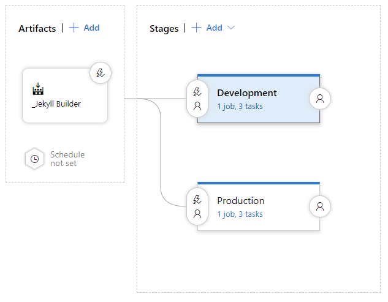

With the heavy lifting done in creating the site building mechanics and a solid foundation to build and share upon; our final objective is to automate the process of connecting these two stages.

# Release Pipeline

Technically the goal we are speaking about is the **Release Pipeline** which will take the artefact *(our site .ZIP file)* that we created in the **Build Pipeline** in our previous topic [Constructing a new Home with Jekyll and Azure DevOps](/Building-The-Site/); and publish this to our storage account.

In simple terms, we are going to Unzip the archive to the storage, which is configured to expose the content as a website, and to increase performance we are leveraging a content delivery network.

## Copying Content

As with our *Build Pipeline* there are a few different options on how to accomplish the work.

> Currently Azure DevOps is not exposing the release pipelines in an Infrastructure as Code configuration so we will complete this in the portal.

We begin with a new *Release Pipeline*, add add the task **Azure File Copy**, and set the settings similar to the following:

  Done!, Seriously; pretty easy right!

## Replace Content

One small issue with the previous approach is that it merely overwrites the content in the blob with the latest version, but it failed to remove any content which might have been removed from the site.

Currently, there is no equivalent to the magic *XCOPY* command that will sync the blob removing the data that is no longer required; that’s a project for another day.

The quick and dirty fix for this scenario is first to delete the existing content and then deploy the latest version. This would typically result in a potential outage as the content vanishes for a little time; however, we do not have that concern, because we have decided to use a Content Delivery Network which caches our site.

### Task 1

  ### Task 2

  ## Tiggers Ready

The last point to consider is *When* should this deployment happen, and that’s also pretty obvious when we think about it.

Every time we have a good build of the site, we should check to see which branch just completed the process, and update the relevant site based on this information.

## Summary

Which flow you choose to implement are entirely at your discretion; As I am currently doing much work on the taxonomy of the site; I have implemented the second option of delete and redeploy; but I do in the plan to come back and optimize this by adding a sync process which will be far more efficient.

