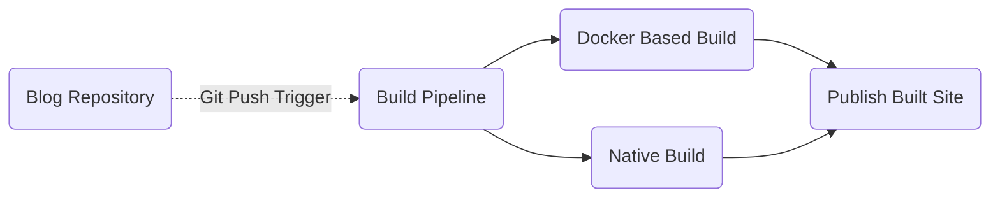
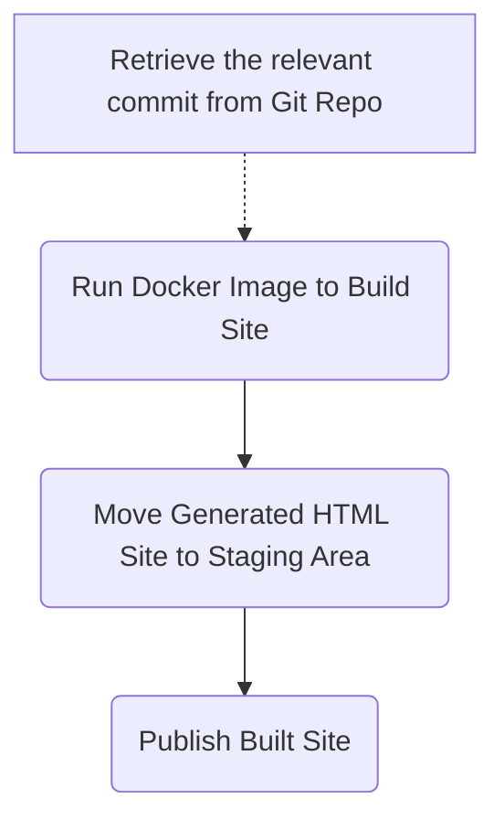
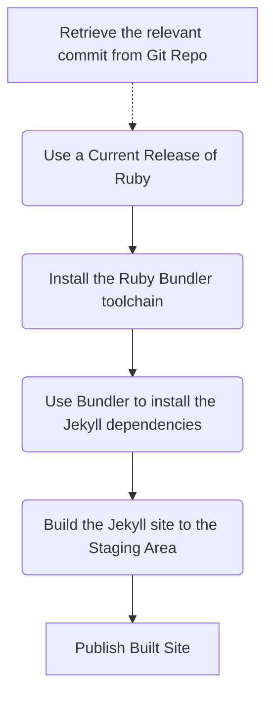

One of the unspoken truths behind the lack of posts on ths [blog](blog) in recent history was due to a few bugs, which in the end resulted in an experience where from home it appeared that any new content was published and working; but outside this fortress in the real world, there was a large silence echoing.

I really only discovered this issue in May of this year (2018), and was, to say the least, a little agitated with the situation and decided then to change the approach to how I save my notes and share my thoughts.

## [Jekyll](Jekyll)

After a lot of hours hacking at CSS and JS, neither of which are my strongest points; combined with a whole lot of *liquid* scripting, which is based on the [Python](Python) Jinja library; I chose to leverage the open source Jekyll project.

This is not to say, that I might not reconsider this again as I am pretty intrigued also with [Hugo](Hugo); but one point is for sure... My days struggling with *Wordpress* are history. 

Don't get me wrong, Wordpress is great, even fantastic, but when it breaks, or its hacked (and boy have I been hacked), or when the comments system becomes a spam target; then its a total nightmare to have to deal with.

I want something that is easy to use, a lot less prone to hacking, and painless to host; so my choice was clear from the start - I was going to use a Static Site Generator

## Building

Leveraging [GIT](GIT) for my version control, I have a simple pipeline which rebuilds a new version of the site each time a new commit is made to the repository. I do like to tweak and have actually no less than two approaches to the effort



As I spend the majority of my time focused on Microsoft Technology stack, I am leveraging [Azure DevOps](Azure DevOps) to run my build process; however, if you prefer other tools, for example, Jenkins, CircleCI, etc; then the concepts should be easily transportable, as there is nothing truly complex happening at this point.

### Docker Build Pipeline

This version of the pipeline is my favourite, as I can use the same commands on my workstation to run a local web server to watch in realtime what my edits are going to look like when I finally commit, with 100% confidence that there will be no drift, as I use the exact same container for both roles, development and deployment

The pipeline I am sharing is in YAML format, which we are going to see a whole lot most of over time, and by sharing this you can easily recreate your own build pipeline with nothing more than a good paste!

The build is running on a hosted Ubuntu 16.04 instance, but this could be easily replaced with a dedicated build node; however for the amount of time I will use for the building, I should fall well inside the free monthly allocation offered in Azure DevOps; so, for now, this is perfect.

The pipeline has only 3 steps



The *YAML* representation of the flow is as follows; you can also choose to add the steps in the UX and provide the data below into the relevant fields, as there is a 1:1 relationship between the UX and the YAML Infrastructure as Code

```yaml
resources:
- repo: self
queue:
  name: Hosted Ubuntu 1604
steps:
- task: Docker@1
  displayName: 'Run an image'
  inputs:
    containerregistrytype: 'Container Registry'

    command: 'Run an image'

    imageName: 'jekyll/builder:latest'

    qualifyImageName: false

    volumes: |
     $(Build.SourcesDirectory):/srv/jekyll
     $(Build.BinariesDirectory):/srv/jekyll/_site
     

    workingDirectory: '$(Build.SourcesDirectory):/srv/jekyll'

    containerCommand: 'jekyll build --future'

    runInBackground: false

- task: CopyFiles@2
  displayName: 'Copy Files to: $(Build.ArtifactStagingDirectory)'
  inputs:
    SourceFolder: '$(Build.BinariesDirectory)'

    TargetFolder: '$(Build.ArtifactStagingDirectory)'


- task: PublishBuildArtifacts@1
  displayName: 'Publish Artifact: _site'
  inputs:
    ArtifactName: '_site'
```

### Native Build Pipeline

The Native approach does not offer a whole lot of immediate advantages over the docker version of the pipeline; I honestly created this to prove to myself that I could. 

However, after creating this, I do see an advantage. If I should choose to create a dedicated Build Server; I would be able to have the *Ruby bundler* and all the *Jekyll gems* pre-staged on the node; which would remove almost 3 minutes from the build pipeline, as these steps would not need to be repeated every time I executed a new build.

Now, I would have expected the Docker approach to have this as an advantage with the Gems pre-installed in the container, but that's not the case with the official container I have used in the other pipeline; As a result, both pipelines take 3.5 minutes to prepare, build and publish my site artefacts currently.  Clearly, I have a lot of room to make this better.

This pipeline is a little more verbose with 5 steps currently


The pipeline has only 3 steps



The *YAML* representation of the flow is very similar to the previous sample, this time however you are going to really just been looking at some shell commands, which run essentially on any platform we can host ruby on.


```yaml
resources:
- repo: self
queue:
  name: Hosted Ubuntu 1604
steps:

- task: UseRubyVersion@0
  displayName: 'Use Ruby >= 2.4'


- script: 'gem install bundler' 
  displayName: 'Install bundler'

- script: 'bundle install' 
  displayName: 'Install Jekyll and Dependencies'

- script: 'bundle exec jekyll build -d $(Build.ArtifactStagingDirectory)' 
  displayName: 'Build Jekyll Static Site'

- task: PublishBuildArtifacts@1
  displayName: 'Publish Artifact: _site'
  inputs:
    ArtifactName: '_site'
```

## Next Steps

With a built site, published; what we really have is a *.ZIP* file which contains all the generated HTML which we can drop onto our web server to publish to the world. 

There are many choices on the web hosting platform to use, keep tuned, and I will share with you the solution I have elected to use for this site